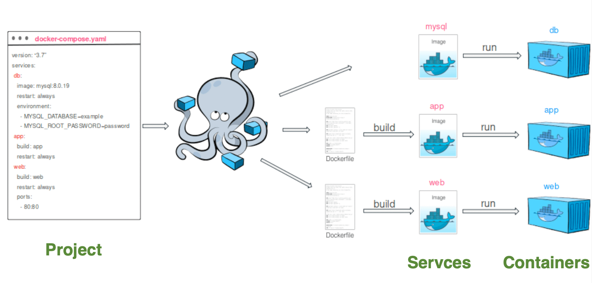
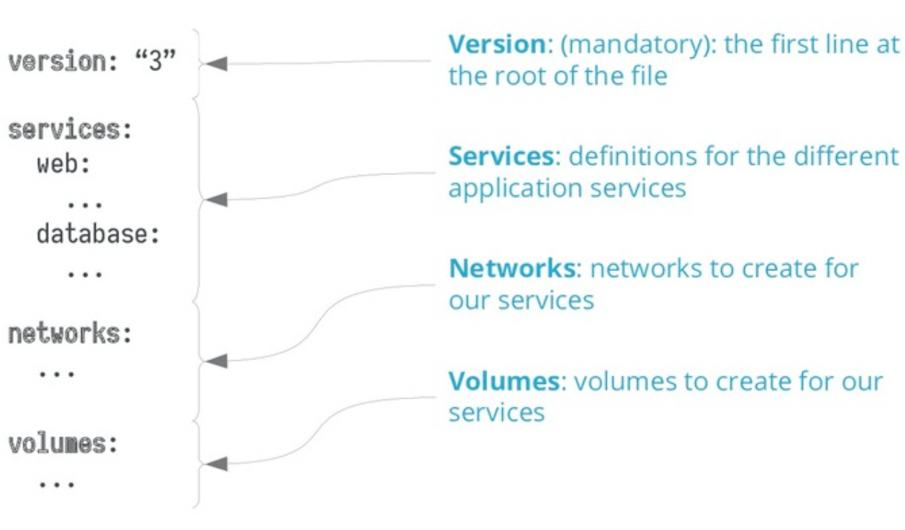

# Docker Compose

## Docker Compose 소개


### 도커 컴포트 (Docker Compose)

- 단일 서버에서 여러 컨테이너를 프로젝트 단위로 묶어서 관리
- `docker-compose.yml` `YAML` 파일을 통해 명시적 관리
- 프로젝트 단위로 도커 네트워크와 볼륨 관리
- 프로젝트 내 서비스 간 의존성 정의 가능
  - 예1) `Service 1`이 실행되기 위해서 `Service 2`가 실행된 상태여야 함
  - 예2) `Service 1`과 `Service 2`가 상호간에 `Service Name`으로 호출
- 프로젝트 내 서비스 디스커버리 자동화
- 손쉬운 컨테이너 수평 확장

## 프로젝트 / 서비스 / 컨테이너

- 파일단위로 서비스를 명세
- `yaml`의 `services` 키로 서비스 종류를 명세
  - `services`의 하부 키 (서비스) 안에 `scale: 3` 등으로 자연스러운 스케일 가능



### 프로젝트 (Project)

- 도커 컴포즈에서 다루는 워크스페이스 단위
- 함께 관리하는 서비스 컨테이너들의 묶음
- 프로젝트 단위로 도커 네트워크가 생성됨

### 서비스 (Service)

- 도커 컴포즈에서 컨테이너를 관리하기 위한 단위
- scale을 통해 서비스 컨테이너의 수 확장 가능

### 컨테이너 (Container)

- 서비스를 통해 컨테이너 관리

## `docker-compose.yml`

- `version`, `services`, `networks`, `volumes`로 총 4개의 최상위 키로 구성



### 버전 (version)

- `2021년 11월` 기준 버전 `3.9`가 최신
- 가능한 최신 버전을 사용하는 것을 권장
- 도커 엔진 및 도커 컴포즈 버전에 따른 호환성 매트릭스를 참조할 것
  [Compose file version 3 reference](https://docs.docker.com/compose/compose-file/compose-file-v3/)
- `버전 3`부터 `Docker Swarm`과 호환
  - `Swarm` 서비스를 `docker-compose.yml`로 정의 가능
  - 단 `Swarm`에서만 전용으로 사용하는 옵션이 정의되면 `Docker`에서는 해당 옵션을 사용할 수 없음 (단적인 예로 `deploy`)
    ```bash
    # deploy
    Specify configuration related to the deployment and running of services. The following
    sub-options only takes effect when deploying to a swarm with docker stack deploy, and is ignored by docker-compose up and docker-compose run, except for resources.
    ```

### networks

- 네트워크는 정의하지 않아도 `network: default` 를 `bridge`모드로 작성함

### 도커 스왐 (Docker Swarm)

- 여러 서버를 기반으로 스웜 클러스터를 형성하여 컨테이너를 관리하는 컨테이너 오케스트레이션 시스템
- 쿠버네티스(`k8s`)와 동일한 목적으로 만들어졌지만 인기를 끌지는 못함

## docker-compose 명령어

```python
import redis
from flask import Flask

app = Flask(__name__)
cache = redis.Redis(host='redis', port=6379)

def get_hit_count():
    retries = 5
    while True:
        try:
            return cache.incr('hits')
        except redis.exceptions.ConnectionError as exc:
            if retries == 0:
                raise exc
            retries -= 1
            time.sleep(0.5)

@app.route('/')
def hello():
    count = get_hit_count()
    return 'Hello World! I have been seen {} times.\n'.format(count)
```

```docker
FROM python:3.7-alpine
WORKDIR /code
ENV FLASK_APP=app.py
ENV FLASK_RUN_HOST=0.0.0.0
RUN apk add --no-cache gcc musl-dev linux-headers
COPY requirements.txt requirements.txt
RUN pip install -r requirements.txt
EXPOSE 5000
COPY . .
CMD ["flask", "run"]
```

```yaml
version: '3.9'
services:
  web:
    build: .
    ports:
      - '5000'
  redis:
    image: 'redis:alpine'
```

```bash
# Foreground로 도커 컴포즈 프로젝트 실행
$ docker-compose up

# Background로 도커 컴포즈 프로젝트 실행
$ docker-compose up -d

# 프로젝트 이름 my-project로 변경하여 도커 컴포즈 프로젝트 실행
$ docker-compose -p my-project up -d

# 프로젝트 내 컨테이너 및 네트워크 종료 및 제거
$ docker-compose down

# 프로젝트 내 컨테이너, 네트워크 및 볼륨 종료 및 제거
$ docker-compose down -v
```

```bash
# web 서비스를 3개로 확장
$ docker-compose up --scale web=3
```

```bash
# 프로젝트 내 서비스 로그 확인
$ docker-compose logs

# 프로젝트 내 컨테이너 이벤트 확인
$ docker-compose events

# 프로젝트 내 이미지 목록
$ docker-compose images

# 프로젝트 내 컨테이너 목록
$ docker-compose ps

# 프로젝트 내 실행중인 프로세스 목록
$ docker-compose top
```

## 주요 사용 사례 (use-case)

### 로컬 개발 환경 구성

- 특정 프로젝트의 로컬 개발 환경 구성 목적으로 사용
- 프로젝트의 의존성 (`Redis`, `MySQL`, `Kafka` 등)을 쉽게 띄울 수 있음

### 자동화된 테스트 환경 구성

- `CI/CD` 파이프라인 중 쉽게 격리된 테스트 환경을 구성하여 테스트 수행 가능

### ⭐️ 단일 호스트 내 컨테이너를 선언적 관리

- 단일 서버에서 컨테이너를 관리할 때 YAML 파일을 통해 선언적으로 관리 가능
