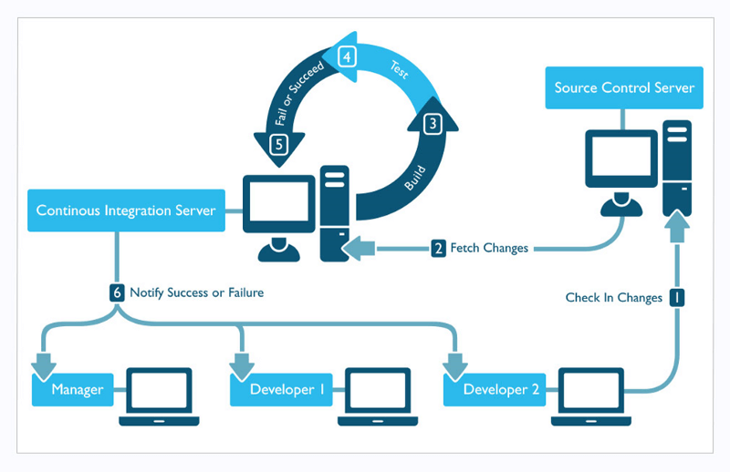
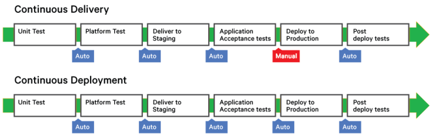
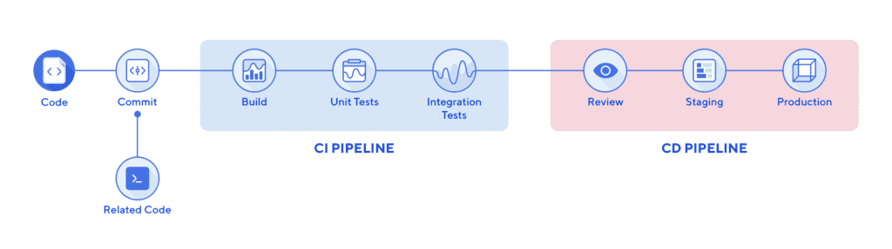

# Docker 활용 소개

## `Docker CI/CD`

- `Jenkins`를 활용한 `CI/CD` 빌드 환경 구성
- `Gradle`을 활용한 개발코드 빌드
- `Jib`을 활용한 `Docker` 이미지 빌드
- `AWS ECR`에 `Docker` 이미지 `Push` 및 저장
- `AWS EC2`에 `Docker` 컨테이너 배포/기동

### CI (`Continous Integration`)

- 여러 개발자들이 작성한 코드 또는 다른 기능과 함께 통합되는 소프트웨어의 개발주기
- 일반적으로 임시 환경에서 코드를 통합, 애플리케이션 빌드 및 기본 테스트 수행을 포함

1. 개발자는 소프트웨어를 개발 한 뒤 깃과 같은 버전 관리 시스템에 통합
2. CI는 업데이트된 소스를 가져와 빌드시 정적 도구 분석을 수행
   1. 정적 분석의 목적은 소스에 문제가 없는지 정량적으로 파악하기 위함 (코드 스타일, 컨벤션 등)
3. 정적 도구 분석이 종료되면 테스트를 수행
   1. 기능 통합 및 성능 테스트 등이 이 과정에 포함될 수 있음
4. 테스트가 종료되면 테스트 결과를 개발자에게 알려주고 결과에 해당하는 아티펙트, 도커 이미지등을 스테이징이나 운영환경등으로 배포할 수 있는 상태가 됨

### CD (`Continuous Deployment`)

- 지속적인 통합, 자동화된 테스트 및 자동화된 배포 기능을 통해 최소화된 사용자 개입으로 소프트웨어를 빠르고 안정적으로 배포하기 위한 접근방식
- 배포 단위로는 자료와 같은 패키지나 아티팩트, 도커 이미지 등
- `Continuous Delivery` vs `Continuous Deployment`
  
  - 운영환경으로 배포시 사용자의 손을 거쳐 수동으로 하는지 아닌지 여부에 따라 `Delivery`와 `Deployment`를 구별함
  - 실무에서 의미하는 CD는 Deployment에 가까움

### CI/CD

- 개발에서 운영에 이르기까지 변경단위를 반영하기 위한 흐름도
- CICD 파이프라인은 다음과 같은 단계로 구성
  - 개발자가 변경을 완료한 뒤 커밋
  - CI도구를 통해 가져와 빌드를 통해 통합
  - 자동화된 테스트가 빌드 중에 실행
  - 빌드된 패키지가 스테이징, 운영환경으로 전달
- 소프트웨어 개발 후 빠른 릴리즈를 위해 실무에서 가장 널리 실행되는 방법
