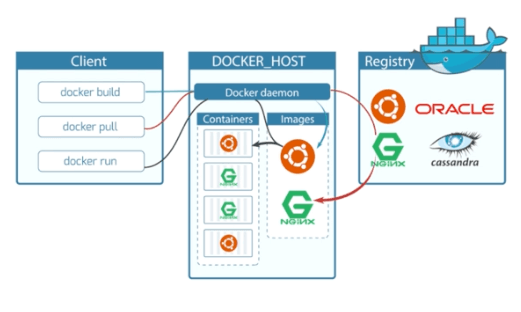
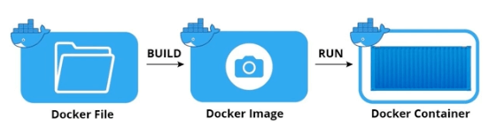

# Docker 이미지와 컨테이너

## Docker 구성요소

### Docker Client

- Docker 명령어를 수행하는 파트

### Docker Host

- Docker daemon = docker engine

- Images
  - 이미지는 컨테이너를 생성할 때 필요한 요소로서, 컨테이너의 목적에 맞는 바이너리와 의존성이 설치되어 있는 일종의 스냅샷 개념
  - 이미지는 여러개의 계층(Layer)으로 된 바이너리 파일로서 존재
  - 이미지를 만드는 방법
    - 직접 빌드
    - 만들어진 이미지를 풀링 해서 사용 (dockerhub)
- Containers
  - 호스트와 다른 컨테이너로부터 격리된 시스템 자원과 네트워크를 사용하는 프로세스
  - 이미지는 읽기 전용으로 사용하여 변경사항은 컨테이너 계층에 저장됨
    - 컨테이너 상에서 어떤 작업을 하든 이미지는 영향받지 않음
- 이미지 vs 컨테이너
- 프로그램 vs 프로세스
- 클래스 vs 인스턴스

## Docker 이미지 이름 구성

- 저장소 이름 (Repository Name)
- 이미지 이름 (Image Name)
- 이미지 태그 (Image Tag)
- repositoryName/imageName
- repositoryName/imageName:imageTag
- imageName:imageTag
- imageName
- 생략의 의미
  - 태그 생략 : 최신 리비전 → lateast
  - 저장소 생략 : dockerhub

## Docker 이미지 저장소

### 이미지 저장소 (Image Repository)

- 도커 이미지를 관리하고 공유하기 위한 서버 어플리케이션
  - public
    - Docker hub
    - QUAY
  - private
    - AWS ECR
    - Docker Registry
