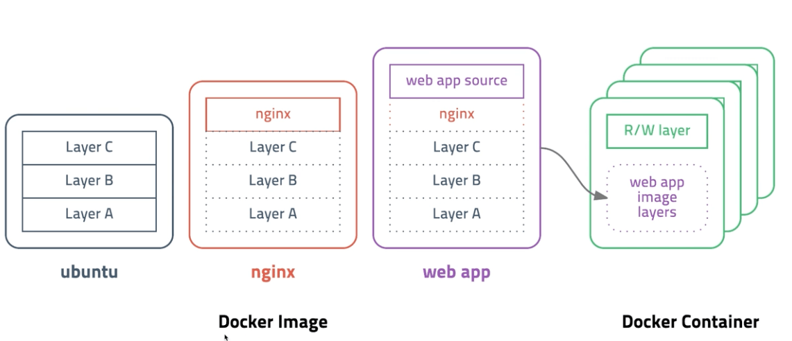

# Docker Image Build

## 도커 이미지 구조



- 도커 이미지는 레이어 구조로 되어 있음
- 각각의 이미지들은 다른 이미지를 참조할 수 있음
  - 운영체제의 기본이 되는 `ubuntu, alpine` 등과 같은 `OS`레벨의 이미지 레이어
  - `nginx, apache`와 같은 웹 서버 미들웨어 이미지 레이어
  - `dependency`와 같은 패키지 이미지 레이어
  - 실질적인 소스 코드 이미지 레이어
- 도커 컨테이너를 생성하면 이미지 레이어는 `Read Only` 레이어로 존재하며, `Container` 고유의 `Read Write` 레이어가 별도로 생성됨 (컨테이너 삭제시 컨테이너 레이어는 삭제된다는 점에 유의)

```bash
# nginx 최신버전의 이미지를 inspect하면 어떤 레이어들로 구성되어 있는지 해시값을 확인할 수 있음
$ docker image inspect nginx:latest
"RootFS": {
    "Type": "layers",
    "Layers": [
        "sha256:5978b6b69f17c6a0254d34a4180f1f2c8d42f54e6ffe96303bacd2db8e30955d",
        "sha256:80730baf846507a3451ce7db38309a762ee0ebf518cb146427f49068af5f70f3",
        "sha256:7b11943dbe46759dbca5555b69b0d0ad198a19b81af28746eb724a2a74ba4cb1",
        "sha256:9dfe3def52f14e876a741b6ee2a18456721c58a691eaba2d0ea56855655c8dc5",
        "sha256:9e13ccef5ed098a72acbf5542b62002c09865b82e37ebb84a08ff1f79f1df619",
        "sha256:f2089ca22bc13b93fec55bb44074023f52f25da6f430181adfd235a88d381eff"
    ]
},
```

## Dockerfile 없이 이미지 생성

- 기존 컨테이너를 기반으로 새로운 이미지 생성

```bash
# docker commit [OPTIONS] CONTAINER [REPOSITORY[:TAG]]
# ubuntu 컨테이너의 현재 상태를 my_ubuntu:v1 이미지로 생성
$ docker commit -a fastcampus -m "First Commit" ubuntu my_ubuntu:v1
```

- `git commit`과 같은 개념으로, 변경점을 저장

## Dockerfile 이용하여 이미지 생성

- `Dockerfile`을 기반으로 새 이미지를 생성 가능

```docker
FROM node:12-alpine
RUN apk add --no-cache python3 g++ make
WORKDIR /app
COPY . .
RUN yarn install --production
CMD ["node", "src/index.js"]
```

- `Dockerfile`은 지시어와 인자로 이루어져 있음

```bash
# docker build [OPTIONS] PATH
# ./ 디렉토리를 빌드 컨텍스트로 my_app:v1 이미지 빌드 (Dockerfile 이용)
$ docker build -t my_app:v1 ./

# ./ 디렉토리를 빌드 컨텍스트로 my_app:v1 이미지 빌드 (example/MyDockerfile 이용)
$ docker build -t my_app:v1 -f example/MyDockerfile ./
```

- 기본적으로는 현재 디렉토리의 `Dockerfile`을 기반으로 이미지를 빌드하지만, `-f` 옵션을 이용하면 `Dockerfile`의 위치를 지정할 수 있음
- 각각의 지시어가 레이어로 구성되는데, 변경되더라도 이미지에 존재하는 레이어의 경우, 재사용 가능한 경우에는 캐시를 기반으로 재작성을 하게 됨 (공간, 시간 효율성)

## 빌드 컨텍스트

- 도커 빌드 명령 수행 시 현재 디렉토리(`Current Working Directory`)를 빌드 컨텍스트(`Build Context`)라고 하며, `Dockerfile`로부터 이미지 빌드에 필요한 정보를 도커 데몬에게 전달하기 위한 것
- 간단하게 이야기 하면 빌드를 하기 위해서는 빌드 명령어가 수행된 장소(CWD)에 어떤 파일들이 있는지, 메타데이터 들이 있는지를 전부 파악해야 함 (그래야 COPY, ADD등을 수행할수 있으니)
- 이때, 빌드에 필요없는 파일들이 잔뜩 있다면 해당 파일들의 데이터들도 전부 컨텍스트에 적재를 해야 하기 때문에 빌드 시간이 불필요하게 증가할 수 있음

## .dockerignore

- 빌드 컨텍스트의 불필요한 파일 및 데이터의 적재를 해결하기 위해서 필요한 것이 `.dockerignore`
- `.gitignore`와 동일한 문법을 가지고 있음
- 특정 디렉토리 혹은 파일 목록을 빌드 컨텍스트에서 제외하기 위한 목적

```bash
# comment
*/temp*
*/*/temp*
temp?

*.md
!README.md
```
