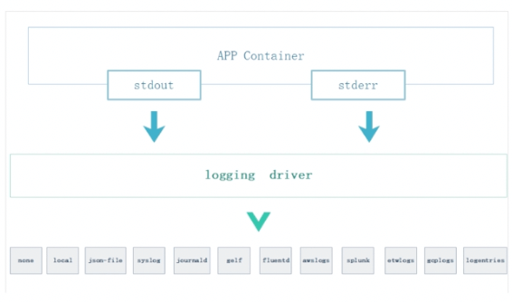
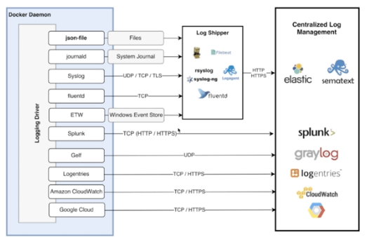

# Docker Logs

- 컨테이너의 로그를 어떻게 관리할 것인가?

## STDOUT / STDERR



- 도커를 사용하게 되면 로그를 컨테이너에서 표준출력과 표준오류로 관리해야 함
- 도커에서 다양한 로그 드라이버를 제공하고 있기 때문에 목적에 맞게 로그 드라이버를 선택하는게 중요
- 예를 들어 `json-file` 로그 드라이버의 경우 모든 로그를 `json` 한줄로 출력해주는 드라이버

## 로그 확인하기

```bash
# 전체 로그 확인
$ docker logs [container]

# 마지막 로그 10줄 확인
$ docker logs --tail 10 [container]

# 실시간 로그 스트림 확인
$ docker logs -f [container]

# 로그마다 타임스탬프 표시
$ docker logs -f -t [container]
```

## 호스트 운영체제의 로그 저장 경로

```bash
$ cat /var/lib/docker/containers/${CONTAINER_ID}/${CONTAINER_ID}-json.log
```

- 상기 명령어는 로그 드라이버가 json-file 일 경우에만 유효
- `json-file` 로그 드라이버는 로그를 인라인 형태의 `json` 파일로 저장하게 됨

<aside>
💡 MacOS에서 docker내 VM에 직접 접속하려면 다음 명령어를 실행 docker run -it --rm --privileged --pid=host `justincormack/nsenter1`

</aside>

## 로그 용량 제한하기

- 컨테이너 단위로 로그 용량을 제한할 수 있지만, 도커 엔진에서 기본 설정도 가능 (프로덕션에서 ⭐️필수 설정)

```bash
# 한 로그 파일 당 최대 크기를 3MB로 제한하고, 최대 로그 파일 5개로 로테이팅
$ docker run \
	-d \
	--log-driver=json-file \
	--log-opt max-size=3m \
	--log-opt max-file=5 \
	nginx
```

## Docker Log Driver



- 도커에는 다양한 로그 드라이버가 준비되어 있으며, 운영 환경에 맞게 드라이버를 선택해서 중앙화된 로그 관리가 가능함
