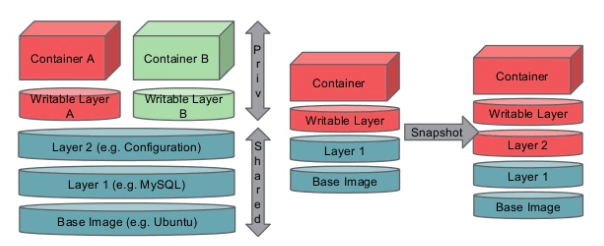

# Docker 운영 관리

- `Nexus Registry` 및 `AWS ECR` 연동
- `Docker Image` `Push/Pull` 관리
- `Docker Base Image` 빌드 속도 향상을 위한 구성
- `Docker Base Image` 튜닝 및 업데이트 관리
- `Docker` 컨테이너 런타임 및 네트워크 트러블 슈팅 방법
- `Private` 환경에서 `Nexus` 및 `Squid`를 활용한 `Docker` 빌드 환경 구성 및 빌드 수행

## Nexus Docker Registry

- 넥서스는 도커 리포지토리를 지원함
- 넥서스를 클라이언트측 리포지토리로 관리하여 조직 내 전용 리포지토리로 활용 가능
- 이렇게 되면 필요한 라이브러리 및 이미지들만 별도로 관리하며 조직 내 빠른 풀링 속도를 보장 가능

## Docker Base Image

- 도커 이미지는 상호간에 공유할수 있는 레이어를 겹쳐서 캐싱할 수 있도록 되어 있음
- 따라서 모든 소프트웨어 패키지는 공통 부분을 레이어로 공유함
