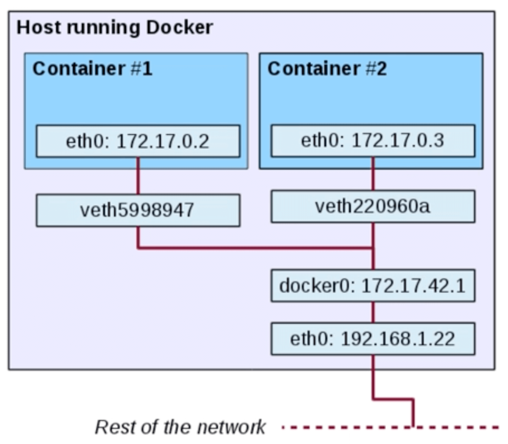
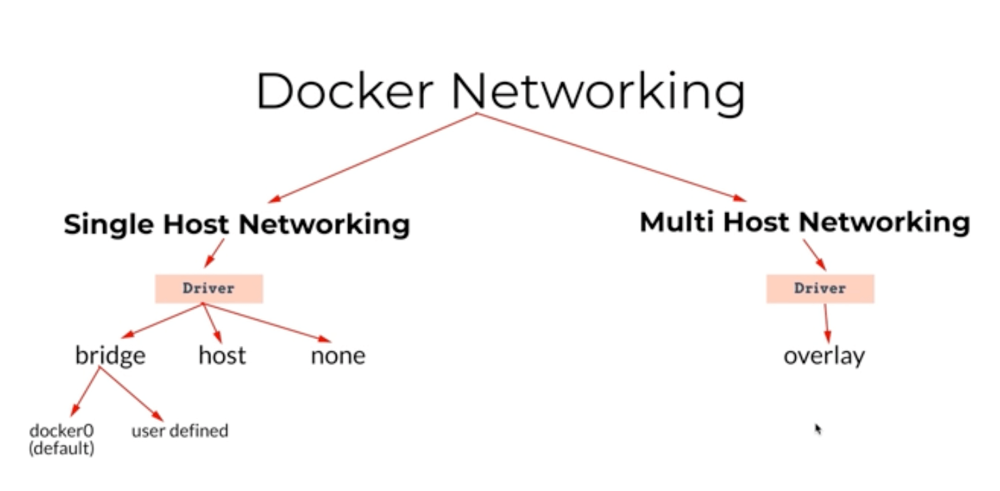

## Docker 네트워크 구조



- veth: virtual eth
- docker0: 도커 엔진에 의해 기본 생성되는 브릿지 네트워크
  - veth와 eth 간 다리 역할

## 컨테이너 포트 노출

- 컨테이너의 포트를 호스트의 IP:PORT와 연결하여 서비스를 노출

```bash
$ docker run -p [HOST IP:PORT]:[CONTAINER PORT] [container]

# nginx 컨테이너의 80번 포트를 호스트 모든 IP의 80번 포트와 연결하여 실행
$ docker run -dp 80:80 nginx

# nginx 컨테이너의 80번 포트를 호스트 127.0.0.1 IP의 80번 포트와 연결하여 실행
$ docker run -dp 127.0.0.1:80:80 nginx

# nginx 컨테이너의 80번 포트를 호스트의 사용 가능한 포트와 연결하여 실행
$ docker run -dp 80 nginx
```

## Expose vs Publish

```bash
# expose 옵션은 그저 문서화 용도
$ docker run -d --expose 80 nginx

# publish 옵션은 실제 포트를 바인딩
$ docker run -dp 80 nginx
```

## Docker 네트워크 드라이버



- 단일 호스트 네트워킹
  - bridge
    - bridge로 생성한 네트워크 안의 컨테이너들은 —net-alias에서 지정된 이름으로 소통할 수 있음
  - host
  - none
  - container에 네트워크를 공유하는 방법
- 멀티 호스트 네트워킹
  - overlay → 컨테이너들을 연결시키는 가상의 네트워크 (오케스트레이션 시스템에서 활용)
  - docker swarm을 사용할때 overlay를 사용
