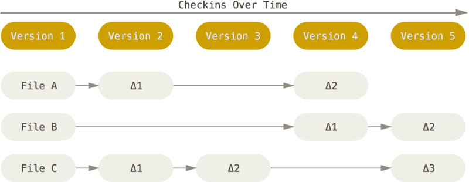
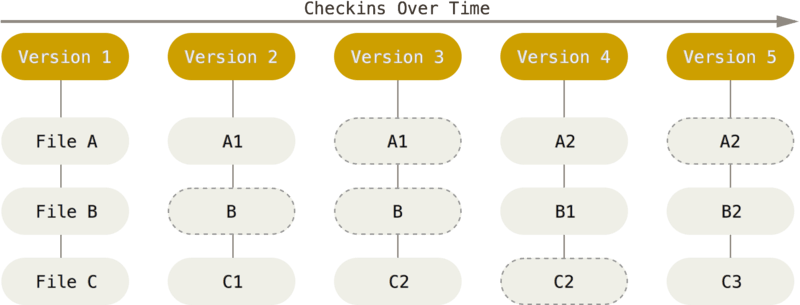

## Git의 탄생 배경

- Git은 VCS(Version Control System)의 한 종류로서 파일의 변경 이력을 관리하는 시스템으로 정의할수 있음
- Git 이전에 Subversion과 Perforce와 같은 VCS도 있었지만, 모든 코드를 중앙 서버에서 관리하고 있었음
  - 중앙집중식 버전관리 시스템의 단점
    - 서버가 중단되면 작업 불가
    - 오프라인상에서 작업 불가
- 이를 해결하기 위해 분산형 버전관리 시스템이 등장
  - 분산형 버전관리 시스템은 각 개별 작업자가 모든 원본파일을 가지고 있는 형태가 됨
  - 서버에 변경된 업로드 하면 서버는 변경된 부분을 자동으로 판단하여 병합하는 형태
- Git은 어떻게 개발되었나?
  - 최초에 리눅스 커널 팀에서 BitKeeper를 사용중이었는데, 돌연 BitKeeper에서 유료화를 선언
  - 리눅스 커널 팀의 리누스 토발즈가 기존 버전관리 시스템의 문제점들을 해결한 Git을 개발, 2005년에 세상에 처음 등장하게 됨

## Git의 주요 특징

### Git 이전 시스템인 delta based version control의 문제점

- 기존의 버전 관리 시스템들의 구조는 각각의 버전별로 변경된 내용만 가지고 있었음
- 이러한 델타 베이스 구조에서의 가장 큰 문제점은 버전별로 달라진 내용만을 가지고 있기 때문에 버전을 변경할때 어떤 부분을 적용해야 하는지 계산하는 시간이 오래걸리고 그 부분에서 문제가 생김

### 스냅샷 스트림

- 그에 비해 Git은 전체 구조를 스냅샷의 형태로 저장하고 있기 때문에 버전 사이를 자유자재로 이동 가능
- 브랜치들 사이에서 이동이 빠르고 오류가 발생할 확률이 줄어듬
- 각각의 스냅샷은 그렇게 무겁지 않은데, 그 이유는 스냅샷의 경우 변경점이 없을 경우 원본 파일의 링크만을 저장하고 있기 때문

### 모든 명령을 로컬에서 수행 가능

- 거의 모든 명령이 로컬에서 수행되며 데이터 또한 로컬에 존재하기 때문에, 네트워크와의 연계는 필요 없음
- CVCS (centralized version control system)을 이용하게 되면 서버와의 통신에 얼마나 많은 오버헤드가 있는지 알게 되고 Git의 성능에 감탄하게 됨

## 깃을 사용해야 하는 이유?

- 가장 일반적으로 이용되고 있음
- 무료
- 오픈 소스
- 속도가 매우 빠름
- 오프라인에서 작업 가능
- 실수를 쉽게 고칠수 있음
- 브랜칭과 머징이 빠르고 쉬움
