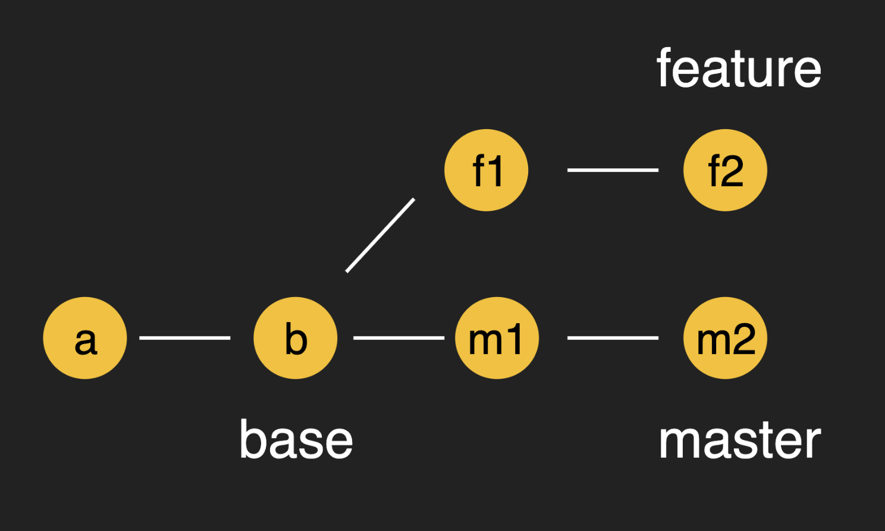
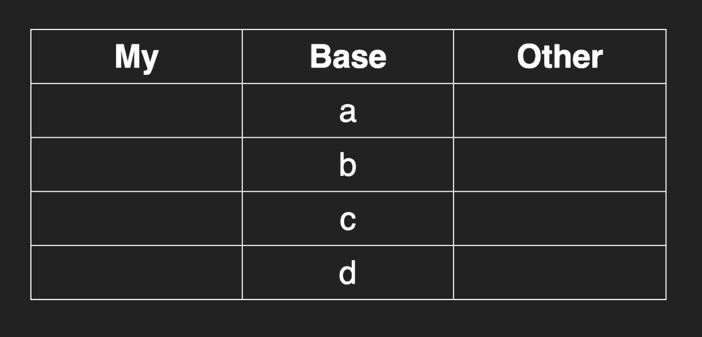
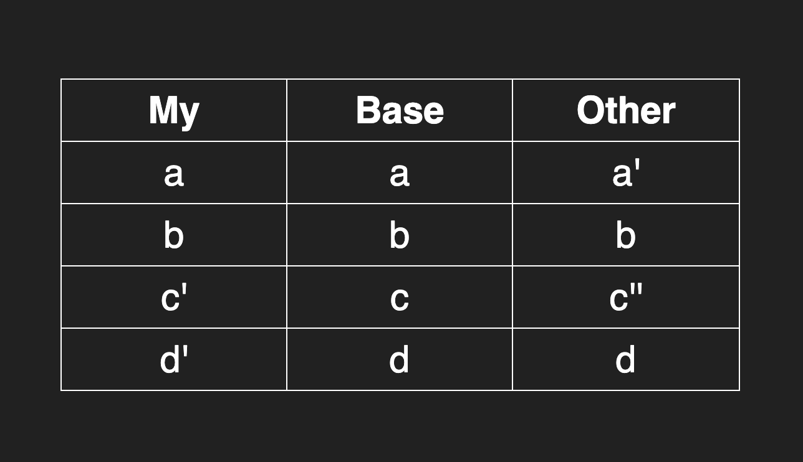
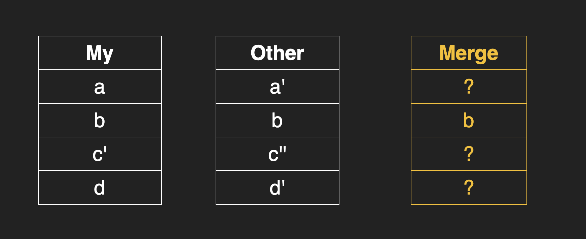
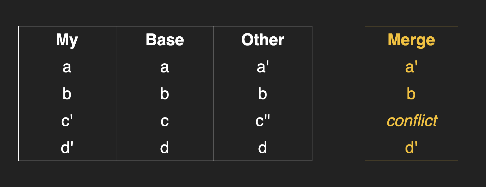
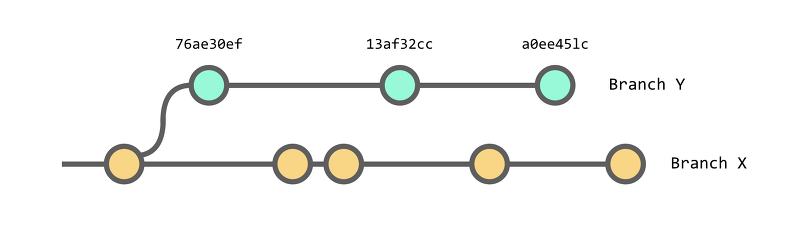
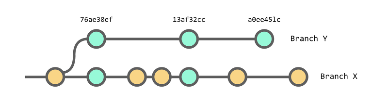

## Merge에 대해서

- merge는 git으로 버전관리를 수행함에 있어서 핵심을 관통하는 개념이기 때문에 자세하게 공부해야 할 필요가 있음
- merge의 2가지 방식에 대한 이해
  1. fast forward merge
  2. three way merge
- merge 진행시 충돌 해결 방법에 대한 이해

### fast-forward-merge

- master 브랜치에서 파생된 기능 브랜치의 작업이 종료된 후 병합하는 과정에서, master 브랜치에서 또 다른 파생 브랜치가 없다면 master의 포인터를 기능 브랜치로 옮겨주기만 하면 병합이 완료됨

```bash
# original

      A---B---C topic
     /
D---E master

# fast forward merge

      A---B---C master
     /
D---E
```

- 이러한 fast forward 병합의 경우 기존의 topic이라는 브랜치가 있었는지도 모르게 병합이 되는데, 이러한 방식을 선호하는 경우와 그렇지 않은 경우가 있음
- 기본적으로는 fast forward 방식으로 merge가 수행되지만, 명시적으로 fast forward를 수행하지 않도록 옵션을 줄 수 있는데 `—no-ff` 옵션을 주면 됨

```bash
# original

      A---B---C topic
     /
D---E master

# no fast forward (with --no-ff)

      A---B---C topic
     /        |
D---E---------F master (merge commit)
```

- 이때 F는 새로운 커밋으로 작성됨 (Merge branch ‘topic’)

### three-way-merge

- master 브랜치에서 직접 파생된 브랜치로 fast forward가 가능한데 비해, master 브랜치의 이전 커밋으로부터 파생된 브랜치를 master 브랜치로 merge하기 위해서는 three-way-merge 방식을 이용해야 함

```bash
# original

      A---B---C master
     /
D---E---F feature

# three way merge

      A---B---C---G master (merge commit)
     /           /
D---E---F-------- feature
```

- G는 merge를 하기 위한 전용 commit임에 주목
- 왜 three way merge를 수행하는것이 좋은걸까?
  - 비교를 위해 필요한 3개의 커밋을 정리하면 다음과 같음
    
    1. 현재 브랜치의 커밋
    2. 병합 대상 브랜치의 커밋
    3. 두 브랜치의 공통 조상이 되는 커밋 (base)
- 공통 조상인 Base에 커밋되어 변경된 부분이 `a,b,c,d`라고 가정하고 다음 표로 관리한다고 생각해보자
  
- 여기서 현재 브랜치 (My)와 병합 대상 브랜치 (Other)에서 변경된 내역은 각각 아래의 표와 같다
  
- 첫번째 a를 보게 되면 현재 브랜치에서는 변경된것이 없고 병합 대상 브랜치에서만 변경이 일어났다. 두번째 브랜치에서는 양쪽 다 변경이 없으며, c는 둘다 변경이 일어났다. d는 현재 브랜치에서만 변경이 일어났음을 알 수 있다.
- 이때 Base가 없다고 가정하면 다음과 같은 일이 발생함
  
- 2 way merge의 경우에는 양쪽에서 동일한 코드로 보이는 b를 제외하면 어떤 코드를 취해야 하는지 알 수 없으므로 충돌로 판정이 될 수밖에 없음
- 그러나 공통 조상을 포함하여 3 way merge를 이용할 경우 자동으로 어떤 커밋을 취해야 할지 그 자리에서 결정할 수 있음
  

### merge

```bash
git merge [-n] [--stat] [--no-commit] [--squash] [--[no-]edit]
	[--no-verify] [-s <strategy>] [-X <strategy-option>] [-S[<keyid>]]
	[--[no-]allow-unrelated-histories]
	[--[no-]rerere-autoupdate] [-m <msg>] [-F <file>]
	[--into-name <branch>] [<commit>…]
git merge (--continue | --abort | --quit)
```

- 두개 이상의 commit을 합침
  - 기존 브랜치에서 갈라져 나온 각기 다른 commit들(별도의 branch로서 명명되어 관리되고 있는 그룹)을 현재의 브랜치로 병합함
- 다른 repository에서 `git pull`을 통해서 변경 사항을 병합하는것과 로직은 동일함, 다만 merge의 경우에는 동일한 repository에서 수행된다는것이 차이점
  - 기타 merge 전략등에 대해서는 공식문서를 참고할것
    [Git - git-merge Documentation](https://git-scm.com/docs/git-merge)

### deal with conflict

- merge를 진행하게 되면 그 결과로 변경사항이 현재 브랜치에 적용되게 됨
- fast forward merge는 충돌이 발생하지 않음 (현재 브랜치는 과거로부터의 변경이력을 그대로 보존하고 있기 때문에, 덮어씌우기를 해도 문제 없기 때문임
- three way merge를 진행하게 되면 과거의 커밋으로부터 파생하여 변경이 발생하게 되는데, 이때 현재 브랜치와의 변경사항이 충돌할 가능성이 있음
- 충돌이 발생하게 되면 git은 충돌파일에 메시지를 남기게 됨

```bash
Here are lines that are either unchanged from the common
ancestor, or cleanly resolved because only one side changed,
or cleanly resolved because both sides changed the same way.
<<<<<< yours:sample.txt
Conflict resolution is hard;
let's go shopping.
=======
Git makes conflict resolution easy.
>>>>>> theirs:sample.txt
And here is another line that is cleanly resolved or unmodified.
```

- 충돌을 해결하기 위해서 2가지 해결방안이 있음
  1. merge를 하지 않고 이전 상태로 되돌림 (merge 취소)
     - HEAD를 이전 병합 이전 상태로 되돌림
     - `git merge —abort` 명령어를 입력하면 됨
  2. 충돌을 해결하고 merge를 진행
     - conflict가 마킹된 파일을 열어 내용을 수정함
     - 대상 파일을 git add로 추가한 뒤, `git commit` 또는 `git merge —continue`를 통해 병합 진행
     - `git merge —continue` 명령어로 병합을 진행할 경우 commit 하기 전에 중단된 merge가 존재하는지 다시한번 확인하는 과정을 거침
- merge를 하기 위한 공식문서에서 제안하는 방법들

  1. `mergetool`을 이용

     ```bash
     git mergetool [--tool=<tool>] [-y | --[no-]prompt] [<file>…]
     ```

     - 병합시 충돌을 해결하는 도구들을 이용해서 충돌을 해결함
     - `git merge`를 이용해서 병합을 진행한 후에 충돌이 발생하면 `git mergetool`을 이용할 수 있음
     - 기본 설정에서는 `mergetool`을 이용해서 merge 변경사항을 적용하고 나면 `filename.orig`가 생기는데, 이를 없애고 싶으면 `git config --global mergetool.keepBackup false`를 이용해서 옵션을 끄자
         <aside>
         💡 `mergetool.keepBackup` After performing a merge, the original file with conflict markers can be saved as a file with a `.orig` extension. If this variable is set to `false` then this file is not preserved. Defaults to `true` (i.e. keep the backup files).
         
         </aside>

  2. `git diff`를 이용
  3. `git log —merge -p`를 이용
  4. `git show :1:filename`을 이용해서 오리지널 파일을 확인

### rebase

```bash
git rebase [-i | --interactive] [<options>] [--exec <cmd>]
	[--onto <newbase> | --keep-base] [<upstream> [<branch>]]
git rebase [-i | --interactive] [<options>] [--exec <cmd>] [--onto <newbase>]
	--root [<branch>]
git rebase (--continue | --skip | --abort | --quit | --edit-todo | --show-current-patch)
```

- 현재 브랜치의 파생점(원본 커밋)을 변경함
- 대상 옵션 중 `<branch>` 가 정의되지 않으면 기본적으로 현재 브랜치를 rebase 하게 됨
- 대상 옵션 중 `<upstream>` 이 정의되지 않으면 branch.<name>.remote와 branch에 upstream이 설정됨
  - upstream이란?
    - 다른 사람의 git을 fork한 경우 내 remote repository(github)가 origin이 됨
    - 이때 fork의 원본 저장소가 upstream이 되며 origin과 upstream 모두 remote 저장소임
    - origin과 구별하기 위해 upstream이라는 명칭을 사용
- rebase에 대한 자세한 설명
  [🎢 Git Rebase 활용하기](https://velog.io/@godori/Git-Rebase)

### cherry-pick

```bash
git cherry-pick [--edit] [-n] [-m <parent-number>] [-s] [-x] [--ff]
		  [-S[<keyid>]] <commit>…
git cherry-pick (--continue | --skip | --abort | --quit)
```

- 다른 브랜치에 있는 커밋을 선택적으로 내 브랜치에 적용하고자 할때 사용
- 예를 들어 다음과 같은 상황이 진행된다고 가정하자



- 이때 `git cherry-pick`을 이용해서 `76ae30ef` `13af32cc`를 브랜치 X로 복사하고 싶을 경우
  ```bash
  git cherry-pick 76ae30ef 13af32cc
  ```
  - 가져오고 싶은 커밋의 해시코드를 입력해주면 됨



- 그러면 그림과 같이 브랜치 Y의 커밋이 브랜치 X로 복사된 것을 확인할 수 있음
- cherry-pick은 작업중인 다른 브랜치의 내용에서 종속성이 발생한 개발내용이 추가되었을 경우나 실수로 다른 브랜치에 커밋내용을 추가해버렸을때 원래 작업대상이었던 브랜치로 작업을 가져와야 할 경우 등에 사용이 가능
