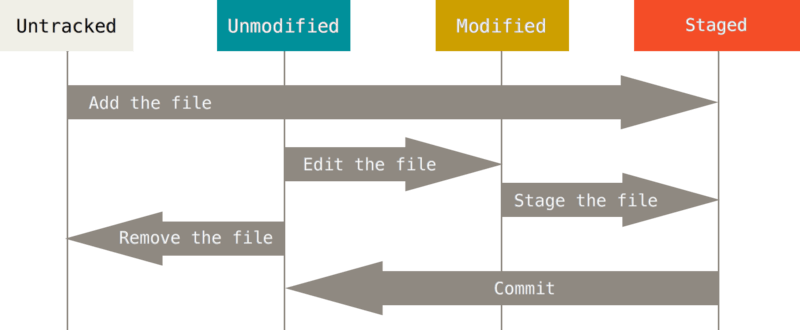

## Git의 기본 컨셉

- 깃의 파일관리 흐름에서 중요한 저장소 개념을 먼저 이해
  1. working tree
  2. staging area
  3. .git directory
  4. remote storage
- 깃의 변경이력(커밋)은 어떻게 변경사항을 확인할수 있는지 이해

### working tree

- 사용자가 작업을 수행하는 디렉토리로서 일반 디렉토리와 동일함
- 다만, 깃은 원본과의 변경점을 지속해서 추적하고 있으며 원본과의 변경 내용을 확인할 수 있음
- working tree에서 관리되는 파일은 2가지 형태가 존재
  
  1. untracked
     - 새로 만들어진 파일
     - git init으로 새롭게 디렉토리에 변경사항 관리를 시작했을 당시, 존재하고 있던 파일
     - 추적되지 않는 상태라는 것은, 원본파일로서 아직 등록이 되어 있지 않다는것을 의미하기 때문에, 최초 등록을 하지 않는 한 과거의 이력을 확인할 수 없음
  2. tracked
     - 깃이 한번 추적을 시작하여 (추가가 됨) 지속적으로 변경사항을 관리하고 있는 상태
     1. unmodified
        - 추적하는 원본파일에 대비 변경점이 없는 경우
     2. modified
        - 추적하는 원본파일에 대비 변경점이 있는 경우
        - 이 경우에는 add 명령을 통해 staging area로 이동이 가능함

### staging area

- working tree에서 작업이 완료된 파일을 staging area에 추가할 수 있음
- staging area는 최종적으로 변경이 확정되는 commit 전에 변경내용을 보관하는 장소임

### .git directory

- commit을 수행하여 staging area에서 변경 확정된 내용이 commit단위로 이력으로 남겨지는 장소
- 깃은 변경이력을 모두 파일로 보관하고 있고, 이러한 내용은 로컬 디렉토리로서 개별적으로 관리됨

### remote storage (remote repository)

- 기본적으로 .git은 로컬 디렉토리로서 기능을 수행하지만, 이러한 내용을 원격지 서버에도 복사하여 저장할 수 있음
- .git을 원격지 서버에 업로드 하고, 해당 내용을 받아오면 동일한 변경이력과 소스를 확인하면서 작업할수 있음

### Git의 변경사항 확인방법

- 깃은 각각의 변경사항에 대해서 스냅샷마다 SHA-1 방식의 hash키를 작성하여 남기는 방식을 취하고 있음
- 커밋에는 이러한 스냅샷 해시외에도 개별 메시지와 담당자, 날짜와 시간등과 같은 정보도 포함되어 있음
