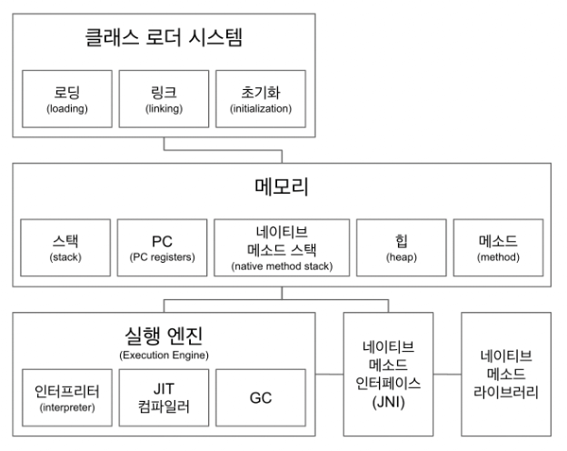

# `JVM` 구조

## 클래스 로더 시스템

- `.class` 파일에서 바이트코드를 읽고 메모리에 저장
- 로딩 → 클래스를 읽어오는 과정
- 링크 → 레퍼런스를 연결하는 과정
- 초기화 → `static` 값들 초기화 및 변수에 할당

## 메모리

- 메소드 영역에는 클래스 수준의 정보 (클래스 이름, 부모 클래스 이름, 정적 메소드 변수) 저장 → 공유 자원
  - 공유자원은 다른 영역에서도 접근이 가능한 부분
  - 런타임 상수 풀 (`Run-time constant pool`)
    - 런타임 상수 풀은 메소드 영역 밖에 존재하고, `JVM`에 의해 클래스나 인터페이스가 만들어질때 같이 만들어짐
    - 런타임 상수 풀은 `constant_pool` 이라는 클래스 혹은 인터페이스에 적용될수 있는 테이블을 관리
    - 여기에는 모든 리터럴들이 저장됨
    - 상수 풀은 동적이라 계속해서 메모리를 적재하게 되는데, 물리적 메모리를 초과할 경우 `OutOfMemoryError`가 발생할 수 있음
- 힙 영역에는 객체를 저장 → 공유 자원
  - 힙 영역에는 클래스의 객체들과 배열들이 저장됨
  - 힙 영역은 여러 쓰레드에서 공통으로 참조하고 공유하는 영역
  - `GC`는 이 영역을 정리하기 위해 존재
    - `VM`이 시작될때 만들어지는 영역으로, `GC`에 의해 자동으로 메모리를 반환하게 됨
  - 할당할 충분한 여분의 메모리가 없을 경우에는 `JVM`에 의해 `OutOfMemoryError`가 발생함
- 스택 영역에는 쓰레드마다 런타임 스택을 만들고, 그 안에 메소드 호출을 스택 프레임이라 부르는 블럭으로 쌓음 → 쓰레드가 종료하면 런타임 스택도 사라짐
  - `JVM` 스택은 스택 프레임을 저장하기 위해 사용됨
  - `JVM`은 스택을 직접 조작하지 않으며, 스택 프레임을 저장하기 위한 용도로만 사용함
  - 스택의 메모리는 고정된 것과 동적인것이 둘다 존재하는데, 여기서 동적의 의미는 필요한 경우에는 자동으로 확장되는 것을 말함
  - `JVM` 스택 프레임은 메소드가 실행될때 만들어지며 동적으로 연결됨
    - 따라서 매번 쓰레드가 만들어질때마다 스택 프레임을 생성해서 관리하게 됨
    - `StackOverflowError`
      - 이 에러는 고정된 사이즈의 `JVM` 스택에서 발생할수 있는데, 프로그램을 실행하면서 당초 할당된 스택 사이즈보다 더 많은 양의 데이터를 쌓을 경우 발생할 수 있음
    - `OutOfMemoryError`
      - 이 에러는 동적 사이즈의 `JVM` 스택에서 발생하는데, 추가적인 용량이 필요할 경우 메모리에서 동적으로 가져다가 사용하지만, 메모리 자체의 크기가 더이상 커버할 수 없을 경우에 발생하는 에러임
  - 예로 자바에서 어떤 에러가 발생했을 경우에 `printStackTrace()`를 통해서 스택을 출력하게 되면, 현재 런타임 스택에 어떤 것들이 쌓여있는지 출력하게 됨
- PC(`Program Counter`) 레지스터
  - 쓰레드마다 쓰레드 내 현재 실행할 `instruction`의 위치를 가리키는 포인터가 생성됨
  - 일반적인 컴퓨팅 아키텍쳐에서 말하는 `PC`는 어떤 상황에서도 현재 실행하는 명령을 추적하는 포인터와 같은 것을 의미하며, 자바에서도 이것은 동일함
  - 단, 자바의 경우에는 멀티 쓰레드를 지원하기 때문에 `PC`는 새로운 쓰레드가 만들어질 때 마다 매번 생성되게 됨
  - 그래서 자바에서는 `PC`가 각 쓰레드가 만들어지면 해당 쓰레드 내의 실행상태를 가리키게 되는데, 해당 메소드가 네이티브라면 `PC`는 `undefined` 상태가 됨
- 네이티브 메소드 스택
  [Java JVM Run-time Data Areas - Javapapers](https://javapapers.com/core-java/java-jvm-run-time-data-areas/#Program_Counter_PC_Register)
  - `ex) Thread.currentThread();`
    - `C`로 구현되어 있지만 자바에서 `JNI`를 경유해서 사용할수 있는 `native` 메소드
    - JNI를 이용해서 네이티브 메소드를 구현하는 방법에 대해서는 다음의 기술 블로그를 참조해보자
      [A Simple Java Native Interface (JNI) example in Java and Scala](https://schlining.medium.com/a-simple-java-native-interface-jni-example-in-java-and-scala-68fdafe76f5f)
  - 네이티브 메소드를 지원하는 `JVM`에서는 네이티브 메소드 스택을 별도로 가지게 됨
    - 네이티브 메소드는 네이티브 메소드 스택을 전용으로 이용함
    - 따라서 네이티브 메소드를 적재할 수 없는 `JVM`의 경우 이 영역이 불필요하게 됨
  - 네이티브 메소드 스택은 일반 `JVM` 스택과 동일하게 고정되거나 동적으로 관리됨
    - 따라서 네이티브 메소드 스택도 `StackOverflowError`나 `OutOfMemoryError`를 발생시킬 수 있음

## 실행 엔진

- 인터프리터
  - 자바 소스코드에서 컴파일되어 생성된 바이트코드(`class` 파일)을 한줄씩 해석하고 실행
    - 해석 → 바이트코드를 네이티브 코드로 전환하는 것을 의미
  - 한줄씩 반복하다 보면 중복되는 바이트코드가 있을텐데, 이를 반복적으로 수행하면 해당 부분에서 오버헤드가 발생할 수 있음
- `JIT`(`Just In Time`) 컴파일러
  - 인터프리터의 효율을 높이기 위해, 인터프리터가 반복하는 코드를 발견하면 해당 코드들을 모두 네이티브 코드로 바꿈
  - 인터프리터는 네이티브 코드를 발견하면 바로 사용하기 때문에 효율이 올라감
- `GC`(`Garbage Collector`)
  - 더이상 참조되지 않는 객체들을 모아서 정리
