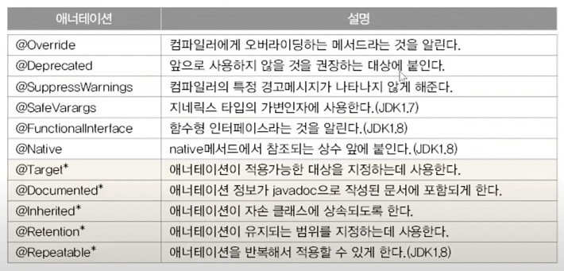

# Annotation

## 애너테이션(`Annotation`)이란?

- 주석처럼 프로그래밍 언어에 영향을 미치지 않으면서도, 유용한 정보를 제공

### 이전의 코드 문서화 (`Annotation`의 등장 배경)

- `*.java` 소스코드가 있을 때, 이전에는 소스코드와 해당 소스코드에 대한 설명 문서를 별개로 작성함
- 소스코드를 변경하면 문서도 변경해야 하지만, 소스코드 변경 후에 문서 변경을 잊거나 하는 일이 종종 발생
  - 소스코드와 문서 불일치로 인해 신규 유입 개발자등이 고통받음
- 이를 해결하기 위해 소스코드에 문서를 포함시키려는 시도가 등장 (`javadoc`)
  - 소스코드에 주석을 달아두면, `javadoc`이 주석을 취합해서 문서화를 자동으로 처리 → Profit..!!
- 클래스에서 마찬가지로, 클래스를 생성한 후에 해당 클래스에 대한 각종 설정을 `XML` 문서로 정리했는데 (매핑, 기타 설정) 동일한 문제가 발생
- 이를 해결하기 위해 소스코드에 설정 정보를 포함시키기 시작 (`annotation`)
  - `XML` 문서를 따로 공유할 필요 없음

### Annotation Interface

```java
// 애너테이션의 조상인 Annotation은 인터페이스로 구현되어 있음
public interface Annotation {}
```

### 애너테이션의 사용 예

```java
@Test // 이 메서드가 테스트 대상임을 테스트 프로그램에 알림 (JUnit - 단위테스트 프로그램)
public void method() {
	...
}
```

## 표준 애너테이션



자바에서 기본적으로 제공하는 표준 애너테이션 (\*가 붙은 것은 메타 애너테이션)

- 자바에서 제공하는 애너테이션
- 메타 애너테이션은 애너테이션을 만들때 사용

### `@Override`

- 오버라이딩을 올바르게 했는지 컴파일러가 체크하게 함
- 오버라이딩을 할 때 메서드 이름을 잘못적는 실수를 하는 경우가 많음
- `ASIS`

  ```java
  class Parent {
  	void parentMethod() {}
  }

  class Child extends Parent {
  	void parentmethod() {}  // 부모의 메서드와 철자가 다름 Typo Issue
  }
  ```

- `TOBE` → 오버라이딩을 할 때는 메서드 선언부 앞에 `@Override`를 붙이자

  ```java
  class Parent {
  	void parentMethod() {}
  }

  class Child extends Parent {
  	@Override
  	void parentmethod() {}  // ERROR: method does not override or implement a method
  }
  ```

### `@Deprecated`

- 앞으로 사용하지 않을 것을 권장하는 필드나 메서드에 붙임
- `@Deprecated`의 사용 예, `Date` 클래스의 `getDate()` 함수
  ```java
  @Deprecated
  public int getDate() {
  	return normalize().getDayOfMonth();
  }
  ```
- 안쓰는거 없애버리지 왜 저런식으로 관리하는가?
  - 하위 호환성을 중요시 하기 때문에, `JDK` 업데이트를 하더라도 문제가 발생하지 않도록 배려
- `@Deprecated`가 붙은 대상이 사용된 코드를 컴파일하면 나타나는 메시지
  ```java
  Note: ****.java uses or overrides a deprecated API.
  Note: Recompile with -Xlint:deprecation for details.
  ```

### `@FunctionalInterface`

- 함수형 인터페이스에 붙이면, 컴파일러가 올바르게 작성했는지 체크해줌
- 함수형 인터페이스에는 하나의 추상메서드만 가져야 한다는 제약이 있음

```java
@FunctionalInterface
public interface Runnable {
	public abstract void run();   // 추상메서드
	public abstract void test();  // ERROR
}
```

### `@SupressWarnings`

- 컴파일러의 경고메시지가 나타나지 않게 억제
- 괄호()안에 억제하고자 하는 경고의 종류를 문자열로 지정

```java
@SupressWarning("unchecked")    // 지네릭스(Generics)와 관련된 경고 비표시
ArrayList list = new ArrayList();    // 원래는 <E>를 지정해줘야 함
list.add(obj);
```

- 둘 이상의 경고를 동시에 억제하려면 다음과 같이 작성

```java
@SupressWarning({"deprecation", "unchecked", "varargs"})
```

- `-Xlint` 옵션으로 컴파일하면 경고메시지를 확인할 수 있음
- 괄호[]안이 경고의 종류

## 메타 애너테이션 (`Meta Annotation`)


- 메타 애너테이션은 애너테이션을 위한 애너테이션
- 메타 애너테이션은 `java.lang.annotation` 패키지에 포함

### `@Target`

- 애너테이션을 정의할 때, 적용 대상 지정에 사용

```java
@Target({TYPE, FIELD, METHOD, PARAMETER, CONSTRUCTOR, LOCAL VARIABLE})
@Retention(RetentionPolicy.SOURCE)
public @interface SupressWarnings {
	String[] value();
}
```


### `@Retention`


- 애너테이션이 유지(`retention`)되는 기간을 지정하는데 사용
- 컴파일러에 의해 사용되는 애너테이션의 유지 정책은 `SOURCE`
  ```java
  @Target(Element.METHOD)
  @Retention(RetentionPolicy.SOURCE)
  public @interface Override {} // 컴파일러를 위한 애너테이션
  ```
- 실행시에 사용 가능한 애너테이션의 정책은 `RUNTIME`
  ```java
  @Documented
  @Retention(RetentionPolicy.RUNTIME)
  @Target(ElementType.TYPE)
  public @interface FunctionalInterface {}
  ```

### `@Documented`

- `javadoc`으로 작성한 문서에 포함시키려면 `@Documented`를 붙인다

```java
@Documented
@Retention(RetentionPolicy.RUNTIME)
@Target(ElementType.TYPE)
public @interface FunctionalInterface {}
```

### `@Ingerited`

- 애너테이션을 자손 클래스에 상속하고자 할 때, `@Inherited`를 붙임

```java
@Inherited    // @SuperAnno가 자손까지 영향 미치게
@interface SuperAnno {}

@SuperAnno
class Parent {}

class Child extends Parent {} // Child에 애너테이션이 붙은 것으로 인식
```

### `@Repeatable`

- 반복해서 붙일 수 있는 애너테이션을 정의할 때 사용

```java
@Repeatable(ToDos.class) // ToDo애너테이션을 여러번 반복해서 쓸 수 있게 함
@interface ToDo {
	String value();
}
```

- `@Repeatable`이 붙은 애너테이션은 반복해서 붙일 수 있음

```java
@ToDo("delete test codes.")
@ToDo("override inherited methods.")
class MyClass {
	...
}
```

- `@Repeatable`인 `@ToDo`를 하나로 묶을 컨테이너 애너테이션도 정의해야 함

```java
@interface ToDos {  // 여러개의 ToDo애너테이션을 담을 컨테이너 애너테이션 ToDos
	ToDo[] value();  // ToDo애너테이션 배열타입의 요소를 선언. 이름이 반드시 value이어야 함
}
```

## 애너테이션 타입 정의

### 정의부 (`Definition Part`)

- 애너테이션은 직접 만들어 쓸 수 있음

```java
@interface DateTime{
	String yymmdd();
	String hhmmss();
}
```

- 애너테이션의 메서드는 추상 메서드이며, 애너테이션을 적용할때 지정 (순서는 관계 없음)

```java
@interface TestInfo {
	int count();
	String testedBy();
	String[] testTools();
	TestType testType();  // enum TestType { FIRST, FINAL }
	DateTime testDate();  // 자신이 아닌 다른 애너테이션(@DateTime)을 포함할 수 있음
}
```

### 사용법 (Usage)

```java
@TestInfo(
	count=3, testedBy="Kim",
	testTools={"JUnit", "AutoTester"},
	testType=TestType.FIRST,
	testDate=@DateTime(yymmdd="160101", hhmmss="235959")
)
public class NewClass { ... }
```

## 애너테이션의 요소

- 적용시 값을 지정하지 않으면 사용될 수 있는 기본값 지정 가능 (null제외)

```java
@interface TestInfo {
	int count() default 1;  // 기본값을 1로 지정
}

@TestInfo  // @TestInfo(count=1)과 동일
public class NewClass { ... }
```

- 요소가 하나이고 이름이 `value`일 때는 요소의 이름 생략 가능

```java
@interface TestInfo {
	String value();
}

@TestInfo("passed")  // @TestInfo(value="passed")
public class NewClass { ... }
```

- 요소의 타입이 배열인 경우, 괄호{}를 사용해야 함

```java
@interface TestInfo {
	String[] testTools();
}

@TestInfo(testTools={"JUnit", "AutoTester"})
@TestInfo(testTools="JUnit") // 값이 하나면 괄호 생략 가능
@TestInfo(testTools={}) // 단, 값이 없을땐 반드시 괄호를 넣어야 함
```

### 애너테이션 요소의 규칙

- 애너테이션의 요소를 선언할 때 아래의 규칙을 반드시 지켜야 함
  - 요소의 타입은 기본형, String, enum, 애너테이션, Class만 허용됨
  - 괄호() 안에 매개변수를 선언할 수 없음
  - 예외를 선언 할 수 없음
  - 제네릭을 타입 매개변수로 정의할 수 없음

### 애너테이션 정보 가져오기

```java
@interface TestInfo {
	int count();
	String testedBy();
	String[] testTools();
	TestType testType();  // enum TestType { FIRST, FINAL }
	DateTime testDate();  // 자신이 아닌 다른 애너테이션(@DateTime)을 포함할 수 있음
}

@TestInfo(
	count=3, testedBy="Kim",
	testTools={"JUnit", "AutoTester"},
	testType=TestType.FIRST,
	testDate=@DateTime(yymmdd="160101", hhmmss="235959")
)
class MyClass {
	public static void main(String args[]) {
		Class<MyClass> cls = MyClass.class;

		TestInfo anno = cls.getAnnotation(TestInfo.class);
		System.out.println("anno.testdBy()=" + anno.testedBy();
		...
	}
}

```

## 모든 에너테이션의 조상

- java.lang.annotation.Annotation
- Annotation은 모든 애너테이션의 조상이지만 상속은 불가

```java
@interface TestInfo extends Annotation {} // ❌ ERROR
```

- Annotation은 인터페이스이기 때문

```java
package java.lang.annotation;

public interface Annotation {
	boolean equals(Object obj);
	int hashCode();
	String toString();

	Class<? extends Annotation> annotationType();
}
```

- 인터페이스이지만 implements나 구현이 필요 없는 이유는 컴파일러가 자동으로 해주기 때문임

## 마커 애너테이션 (Marker Annotation)

- 요소가 하나도 정의되지 않은 애너테이션

```java
@Target(ElementType.METHOD)
@Retention(RetentionPolicy.SOURCE)
public @interface Test {}

@Test    // Test툴에게 테스트 대상 클래스임을 알림
public class MyClass {}
```
