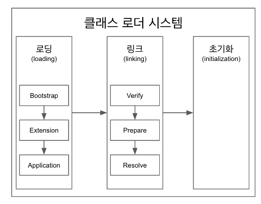

# 클래스 로더



## 클래스 로더

- 로딩, 링크, 초기화의 순서로 진행

### 로딩

- 클래스 로더가 `.class` 바이트코드 파일을 읽고 그 내용에 따라 적절한 바이너리 데이터를 만들어 “메소드" 영역에 저장
- 메소드 영역에 저장하는 데이터
  - `FQCN` (`Fully Qualified Class Name`) 패키지 이름까지 전부 포함한 유니크한 클래스명
  - 클래스, 인터페이스, `Enums`
  - 메소드와 변수
- 로딩이 끝나면 클래스 타입의 `Class` 객체를 생성하여 “힙" 영역에 저장

### 링크

- `verify`, `prepare`, `resolve`(`optional`)의 세 단계로 나눠져 있음
- `verify`
  - `.class` 파일의 형식이 유효한지 검사
- `prepare`
  - 클래스 변수(`static` 변수)와 기본값에 필요한 메모리를 준비
- `resolve`
  - 심볼릭 메모리 레퍼런스를 메소드 영역에 있는 실제 레퍼런스로 교체
  - 심볼릭 메모리 레퍼런스
    - 기본 자료형을 제외한 모든 타입(클래스와 인터페이스)을 명시적인 메모리 주소 기반의 레퍼런스가 아닌 심볼릭 레퍼런스를 통해 참조

### 초기화

- `static` 변수의 값을 할당

## 클래스 로더의 3가지 타입

### 부트스트랩(`bootstrap`) `class loader`

- 모든 `JVM` 구현에는 신뢰되는 클래스들을 로딩하기 위해 부트스트랩 클래스 로더가 필요
- 부트스트랩 클래스 로더는 `${JAVA_HOME}/jre/lib` 디렉토리에 존재하는 핵심 `Java API`들을 로드
- `Java`가 아닌 `C`나 `C++`와 같은 네이티브 언어로 구현되어 있음

### ~~확장(`Extension`)~~ 플랫폼(`platform`) `class loader`

- 부트스트랩 클래스 로더의 자손
- `${JAVA_HOME}/jre/lib/ext` 또는 `java.ext.dirs` 시스템 속성으로 명시된 다른 디렉토리인 확장 디렉토리 안에 존재하는 클래스를 로드
- `Java`로 구현됨

### 시스템/앱(`system/app`) `class loader`

- 플랫폼 클래스 로더의 자손
- `application class` 경로로부터 클래스를 로드
- `Java`로 구현됨

```java
public class Test {
	public static void main(String[] args) {
		// String 클래스는 Bootstrap loader로부터 로드된다.
		// 부트스트랩 로더는 자바 객체가 아니다. 그러니 null이 나온다
    System.out.println(String.class.getClassLoader());

    // Test 클래스 Application loader로부터 로드된다.
    System.out.println(Test.class.getClassLoader());
  }
}
// output
null
sun.misc.Launcher$AppClassLoader@73d16e93
```
