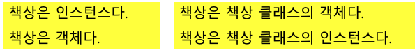
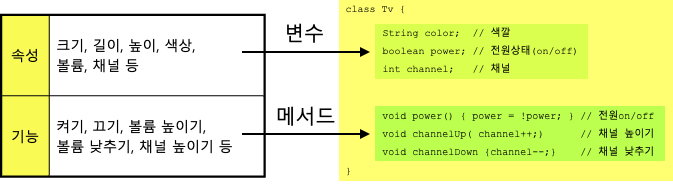
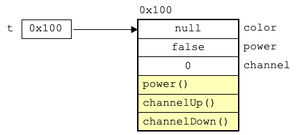
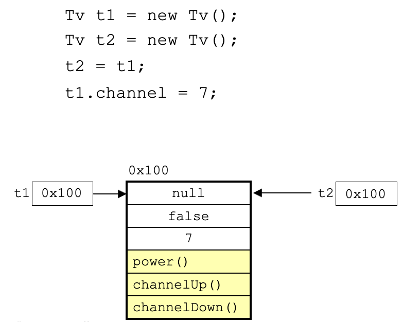
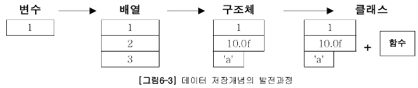

# 객체지향언어

## 객체지향언어

### 객체지향언어의 역사

- 프로그램의 규모가 점점 커지고, 사용자들의 요구가 빠르게 변화하는 상황
- 절차적 언어로는 극복하기 어려운 한계를 느끼고 객체지향 언어를 이용한 개발방법론이 등장

### 객체지향 언어

- 코드의 재사용성이 높고
- 유지보수가 용이
- 중복 코드를 제거

### 핵심개념

- 캡슐화
- 상속
- 추상화
- 다형성

## 클래스와 객체

### 클래스와 객체의 정의와 용도

- 클래스의 정의
  - 클래스란 객체를 정의해 놓은 것
- 클래스의 용도
  - 클래스는 객체를 생성하는데 사용
- 객체의 정의
  - 실제로 존재하는 것
  - 사물 또는 개념
- 객체의 용도
  - 객체가 가지고 있는 기능과 속성에 따라 다름


### 객체와 인스턴스

- 클래스로부터 객체를 만드는 과정 → 인스턴스화
- 어떤 클래스로부터 만들어진 객체 → 인스턴스
- 객체는 인스턴스들을 포괄하는 전체적인 개념을 의미
- 인스턴스는 어떤 클래스로부터 만들어진 객체 그 자체를 의미



### 객체의 구성요소 (속성과 기능)

- 객체는 속성과 기능으로 이루어져 있음
  - 객체는 속성과 기능의 집합
  - 속성과 기능을 객체의 멤버(member → 구성요소)라고 함
- 속성은 변수, 기능은 메서드로 정의
  - 클래스를 정의할때 객체의 속성은 변수
  - 기능은 메서드



### 인스턴스의 생성과 사용

- 인스턴스의 생성방법

```java
클래스명 참조변수명; // 객체를 다루기 위한 참조변수 선언
참조변수명 = new 클래스명(); // 객체생성 후, 생성된 객체의 주소를 참조변수에 저장

Tv t; // Tv클래스 타입의 참조변수 t를 선언
t = new Tv(); // Tv인스턴스를 생성한 후, 생성된 Tv인스턴스의 주소를 t에 저장
```



- 인스턴스는 참조변수를 통해서만 다룰 수 있으며, 참조변수의 타입은 인스턴스의 타입과 일치해야 함
  - Tv인스턴스는 Tv타입의 참조변수로만 참조할 수 있다는 의미

```java
Tv t1 = new Tv();
Tv t2 = new Tv();
t2 = t1;
t1.channel = 7;
```



- 하나의 인스턴스를 여러 개의 참조변수가 가리키는 경우 (가능)
- 여러 개의 인스턴스를 하나의 참조변수가 가리키는 경우 (불가능)

### 객체 배열

- 기본형과 같이 객체 또한 배열로 다루는 것이 가능 “객체 배열”
- 객체의 주소를 가진 참조변수의 배열을 다루는 것

```java
Tv tv1, tv2, tv3;
Tv[] tvArr = new Tv[3]; // 각 Tv배열에는 null이 저장됨 (new로 생성한것은 배열)

// 객체를 생성해서 각 배열에 저장
tvArr[0] = new Tv();
tvArr[1] = new Tv();
tvArr[2] = new Tv();
```

## 클래스의 또 다른 정의

### 클래스 → 데이터와 함수의 결합



- 변수
  - 하나의 데이터를 저장할 수 있는 공간
- 배열
  - 같은 타입의 여러 데이터를 저장할 수 있는 공간
- 구조체
  - 타입에 관계없이 서로 관련된 데이터들을 저장할 수 있는 공간
- 클래스
  - 데이터와 함수의 결합 (구조체+함수)

### 클래스 → 사용자 정의 타입 (User-defined type)

- 프로그래머가 직접 새로운 타입을 정의할 수 있음
- 서로 관련된 값을 묶어서 하나의 타입으로 정의

```java
class Time {
	int hour;
	int minute;
	int second;
}

// 절차적 방식
int hour1, hour2, hour3;
int minute1, minute2, minute3;
int second1, second2, second3;

// 객체적 방식
Time t1 = new Time();
Time t2 = new Time();
Time t3 = new Time();
```

- 제약조건의 반영

1. 시, 분, 초는 모두 0보다 크거나 같아야 함
2. 시의 범위는 0~23, 분과 초의 범위는 0~59

- 절차지향적 언어들에서는 이러한 제약조건을 반영하기가 어려움
- 객체지향적 언어에서는 클래스 내부에 생성자를 통해 객체가 생성될때의 제약조건을 프로그램적(메서드)으로 처리할 수 있기 때문에 제약조건의 반영이 쉬움
