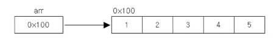
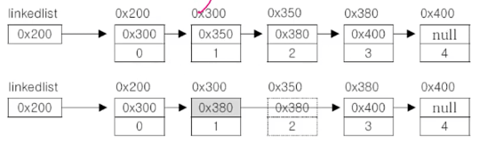

# 컬렉션 프레임웍과 핵심 인터페이스

## 컬렉션 프레임웍 (`collection framework`)

### 컬렉션 (`collection`)

- 여러 객체(데이터)를 모아 놓은 것을 의미

### 프레임웍 (`framework`)

- 표준화 정형화된 체계적인 프로그래밍 방식
  > `library` → 개발한 기능들의 집합
- 라이브러리와 달리 프로그래밍 방식까지 정의해서 생산성을 올리는 방법
- ex) `Spring framework`

### 컬렉션 프레임웍 (`collection framework`)

- 컬렉션(다수의 객체)을 다루기 위한 표준화된 프로그래밍 방식
- 컬렉션을 쉽고 편리하게 다룰 수 있는 다양한 클래스를 제공
  - 저장, 삭제, 검색, 정렬 (`CRUD`, `Sort`)
- java.util 패키지에 포함됨 (`JDK 1.2`)

### 컬렉션 클래스 (`collection class`)

- 다수의 데이터를 저장할 수 있는 클래스 (`Vector`, `ArrayList`, `HashSet`)

## 컬렉션 프레임웍의 핵심 인터페이스

## `Collection`

- `List`
- `Set`
- 공통 부분을 뽑아서 `Collection` 인터페이스를 작성

### `List`

- 순서가 있는 데이터의 집합
- 데이터의 중복을 허용
- ex) 대기자 명단 (`Waiting List`)
- 구현 클래스
  - `ArrayList`
  - `LinkedList`
  - `Stack`
  - `Vector`

### `Set`

- 순서를 유지하지 않는 데이터의 집합
- 데이터의 중복을 허용하지 않음
- ex) 양의 정수집합, 소수의 집합
- 구현 클래스
  - `HashSet`
  - `TreeSet`

### `Map`

- 키(`key`)와 값(`value`)의 쌍(`pair`)로 이루어진 데이터의 집합
- 순서는 유지되지 않고, 키는 중복을 허용하지 않으며, 값은 중복을 허용함
- ex) 우편번호, 지역번호(전화번호)
- 구현 클래스
  - `HashMap`
  - `TreeMap`
  - `Hashtable` (표준화 이전)
  - `Properties` (표준화 이전)

## `Collection` 인터페이스의 메서드

```java
// 추가
boolean add(Object o);
boolean addAll(Collection c);

// 삭제
boolean remove(Object o);
boolean removeAll(Collection c);
void clear();

boolean retinAll(Collection c);
// 지정한 컬렉션에서 매개변수의 컬렉션만 남기고 나머지는 삭제함
// 이로 인한 작업으로 컬렉션에 변화가 있었으면 true, 아니면 false

// 검색
boolean contains(Object o);
boolean contains(Collection c);
boolean isEmpty();

int size();
```

## `List` 인터페이스 (순서O, 중복O)

```java
// 추가
void add(int index, Object element);
boolean addAll(int index, Collection c);

// 삭제
Object remove(int index)

// 지정된 위치의 객체를 반환
Object get(int index);

// 지정된 위치에 객체를 저장
Object set(int index, Object element);

// 검색
int indexOf(Object o);
int lastIndexOf(Object o);

// 정렬
void sort(Comparator c);

// 지정된 범위에 있는 객체의 집합을 반환
List subList(int fromIndex, int toIndex);
```

## `Set` 인터페이스 (순서X, 중복X)

```java
// 컬렉션 인터페이스를 거의 그대로 상속
// 집합과 관련된 메서드가 일부 있음
// boolean은 메서드 수행으로 컬렉션에 변화가 있으면 true

// 컬렉션에 추가 (합집합)
boolean addAll(collection c);

// 컬렉션과의 부분집합을 확인
boolean containsAll(Collection c);

// 컬렉션에서 삭제 (차집합)
boolean removeAll(Collection c);

// 컬렉션과의 교집합을 남김
boolean retainAll(Collection c);
```

## `Map` 인터페이스 (순서X, 중복키X, 값중복O)

- 구현체 중 `HashMap`의 자손인 `LinkedHashMap`은 맵에 순서를 부여함
- 기본적으로 `Hashtable`과 `HashMap` 의 차이로는 `Hashtable`이 내장으로 동기화를 제공하지만, `HashMap`도 자손인 `ConcurrentHashMap`을 사용하면 동기화 제공 + `Hashtable`보다 빠름

```java
void clear();

// 맵에서 키나 밸류로 검색해서 있는지 확인하기
boolean containsKey(Object key);
boolean containsValue(Object value);

// 맵의 key-value pair를 Map.Entry객체의 Set으로 반환
Set entrySet();
// Map에 저장된 모든 key 객
Set keySet();
// Map에 저장된 모든 value 객체를 반환
Collection values();

// 맵끼리 같은지 확인
boolean equals(Object o);

// 맵으로부터 키로 객체를 찾기
Object get(Object key);

// 맵에 객체를 추가
Object put(Object key, Object value);
Object putAll(Map t);

// 맵에서 해당 키를 삭제
Object remove(Object key);

// 맵의 길이를 반환
int size();

```

## `ArrayList`

- `ArrayList`는 기존의 `Vector`를 개선한 것으로 구현원리와 기능적으로 동일
- `ArrayList`와 달리 `Vector`는 자체적으로 동기화 처리가 되어 있음
  - `ArrayList`는 동기화 처리가 안되어 있어 `thread-safe` 하지 않음
- `List` 인터페이스를 구현하므로, 저장 순서가 유지되고 중복을 허용
- 데이터의 저장공간으로 배열을 사용

### 생성자

```java
ArrayList(); // 빈 ArrayList를 생성
ArrayList(Collection c); // 컬렉션의 내용을 ArrayList로 생성
ArrayList(int initialCapacity); // 배열 갯수 지정 가능
```

### 메서드

```java
boolean add(Object o);
void add(int index, Object element);
boolean addAll(Collection c);
boolean addAll(int index, Collection c);

boolean remove(Object o);
Object remove(int index);
boolean removeAll(Collection c);
void clear();

int indexOf(Object o);
int lastIndexOf(Object o);
boolean contains(Object o);
Object get(int index);
Object set(int index, Object element); // 변경

List subList(int fromIndex, int toIndex);
Object[] toArray(); // 객체들의 배열을 반환
Object[] toArray(Object[] a);
boolean isEmpty();
void trimToSize();
int size();
```

## `ArrayList`에 저장된 객체의 삭제 과정

- `ArrayList`에 저장된 세 번째 데이터(`data[2]`)를 삭제하는 과정
- `list.remove(2);`의 동작과정

1. 삭제할 데이터 아래의 데이터를 한 칸씩 위로 복사해서 삭제할 데이터를 덮어씀
2. 데이터가 모두 한 칸씩 이동했으므로 마지막 데이터는 `null`로 변경
3. 데이터가 삭제되어 데이터의 개수가 줄었으므로 `size`의 값을 감소시킴

- 마지막 데이터를 삭제하는 경우, 과정 `1`번은 불필요
- `for`의 증감식을 이용해서 접근하며 삭제하는 프로세스를 할 경우 주의
  - `ArrayList`의 객체를 삭제하면 인덱스가 하나씩 당겨짐
  - 그래서 감소식으로 마지막 인덱스부터 삭제하는 전략을 이용

## `LinkedList` 배열의 장단점

### 배열의 장점

- 배열은 구조가 간단하고 데이터를 읽는데 걸리는 시간(`access time`)이 짧음
  
  - 연속적인 데이터이므로 요소를 읽을때 메모리에 직접 접근할경우 객체사이즈 \* 요소크기로 접근가능
  - O(1)

### 배열의 단점

- 크기를 변경할 수 없음
- 크기를 변경해야 하는 경우 새로운 배열을 생성 후 데이터를 복사해야 함
  1. 더 큰 배열 생성
  2. 값을 복사
  3. 참조변수의 값 변경
- 크기 변경을 막기 위해 큰 배열을 생성하면 메모리가 낭비됨
- 비 순차적인 데이터의 추가, 삭제에 시간이 많이 소비됨
  - 차례대로 추가, 삭제가 아닌 배열 중간의 데이터를 삭제하는 경우를 말함
  1. 값을 삭제
  2. 뒤 배열의 모든 값을 복사
- 순차적인 데이터의 추가, 삭제는 빠름
  - 배열의 값을 이동할 필요가 없어지기 때문임

## `LinkedList` 배열의 단점을 보완

- 배열의 크기변경, 비 순차적인 데이터의 추가, 삭제에서의 오버헤드를 해결하고자 나온 구현체
- 배열과 달리 `LinkedList`는 불연속적으로 존재하는 데이터를 연결 (`Link`)
- 이렇게 하면 단 한번의 참조변경으로 데이터를 삭제 가능
  
  - 이후에는 `GC`가 찾아와서 끊어진 `0x350`를 회수함
- `LinkedList`의 각 객체는 `Node`로 정의됨
  ```java
  class Node {
  	Node next; // 다음 노드의 주소값
  	Object obj; // 노드가 가리키는 실제 오브젝트 (데이터)
  }
  ```
- 데이터의 추가는 한번에 `Node` 객체 생성과 두번의 참조 변경으로 가능
  - 배열은 추가 위치에 따라서 그 이후에 데이터의 양에 따라서 처리시간이 가변적임
  - `LinkedList`는 두번의 오퍼레이션으로 정해져 있기 때문에 예측 가능

### 이러한 `LinkedList`도 단점이 있음

- 데이터의 접근성이 나쁨
  - 연속적인 데이터는 O(1)로 데이터 참조가 가능
  - `LinkedList` 처럼 불연속적인 데이터는 객체만큼의 오퍼레이션이 수행됨 O(n)
    - `LinkedList`의 객체 숫자에 따라서 처리시간이 가변적임
- 데이터의 접근성을 개선시키기 위해 `Doubly LinkedList`가 등장
  - 이중 연결리스트는 `Node`의 `next`와 `previous`를 동시에 가지고 있음
  - 앞뒤로 이동가능하기 때문에 살짝 접근성이 올라감
  - 여러 객체를 동시에 건너뛰는것은 여전히 불가능
- 접근성 개선은 `Doubly Circular LinkedList`도 존재함
  - 마지막 객체의 `next`가 원래는 `null`이었으나, `next`에 첫 객체의 주소를 담음
  - 첫 객체의 `previous`에는 마지막 객체의 주소를 담음
  - 이렇게 되면, `N`번째의 요소에 도달하기 위해 꼭 `next`를 거치지 않더라도 뒤에서 가깝다면 `previous`를 반복해서 접근 가능하기 때문에 최대 O(n/2)로 검색을 수행 가능

### 결론

- `ArrayList` → 읽기가 빠름, 순차 추가/삭제 빠름, 메모리 비효율성
- `LinkedList` → 읽기가 느림, 비순차 추가/삭제 빠름, 메모리 효율성

## 스택과 큐 (`stack and queue`)

### 스택 (`stack`)

- `LIFO` (`Last In First Out`) 구조
- 마지막에 저장된 것을 제일 먼저 꺼내게 됨

### 큐 (`queue`)

- FIFO (`First In First Out`) 구조
- 제일 먼저 저장한 것을 제일 먼저 꺼내게 됨

> 💡 스택 구현하기 위해 어떤것이 효율적?
> → `Array`
> 순차적으로 저장되고 빠져나가는 구조이기 때문에 배열이 효율적임
> 넣는것과 빠져나가는 것이 역순인게 포인트

> 💡 큐를 구현하기 위해서 어떤것이 효율적?
> → `LinkedList`
> 배열로 구현하면 첫번째 아이템을 삭제했을 경우에 모든 나머지 아이템을 재배열 해야 하기 때문에
> 이러한 경우에는 연결 리스트로 구현하는 것이 효율적이게 됨

### 스택 메서드

```java
// stack이 비었는지 알려줌
boolean empty();

// stack의 맨 위에 저장된 객체를 반환
// pop과 다르게 객체를 꺼내지는 않고 비었을때 EmptyStackException 발생
Object peek();

// 맨위의 객체를 꺼냄 비었을때 EmptyStackException 발생
Object pop();

// stack에 객체 저장
Object push(Object item);

// stack에서 객체를 찾아 위치를 반환, 못찾으면 -1, 주의점: 인덱스가 1부터 시작함
int search(Object o);
```

### 큐 메서드

```java
// 지정된 객체를 queue에 추가, 성공하면 true 저장공간이 부족하면 IlligalStateException
boolean add(Object o);

// queue에서 객체를 꺼내 반환, 비어있으면 NoSuchElementException
Object remove();

// 삭제없이 요소 읽기 peek과 달리 queue가 비어있으면 NoSuchElementException 발생
Object element();

// queue에 객체를 저장, 성공하면 true, 실패시 false
boolean offer(Object o); // 기본

// queue에서 객체를 꺼내 반환, 비었으면 null
Object poll(); // 기본

// 삭제없이 객체 읽기, queue가 비었으면 null
Object peek(); // 기본
```

- 큐는 인터페이스임 → 객체 생성이 불가능함
- 그럼 큐를 어떻게 사용할까?

  1. 직접 구현체 작성
  2. 준비된 구현체 사용

     - `LinkedList` (연결리스트가 큐네)

     ```java
     Queue q = new LinkedList();
     q.offer(Object o);
     Object o = q.poll();
     ```

## 스택과 큐 활용

### 스택의 활용 예

- 수식계산
  - `((3+2))*8/2` → 순서성 있는 계산의 경우
- 수식 괄호 갯수 검사
- `undo/redo`
- 브라우저의 앞으로/뒤로
  - 방문한 페이지를 스택에 담아두고 뒤로가기를 하면 `pop()`으로 꺼내면 됨
  - 뒤로가기를 하면 앞으로가기 스택에 이전 페이지를 `push()`

```java
package com.solarsdev.ch11;

import java.util.Stack;

public class StackEx1 {
    public static Stack<String> back = new Stack<>();
    public static Stack<String> forward = new Stack<>();

    public static void main(String[] args) {
        goUrl("1.네이트");
        goUrl("2.야후");
        goUrl("3.네이버");
        goUrl("4.다음");

        printStatus();

        goBack();
        System.out.println("= 뒤로 버튼을 누름 =");
        printStatus();

        goBack();
        System.out.println("= 뒤로 버튼을 누름 =");
        printStatus();

        goForward();
        System.out.println("= 앞으로 버튼을 누름 =");
        printStatus();

        goUrl("codechobo.com");
        System.out.println("= 새로운 주소로 이동 =");
        printStatus();
    }

    public static void printStatus() {
        System.out.println("back: " + back);
        System.out.println("forward: " + forward);
        System.out.println("현재 화면은 " + back.peek() + "입니다");
        System.out.println();
    }

    public static void goUrl(String url) {
        back.push(url);

        if (!forward.empty()) {
            forward.clear();
        }
    }

    public static void goForward() {
        if (!forward.empty()) {
            back.push(forward.pop());
        } else {
            // ToDo: 버튼 못누르게 막기
        }
    }

    public static void goBack() {
        if (!back.empty()) {
            forward.push(back.pop());
        }
    }
}
```

### 큐의 활용 예

- 최근 사용 문서 (`Recent files`)
  - 제일 오래된 문서를 리스트에서 삭제하고 최신을 추가
- 인쇄 작업 대기목록
- 버퍼 (`buffer`)

## `Iterator`, `ListIterator`, `Enumeration`

- 컬렉션에 저장된 데이터를 접근하는데 사용되는 인터페이스
- `Enumeration`은 `Iterator`의 구버전
- `ListIterator`는 `Iterator`의 접근성을 향상시킨 버전 (단방향 → 양방향)
  - `Doubly LinkedList`를 생각하자

### 메서드 (Iterator)

```java
boolean hasNext();
// 읽어 올 요소가 남아있는지 확인
// 있으면 true, 없으면 false를 반환

Object next();
// 다음 요소를 읽어들임
// next()를 호출하기 전에 hasNext()를 호출해서 읽을 요소가 있는지 확인하는 것이 안전

void remove();
// next()로 읽어 온 요소를 삭제
// next()를 호출한 다음에 remove()를 호출해야 함

void forEachRemainging(Consumer<? super E> action)
// 컬렉션에 남아있는 요소들에 대해 지정된 작업(action)을 수행
// 람다식을 사용하는 디폴트 메서드 (JDK 1.8~)
```

### 메서드 (`Enumeration`)

```java
boolean hasMoreElements();
Object nextElement();
```

### 만들어진 목적

- 컬렉션에 저장된 요소들을 읽어오는 방법을 표준화 한 것
- 컬렉션의 종류에는 다양한 것들이 있기 때문에, 각각의 구현체마다 읽어오는 방법이 다름

  - 하지만 “읽어온다” 라는 기능은 동일하기 때문에 인터페이스로 추상화 한것 (다형성)

  ```java
  List list = new ArrayList(); // 컬렉션이 변경되면 이 부분만 교체하면 됨
  Iterator it = list.iterator();

  while(it.hasNext()) { // 다음 요소가 있는지 확인해서 루프
  	System.out.println(it.next()); // Object next() 다음 요소 가져오기
  }
  ```

- `Iterator`는 1회용임
  - 돌아올수 없는 연결리스트로 구현되어 있기 때문에, `next()`를 계속 호출하면서 끝까지 도달하면 노드의 처음으로 돌아올 수 없음

## `Map`과 `Iterator`

- `Map`에는 `Iterator`가 없음
  - `Map`은 `Collection`의 자손이 아니기 때문
  ```java
  public interface Collection {
  	public Iterator iterator();
  }
  ```
- 대신 `keySet()`, `entrySet()`, `values()`를 호출하면 `Collection`의 구현체로 변환 가능함
  ```java
  Map m = new HashMap();
  Iteratir it = m.entrySet().iterator();
  ```

## `Arrays`

- 배열을 다루기 위한 편리한 메서드 (`static`) 제공

```java
// 1. 배열의 출력
static String toString(); // [1, 2, 3, 4, 5]

// 2. 배열의 복사
int[] arr = {0,1,2,3,4};
int[] arr2 = Arrays.copyOf(arr, arr.length); // [0,1,2,3,4]
int[] arr3 = Arrays.copyOf(arr, 3); // [0,1,2]
int[] arr4 = Arrays.copyOf(arr, 7); // [0,1,2,3,4,0,0]
int[] arr5 = Arrays.copyOf(arr, 2, 4); // [2,3] -> 4는 불포함
int[] arr6 = Arrays.copyOf(arr, 0, 7); // [0,1,2,3,4,0,0]

// 3. 배열 채우기
int[] arr = new int[5];
Arrays.fill(arr, 9); // [9,9,9,9,9]
Arrays.setAll(arr, () -> (int)(Math.random()*5+1); // arr=[1,5,2,3,2]

// 4. 배열의 정렬과 검색 (sort(), binarySearch())
int[] arr = { 3, 2, 0, 1, 4 };
int idx = Arrays.binarySearch(arr, 2); // idx = -5 잘못된 결과임 왜? 이진탐색은 정렬된 배열에서만 가능

Arrays.sort(arr);
System.out.println(Arrays.toString(arr)); // [0, 1, 2, 3, 4]
idx = Arrays.binarySearch(arr, 2); // idx=2 잘된 결과

// 5. 다차원 배열의 출력 deepToString()
int[] arr = {0,1,2,3,4};
int[][] arr2D = {{11,22},{21,22}};
System.out.println(Arrays.toString(arr)); // [0,1,2,3,4]
System.out.println(Arrays.deepToString(arr2D)); // [[11,22],[21,22]]

// 6. 다차원 배열의 비교 deepEquals()
String[][] str2D = new String[][]{{"aaa","bbb"},{"AAA","BBB"}};
String[][] str2D2 = new String[][]{{"aaa","bbb"},{"AAA","BBB"}};
System.out.println(Arrays.equals(str2D, str2D2)); // false
System.out.println(Arrays.deepEquals(str2D, str2D2)); // true

// 7. 배열을 List로 변환 asList(Object... a) 단, 읽기전용 List가 됨
List list = Arrays.asList(new Integer[]{1,2,3,4,5}); // list = [1,2,3,4,5]
List list = Arrays.asList(1,2,3,4,5); // list = [1,2,3,4,5]

// 8. 람다와 스트림 관련
// parallelOO(), soliterator(), stream()
```

## `Comparator`와 `Comparable`

- 객체 정렬에 필요한 메서드(정렬기준 제공)를 정의한 인터페이스

### `Comparable`

- 기본 정렬 기준을 구현하는데 사용

### `Comparator`

- 기본 정렬 기준 외에 다른 기준으로 정렬하고자 할 때 사용

```java
public interface Comparator {
	int compare(Object o1, Object o2); // o1, o2 두 객체를 비교
	// 양수 왼쪽이 큼, 0 같음, 음수 오른쪽이 큼
	boolean equals(Object obj); // equals를 오버라이딩하라는 뜻
}

public interface Comparable {
	int compareTo(Object o); // 주어진 객체o를 this와 비교
}
```

- 정렬은 `compare`에서 지정한 기준에 의한 자리교체
- `compare`의 오름차순 기준은 비교 대상이 크면 양수, 작으면 음수, 같으면 0을 반환해야 함
  - 내림차순은 비교 대상이 크면 음수, 작으면 양수, 같으면 0을 반환하도록 compareTo를 오버라이딩 하면 됨

1. A, B 비교
2. `compare`
3. 반복
