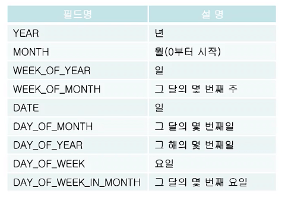
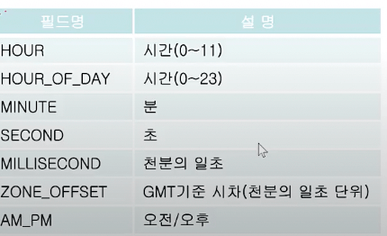
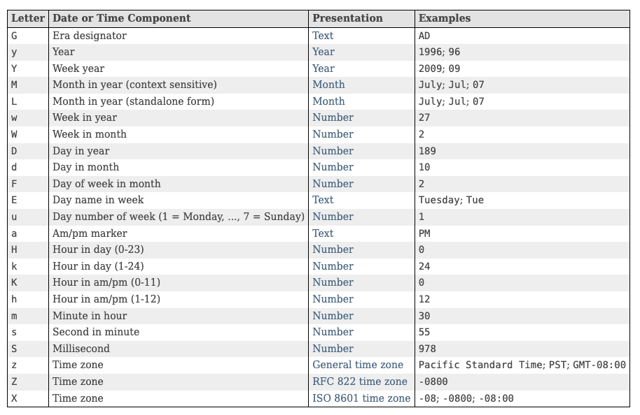

# 날짜와 시간 & 형식화

## 날짜와 시간

### `java.util.Date`

- 날짜와 시간을 다룰 목적으로 만들어진 클래스 (`JDK 1.0`)
- `Date` 메서드는 거의 `deprecated` 되었지만, 아직도 쓰이고 있음

### `java.util.Calendar`

- `Date` 클래스를 개선한 새로운 클래스 (`JDK 1.1`)
- 여전히 단점이 존재

## 기존 클래스(`Date`, `Calendar`)의 문제점들

[NAVER D2](https://d2.naver.com/helloworld/645609#note16)

### 불변 객체가 아님 (`mutable`)

- `VO`는 값에 의해 동등성이 판단되는 객체이며, 완전히 불변해야 객체를 공유해도 안전하게 됨
- 날짜, 돈 등의 객체들이 대표적인 `VO`라고 할 수 있으며, 다른 `C#`이나 `Python`의 경우 날짜 클래스가 불변 객체임
- `Java`에서는 날짜 객체가 불변이 아니기 때문에 객체 내부에 `set` 메서드가 다수 존재하고 메서드를 호출하면 인스턴스의 값을 변경할수 있음 → 이로 인해 공유된 다른 곳에 영향을 미치는 부작용이 존재
- 이를 방지하려면 객체를 복사해서 반환해야 하는데, 상세 코드는 다음과 같음

  - 방어적 복사(`Defensive copy`)라고 부르는 이 기법은 생성자를 통해 초기화를 할 때, 새로운 객체로 복사해주는 방법을 일컬음
  - 생성자로 참조변수를 입력받을때 참조하는 객체가 불변이 아니라면, 참조 원본에서 실행한 `setter`에 의해 영향을 받게 됨

  ```java
  public class Game {
  	private final Date startTime;
  	private final Date endTime;

  	public Game(Date startTime, Date endTime) {
  		this.startTime = startTime; // 외부에서 입력받은 startTime은 외부의 setter에 영향을 받음 (왜? Date가 불변이 아니니까)
  		this.endTime = new Date(endTime.getTime()); // 그래서 외부 Date객체의 getTime을 이용해 새로운 객체를 생성해서 저장함
  	}

  	public Date getStartTime() {
  		return this.startTime;
  	}

  	public Date getEndTime() {
  		return new Date(this.endTime.getTime()); // 게터에도 this.endTime과의 연결을 끊기 위해 새로운 객체를 생성해서 리턴하는것이 바람직함
  	}
  }
  ```

### 상수 필드의 남용

- `Calendar`를 사용한 날짜 연산은 대부분 상수 필드를 사용함
  ```java
  calendar.add(Calendar.SECOND, 8);
  // 8초 더하기 코드
  ```
  - 여기서 `Calendar.SECOND`를 `Calendar.JUNE`과 같은것으로 변경해도 컴파일러가 파악할 방법이 없음
  - 또한 월에 해당하는 `Calendar.OCTOBER`가 실제 내부 상수로 `9`를 가지고 있는 사실은 이미 널리 알려진 실수하기 쉬운 정의방식임

### `Date`와 `Calendar`의 불편한 역할 분담

- 특정 시간대의 날짜를 생성하거나, 년/월/일 같은 날짜 단위의 계산은 `Date` 클래스만으로 수행이 어려움
- 날짜를 계산하기 위해 도중에 `Calendar` 클래스를 생성하고 `Calendar` 클래스를 이용해서 `Date` 클래스를 생성

### 오류파악이 힘든 시간대 `ID` 지정

```java
@Test
public void shouldSetGmtWhenWrongTimeZoneId() {
	Timezone zone = Timezone.getTimeZone("Toko/Asia");
	assertThat(zone.getID()).isEqualTo("GMT");
}
```

- 이상하게도 위의 코드는 에러가 발생하지 않고 디폴트인 `GMT`가 시간대로 지정된 것처럼 테스트를 통과함
- 이러한 문제는 개발자가 찾기 힘든 버그를 발생 시킬 소지가 다분함

## 새로운 클래스의 등장

### `java.time package`

- `Date`와 `Calendar`의 단점을 개선한 새로운 클래스들을 제공 (`JDK 1.8`)
- 다뤄야 할 경우의 수에 따라 각각 다른 객체를 제공
  - 날짜 (`LocalDate`)
  - 시간 (`LocalTime`)
  - 날짜+시간 (`LocalDateTime`)
- 객체가 불변이 됨

## `Calendar` 클래스

- 추상 클래스이므로 `getInstance()`를 통해 구현된 객체를 얻어야 함

```java
Calendar cal = new Calendar(); // error 추상클래스는 인스턴스 생성 불가
Calendar cal = Calendar.getInstance(); // getInstance() 메서드가 클래스를 대신 생성해서 반환

// 팩토리 메서드를 사용하는 이유
// 여러가지 조건에 따라 다른 인스턴스 타입을 반환
// 서양력 - 그레고리력 new GregorianCalendar();
// 불교력
// 일본력
```

- `get()`으로 날짜와 시간 필드 가져오기 `int get(int field);`

```java
Calendar cal = Calendar.getInstance(); // 현재 날짜와 시간으로 셋팅
int thisyear = cal.get(Calendar.YEAR); // 올해가 몇년인지 알아냄
int lastDayOfMonth = cal.getActualMaximum(Calendar.DATE); // 이 달의 마지막 날
```

- `Calendar`에 정의된 필드



- `WEEK_OF_YEAR` (`1`월 `1`일로부터의 일)
- `MONTH`의 시작이 `0`인것에 주의 (요일은 또 `1`부터 시작함)



- `clear()`는 `Calendar` 객체의 모든 필드를 초기화
  - 초기화시 `EPOCH TIME`으로 초기화됨
  - `EPOCH TIME`은 유닉스 타임으로 불리는데 컴퓨터가 처음 존재하기 시작한 `1970년 1월 1일 0시`로 정함
  - 객체 생성 후 비교시에 초기화를 해줘야함
    - 동기적 코드 진행시에 한줄 두줄 차이로 인해 `ms` 차이가 발생할 소지 있음
- `add()`는 특정 필드값을 증가 또는 감소 (다른 필드에 영향 있음)

  ```java
  Calendar date = Calendar.getInstance();
  date.clear();
  date.set(2020, 8 - 1, 31); // 2020년 8월 31일로 설정

  date.add(Calendar.DATE, 1); // 날짜(DATE)에 1을 더함
  date.add(Calendar.MONTH, -8); // 월(MONTH)에서 8을 뺌
  // 결론 1월 1일 -> DATE가 증가하며 9월 1일로 되었고, 거기서 8을 빼니 1월 1일
  ```

- `role()`은 특정 필드값을 증가 또는 감소 (다른 필드에 영향 없음)

  ```java
  // 상기 코드에서
  date.set(2020, 8 - 1, 31);

  // add()와 달리 role()은 다른 필드에 영향을 주지 않음
  date.role(Calendar.DATE, 1);
  date.role(Calendar.MONTH, -8);
  ```

## `Date`와 `Calendar`간의 변환

- `Date`의 메서드는 대부분 `deprecated` 되었지만 여전히 사용됨 (레거시)

1. `Calendar`를 `Date`로 변환

   ```java
   Calendar cal = Calendar.getInstance();
   Date d = new Date(cal.getTimeMillis());
   ```

2. `Date`를 `Calendar`로 변환

   ```java
   Date d = new Date();
   Calendar cal = Calendar.getInstance();
   cal.setTime(d);
   ```

## 형식화 클래스

- `java.text` 패키지의 `DecimalFormat`, `SimpleDateFormat`
- 숫자와 날짜를 원하는 형식으로 쉽게 출력 가능 (숫자, 날짜 > 형식 문자열)

```java
double number = 1234567.90;
DecimalFormat df = new DecimalFormat("#.#E0"); // 지수형식
String result = df.format(number); // result = "1.2E6" 지수표현
```

- 형식 문자열에서 숫자와 날짜를 뽑아내는 것 또한 가능 (형식 문자열 > 숫자, 날짜)

```java
DecimalFormat df = new DecimalFormat("#,###.##");
Number num = df.parse("1,234,567.89");
double d = num.doubleValue(); // 1234567.89
```

### `DecimalFormat`

- 숫자를 형식화 할 때 사용 (숫자 > 형식 문자열)
  - `0` (10진수, 없을 경우 0으로 패딩)
  - `#` (10진수, 없을 경우 생략)
  - `E` (지수기호)
- 특정 형식의 문자열을 숫자로 변환할 때도 사용
- 예를 들어 `1,000,000`와 같이 자리수 기호가 있는 숫자로 간주되는 문자열을 변환할때 `parseInt()`에서는 대응이 불가능하지만, `DecimalFormat`의 `format()`을 이용하면 숫자로 변환 가능

### `SimpleDateFormat`

[SimpleDateFormat (Java SE 11 & JDK 11 )](https://docs.oracle.com/en/java/javase/11/docs/api/java.base/java/text/SimpleDateFormat.html)



- 날짜와 시간을 다양한 형식으로 출력할 수 있게 해주는 클래스

```java
Date today = new Date();
SimpleDateFormat df = new SimepleDateFormat("yyyy-MM-dd");

// 오늘 날짜를 yyyy-MM-dd형태로 변환하여 반환
String result = df.format(today);
```

- 특정 문자열에서 패턴을 캐치하여 날짜와 시간을 뽑아낼 수 있음

```java
DateFormat df = new SimpleDateFormat("yyyy년 MM월 dd일");
DateFormat df2 = new SimpleDateFormat("yyyy/MM/dd");

Date d = df.parse("2015년 11월 23일");
String result = df2.format(d);

// 2015년 11월 23일 -> 2015/11/23
```
