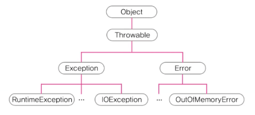

# 예외처리

## 프로그램 오류

### 컴파일 에러

- 컴파일 단계에서 발생하는 문법적인 에러
- 컴파일러가 잡아주기 때문에 코딩중 수정 가능하고, 바이트 코드가 만들어지지 않기 때문에 코드 실행 불가능

### 런타임 에러

- 코드를 실행하던 도중에 발생하는 에러
- 문법은 맞기 때문에 컴파일러가 체크할 수 없으나, 실행중에 동적으로 발생하는 에러가 여기에 속함

### 논리적 에러

- 작성 의도와 다르게 동작하는 경우
- 프로그램이 종료되지 않기 때문에 에러는 아니지만, 프로그램이 의도한 대로 동작하지 않기 때문에 문제

## Java에서의 런타임 에러

### 에러 (error)

- 프로그램 코드에 의해서는 수습될 수 없는 심각한 오류
  - OOME → Out Of Memory Error (메모리 부족으로 프로그램 종료)

### 예외 (exception)

- 프로그램 코드에 의해서 수습할 수 있는 다소 미약한 오류

<aside>
💡 에러는 어쩔수 없더라도, 예외는 처리하자

</aside>

## 예외처리 정의와 목적

### 정의

- 프로그램 실행 시 발생할 수 있는 예외의 발생에 대비한 코드를 작성하는 것

### 목적

- 프로그램의 비정상 종료를 최대한 막고, 정상적인 실행상태를 유지하는 것

## 예외 클래스의 계층 구조



< 자바의 정석 : 예외 클래스의 계층 구조 >

- 최고 조상 (`Object`)
- `Throwable` (클래스, 모든 오류의 조상)
- `Exception` (예외)
  - `RuntimeException`
  - …
- `Error` (에러)
  - `OOME`
  - …

## Exception의 계층 구조

### Exception과 그 자손

- **사용자의 실수**와 같은 **외적인 요인**에 의해 발생하는 예외
  - `IOException`
  - `ClassNotFoundException`
  - …

### RuntimeException과 그 자손

- **프로그래머의 실수**로 발생하는 예외
  - NPE (NullPointerException)
  - IndexOutOfBoundsException
  - …

## printStackTrace()와 getMessage()

### printStackTrace()

- 예외 발생 당시의 호출스택(Call Stack)에 있었던 메서드의 정보와 예외 메시지를 출력

### getMessage()

- 발생한 예외 클래스의 인스턴스에 저장된 메시지를 얻을 수 있음

## 멀티 catch 블럭

- 내용이 같은 catch 블럭을 하나로 합칠 수 있음 (JDK 1.7~)

```java
try {}
catch (ExceptionA e) {
	e.printStackTrace();
}
catch (ExceptionB e2) {
	e2.printStackTrace();
}
```

```java
try {}
catch (ExceptionA | ExceptionB e) {
	e.printStackTrace();
}

// 또는 이렇게
try {}
catch (ExceptionA | ExceptionB e) {
	e.printStackTrace();

	if(e instanceof ExceptionA) {}
	else if(e instanceof ExceptionB) {}
}
```

- 단 합치는 예외사이의 관계가 부모 자식 사이처럼 종속관계면 안됨

## 예외 발생시키기

1. 연산자 new를 이용하여 발생시키려는 예외 클래스의 객체를 생성

   ```java
   Exception e = new Exception("예외 클래스 샘플");
   ```

2. 키워드 throw를 이용해서 예외를 발생시킴

   ```java
   throw e;
   ```

## Checked 예외와 Unchecked예외

### checked 예외

- 컴파일러가 예외 처리 여부를 체크 (예외 처리 필수)
- Exception과 그 자손들

### unchecked 예외

- 컴파일러가 예외 처리 여부를 체크하지 않음 (예외 처리가 선택)
- RuntimeException과 그 자손들

### 왜 이런 unchecked 예외가 존재할까? 그냥 다 컴파일러가 체크하면 될텐데

- 예를 들어 배열을 사용한다 하면, 모든 배열은 NullPointerException이 발생할 여지가 있음
- 따라서 모든 예외를 다 체크하게 되면 코딩시에 사용하는 모든 구문에 전부 예외처리를 해야 할 것임

## 메서드에 예외 선언하기

### 예외를 처리하는 방법

1. try-catch문을 이용해서 직접 처리
2. 예외 선언하기 (자신을 호출한 쪽으로 예외처리를 위임하기)

   - 메서드가 호출시 발생가능한 예외를 호출하는 쪽에 알림

     ```java
     void method() throws ExceptionA, ExceptionB, ..., ExceptionN {
     	//
     }

     // 모든 에러를 전부 선언
     void method() throws Exception {}
     ```

   - throws에 선언하는 예외에는 RuntimeException(선택적 예외처리)를 작성하지 않는것에 주의

3. \*은폐 (덮기) 빈 catch블럭 작성해버리기

## finally 블럭

- 예외 발생여부와 관계없이 수행되어야 하는 코드를 입력

```java
try {}
catch (Exception1 e1) {}
finally {
// 예외 발생여부에 관계없이 이 문장은 무조건 수행됨
// finally 블럭은 try-catch의 마지막에 위치해야 함
}
```

## 사용자 정의 예외 만들기

- 프로그래머가 직접 예외 클래스를 정의할 수 있음
- 조상은 Exception과 RuntimeException중에서 선택

```java
class MyException extends Exception {
	// 에러 코드 값을 저장하기 위한 필드 추가
	private final int ERR_CODE;

	MyException(String msg, int errCode) {
		super(msg);
		ERR_CODE = errcode;
	}

	MyException(String msg) {
		super(msg);
		ERR_CODE = 100;
	}

	public int getErrCode() {
		return ERR_CODE;
	}
}
```

## 예외 되던지기 (re-throwing)

- 예외가 발생한 쪽에서 처리한 뒤에 다시 발생시키는 것
- 호출한 메서드와 호출된 메서드 양쪽 모두에서 예외처리의 필요성이 있을 경우 사용

```java
class C {
	public static void main(String[] args) {
		try {
			method1();
		}
		catch (Exception e) {
			System.out.println("main메서드에서 예외가 처리되었습니다.");
		}
	}

	static void method1() throws Exception {
		try {
			throw new Exception();
		} catch (Exception e) {
			System.out.println("method1메서드에서 예외가 처리되었습니다.");
			throw e;
		}
}
```

## 연결된 예외 (chained exception)

- 한 예외가 다른 예외를 발생시킬 수 있음
- 예외 A가 다른 예외 B를 발생시키면, A는 B의 원인 예외(cause exception)

```java
Throwable initCause(Throwable cause) // 지정한 예외를 원인 예외로 등록
Throwable getCause() // 원인 예외를 반환

public class Throwable implements Serializable {
	...
	private Throwable cuase = this;

	public synchronized Throwable initCause(Throwable cuase) {
		this.cuase = cuase;
		return this;
	}
}
```

- 샘플 코드 (프로그램 설치)

```java
// InstallException은 커스텀 예외
void install() throws InstallException {
	try {
		startInstall(); // SpaceException 발생
		copyFiles();
	} catch (SpaceException e) {
		InstallException ie = new InstallException("설치 예외 발생");
		ie.initCause(e); // InstallException의 원인 예외를 SpaceException으로 지정
	} catch (MemoryException me) {
		//
	}
}
```

### 왜 사용하나?

1. 여러 예외를 하나로 묶어서 다루기 위해

   ```java
   try {
   	install(); // 예외 발생
   }
   catch (SpaceException e) {}
   catch (MemoryException e) {}
   catch (Exception e) {}

   try {
   	install();
   }
   catch (InstallException e) {}
   catch (Exception e) {}
   ```

   - 예외의 좀 더 상세한 내용을 알려주기 위함
     - InstallException은 설치가 실패한 경우 알려주는 예외이지만, 좀 더 상세하게 해당 원인이 SpaceException, 즉 공간이 부족하기 때문이다라고 알려주면 친절함
   - 예외처리를 조금 더 간단하게 핸들링 (코드를 줄임)
     - InstallException이 포함하는 SpaceException, MemoryException등을 하나의 catch 블럭에서 처리 가능

2. checked 예외를 unchecked 예외로 변경하려 할 때
   - 커스텀 예외로 Exception을 상속받아 작성한 예외가 있다고 가정
   - 이러한 경우 예외가 checked 예외이기 때문에 무조건 처리되어야 함
   - 나중에 사양 변경으로 이것을 RuntimeException으로 변경하여 unchecked 예외로 변경하고자 해도, 이미 구현체를 다른곳에서 많이 사용하고 있어서 쉽게 바꾸지 못한다면, RuntimeException을 새로 작성하고 해당 예외의 원인예외로 커스텀 예외를 지정하면 선택 예외로 은폐가 가능함
