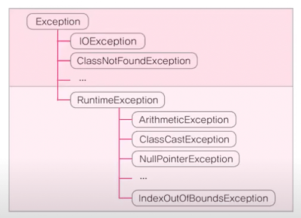

# Generics

## 제네릭이란?

- 컴파일시 타입을 체크해 주는 기능 (`compile time type check`)
- `JDK 1.5`부터 도입됨

### 컴파일러의 한계

- 컴파일 단계에서 문제없는 코딩이지만, 런타임에 에러가 발생할 수 있는 여지가 있음
- 컴파일러의 한계로 런타임에서 발생하는 에러는 잡아낼 수 없음

```java
public class GenericTest {
	public static void main(String[] args) {
		ArrayList list = new ArrayList();
		list.add(10); // String -> Integer 자동 업캐스팅
		list.add(20); // String -> Integer 자동 업캐스팅
		list.add("30"); // String -> Object 자동 업캐스팅

		Integer i = (Integer) list.get(2); // Compile OK -> 컴파일러의 한계
	  // list는 명시적 타입 지정 없이는 Object로 초기화되기 때문에 가능한 문제
	}
```

- 컴파일러에게 추가정보를 제공해줘서 이러한 문제를 최대한 해결하고자 함

```java
public class GenericTest {
	public static void main(String[] args) {
		ArrayList<Integer> list = new ArrayList<Integer>();
		list.add(10); // int -> Integer 래핑
		list.add(20); // int -> Integer 래핑
		list.add("30"); // 컴파일 에러
	}
```

```java
ArrayList list = new ArrayList();  // JDK 1.5이전
ArrayList<Object> list = new ArrayList<>();  // JDK 1.5이후
```

### 제네릭의 장점

- 객체의 타입 안정성을 높이고 형변환의 번거로움을 줄여줌
- 타입체크와 형변환을 생략할 수 있으므로 코드가 간결해짐

## 제네릭스는 런타임 예외를 방지



예외의 상속계층도

- 예외에는 컴파일 타임에 발생할 수 있는 에러와 런타임에 발생할 수 있는 에러로 나뉨
- 컴파일 타임에 발생하는 에러는 컴파일러가 미리 잡아주기 때문에 실행중에는 발생하지 않지만, 런타임 에러는 프로그래머의 코딩 실수로 프로그램을 종료시킬 수 있기 때문에 조심해야 함
- 위 예제와 같이 제네릭스는 런타임 예외 중 `ClassCastException`을 방지해주기 때문에 유용함

## 타입 변수 (제네릭 클래스 변수)

- 클래스를 작성할 때, `Object`타입(일반 클래스) 대신 타입 변수(`<E> 제네릭 클래스`)를 선언해서 사용
- 제네릭 클래스는 `JDK 1.5` 부터 제공되기 시작
- 기존 (일반 클래스 사용)
  ```java
  public class ArrayList extends AbstractList {
  	private transient Object[] elementData;
  	public boolean add(Object o) { ... }
  	public Object get(int index) { ... }
  	...
  }
  ```
- 제네릭 도입 후 (제네릭 클래스 사용)
  ```java
  public class ArrayList<E> extends AbstractList<E> {
  	private transient E[] elementData;
  	public boolean add(E o) { ... }
  	public E get(int index) { ... }
  	...
  }
  ```
- 제네릭 클래스로 선언시에 문자는 상기에서는 `<E>` 로 선언되어 있으나, 특별히 지정된 바는 없음
- 따라서 원하는 문자를 사용하면 되는데, 자바 컨벤션은 존재함
  - T → Type
  - E → Element
  - K → Key
  - V → Value
  - T, S, U, V 등등

### 타입 변수 대입하기 (제네릭 사용방법)

- 객체를 생성 시, 타입 변수 `<E>` 대신 실제 타입을 지정 (대입)
  ```java
  ArrayList<Tv> tvList = new ArrayList<Tv>();
  ```
- 타입 변수가 지정되면 컴파일 단계에서 `ArrayList`의 제네릭 클래스 부분이 치환됨
  ```java
  public class ArrayList extends AbstractList {
  	private transient Tv[] elementData;
  	public boolean add(Tv o) { ... }
  	public Tv get(int index) { ... }
  	...
  }
  ```
- 이렇게 동적 컴파일단계에서 치환되기 때문에 기존의 `Object` 클래스를 사용할와 비교하여 이점이 새

  ```java
  // 기존
  ArrayList tvList = new ArrayList();
  tvList.add(new Tv());
  Tv t = (Tv) tvList.get(0); // 이때 데이터가 만약 다른 형이면 문제가 되기 때문에 타입체크등 필요

  // 이제
  ArrayList<Tv> tvList = new ArrayList<Tv>();
  tvList.add(new Tv());
  Tv t = tvList.get(0);
  ```

## 제네릭 용어

```java
Box<T> // 제네릭 클래스, T의 Box또는 T Box라고 읽음
T // 타입 변수, 또는 타입 매개변수 (T는 타입문자)
Box // 원시타입(Raw Type)

// 선언부
class Box<T> {}

// 사용부
Box<String> b = new Box<String>();
```

## 제네릭 타입과 다형성

- 참조변수의 생성자와 대입된 타입은 일치해야 함

```java
class Product {}
class Tv extends Product {}

ArrayList<Tv> list = new ArrayList<Tv>(); // 일치, OK
ArrayList<Product> list = new ArrayList<Tv>(); // 불일치, Not OK
// ⭐️ 클래스의 다형성 관계가 성립 (부모 타입으로 자손 타입의 객체를 받을 수 있음) 관계에 있다고 하더라도
// ⭐️ 제네릭의 경우에는 반드시 같은 타입으로 명시해서 객체를 초기화 해야함

// 단 아래와 같이 원시 타입의 다형성은 성립 ✅
List<Tv> list = new ArrayList<Tv>(); // OK

// 대입시에도 OK
ArrayList<Product> list = new ArrayList<Product>(); // OK
list.add(new Product());
list.add(new Tv()); // OK, 자동 업캐스팅
```

### `Iterator<E>`

- 클래스를 작성할 때, `Object` 타입 대신 `T`와 같은 타입 변수를 사용

```java
public interface Iterator {
	boolean hasNext();
	Object next();
	void remote();
}
```

- 제네릭 클래스로 바뀌고 나서는 별도의 다운캐스팅이 필요없어짐

```java
Iterator<Student> itr = list.iterator();
while(itr.hasNext()) {
	Student lee = itr.next(); // OK
}
```

### `HashMap<K, V>`

- 여러개의 타입 변수가 필요한 경우, 콤마(`,`)를 구분자로 선언

```java
HashMap<String, Student> students = new HashMap<>(); // 해시맵 생성
map.put("자바왕", new Student("Lee", 100));

// HashMap 내부
public class HashMap<K, V> extends AbstractMap<K, V> {
	...
	public V get(Object key) {}
	public V put(K key, V value) {}
	public V remove(Object key) {}
```

## 제네릭 클래스 제한하기

- `extends`로 대입할 수 있는 타입을 제한

```java
class FruitBox<T extends Fruit> { // Fruit 및 그 자손 클래스만 가능
	ArrayList<T> list = new ArrayList<T>();
	...
}

// Apple이 Fruit을 상속받는다 하면
FruitBox<Apple> appleBox = new FruitBox<Apple>(); // OK
FruitBox<Toy> toyBox = new FruitBox<Toy>(); // Not OK
```

- 단, 인터페이스의 제네릭 클래스 제한 (인터페이스를 구현한 클래스로 제한) 할때도 `extends`를 사용

```java
interface Eatable {}
class FruitBox<T extends Eatable> {} // implements가 아닌 extends
class FruitBox<T extends Fruit & Eatable> {} // Fruit의 상속자이면서 Eatable을 구현
```

## 제네릭의 제약사항

- 타입 변수에 대입은 인스턴스 별로 다르게 가능

```java
Box<Apple> appleBox = new Box<Apple>():
Box<Grape> grapeBox = new Box<Grape>();

// 다른 인스턴스를 담을 수 있도록 설계되어 있기 때문에, 모든 인스턴스가 공유하는 static에는 제네릭 불가
class Box<T> {
	static T item; // Error
	static int compare(T t1, T t2) {} // Error

	T[] itemArr; // 여기까진 OK
	T[] itemArr = new T[itemArr.length]; // Error, new는 타입이 확정되어 있어야 함
}
```

## 와일드카드`<?>`

- 하나의 참조 변수로 대입된 타입이 다른 객체를 참조 가능
- 제네릭의 제약사항이었던 선언부와 `new`로 객체를 담을 때 타입 일치가 강제되던 부분을 일부 해소

```java
// Apple, Banana클래스가 Fruit을 상속받고 있다고 가정
ArrayList<Fruit> fruitList = new ArrayList<Apple>(); // Error
ArrayList<Fruit> fruitList = new ArrayList<Fruit>();
ArrayList<? extends Fruit> appleList = new ArrayList<Apple>(); // OK
ArrayList<? extends Fruit> bananaList = new ArrayList<Banana>(); // OK
```

## 제네릭 메서드

- 메서드를 호출할 때 마다 타입을 대입해서 수행 가능 (타입은 대부분의 경우 생략 가능)

```java
FruitBox<Fruit> fruitBox = new FruitBox<Fruit>();
FruitBox<Apple> fruitBox = new FruitBox<Apple>();
...
System.out.println(Juicer.<Fruit>makeJuice(fruitBox));
System.out.println(Juicer.<Apple>makeJuice(appleBox));

class Juicer {
	static <T extends Fruit> Juice makeJuice(FruitBox<T> box) {}
	// static Juice makeJuice(FruitBox<? extends Fruit> box) {} // 결과는 같지만 다른 용도
}
```

- 메서드를 호출할때 타입을 생략할 수 있는데도 생략하지 않은 경우에는 클래스 이름도 명시해야 함

```java
System.out.println(<Fruit>makeJuice(fruitBox)); // ERROR
System.out.println(this.<Fruit>makeJuice(fruitBox)); // OK
System.out.println(Juicer.<Fruit>makeJuice(fruitBox)); // OK
```

## 제네릭 타입의 형변환

- 제네릭 타입과 원시 타입간의 형변환은 가능은 하지만 좋지 못함
  ```java
  Box<Object> objBox = null;
  Box box = (Box) objBox;     // 명목상OK, 사용할때 문제점 다수 발생
  objBox = (Box<String>) box; // 명목상OK, 사용할때 문제점 다수 발생

  objBox = (Box<Object>) strBox;  // ERROR, 제네릭 타입만을 바꾼 형변환은 인정 안함
  strBox = (Box<Object>) objBox;  // ERROR, 제네릭 타입만을 바꾼 형변환은 인정 안함
  // Box<Object> objBox = new Box<String>(); // 이것이 안되는 이유랑 동일
  ```
