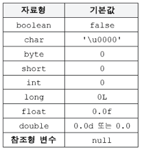
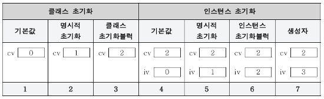

# 변수의 초기화 (initialize variable)

## 변수의 초기화

- 변수를 선언하고 처음으로 값을 저장하는 것
- 변수의 초기화는 선택적이지만, 가능하면 선언과 동시에 적절한 값으로 초기화하는 것이 바람직
- 멤버변수는 초기화가 기본적으로 이루어짐
- 지역변수는 초기화되지 않으므로 초기화 하고 사용해야 함

> 멤버변수(클래스변수와 인스턴스변수)와 배열의 초기화는 선택적
> 지역변수의 초기화는 필수적



### 멤버변수의 초기화 방법

1. 명시적 초기화(explicit initialization)
2. 생성자(constructor)
3. 초기화 블럭(initialization block)
   - 인스턴스 초기화 블럭
     - 인스턴스 변수를 초기화 하는데 사용
   - 클래스 초기화 블럭
     - 클래스 변수를 초기화 하는데 사용

## 명시적 초기화 (explicit initialization)

- 변수를 선언과 동시에 초기화 하는 것을 명시적 초기화라고 함
- 가장 우선적으로 고려해야 함

```java
class Car {
	int door = 4;
}
```

- 명시적 초기화가 간단하긴 하지만, 복잡한 초기화가 필요하면 생성자나 초기화 블럭의 이용이 필요

## 초기화 블럭 (initialization block)

- 코드의 중복을 제거하여 코드의 신뢰성을 높이고 오류의 발생 가능성을 줄이기 위함

### 인스턴스 초기화 블럭

- 생성자에서 공통적으로 수행되는 작업에 사용되며, 인스턴스가 생성될 때 마다 수행됨
- 생성자보다 먼저 실행됨
- 모든 생성자에서 공통으로 수행되어야 하는 로직등을 묶어서 처리하는데 주로 이용됨

### 클래스 초기화 블럭

- 블럭에 static을 정의하여 사용가능
- 클래스 변수의 복잡한 초기화를 할 때 사용됨
- 클래스가 로딩될 때 한번 수행됨

## 멤버변수의 초기화 시기와 순서

- 클래스변수의 초기화 시점
  - 클래스가 처음 로딩될 때 단 한번 초기화
- 인스턴스변수의 초기화 시점
  - 인스턴스가 생성될 때 마다 각 인스턴스별로 초기화
- 클래스변수의 초기화 순서
  - 기본값
  - 명시적 초기화
  - 클래스 초기화 블럭
- 인스턴스변수의 초기화 순서
  - 기본값
  - 명시적 초기화
  - 인스턴스 초기화 블럭
  - 생성자

```java
class InitTest {
	static int cv = 1;
	int iv = 1;

	static { cv = 2; }
	{ iv = 2; }

	InitTest() { iv = 3; }
}
```


