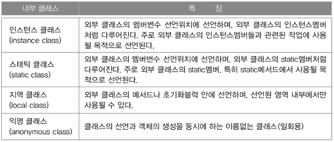

# 내부 클래스 (inner class)

## 내부 클래스란?

- 클래스 내에 선언된 클래스
  - 왜? → 두 클래스가 서로 긴밀한 관계를 가지기 때문임
- 두 클래스 사이의 멤버를 쉽게 접근할수 있음
- 내부 클래스에서 외부 클래스에 쉽게 접근 가능하고, 내부 클래스를 굳이 외부에 노출하지 않음

### 내부 클래스의 장점

- 내부 클래스에서 외부 클래스의 멤버들을 쉽게 접근할 수 있음
- 코드의 복잡성을 줄일 수 있음 (캡슐화)

## 내부 클래스의 종류와 특징

## 내부 클래스의 선언

- 내부 클래스는 멤버로 취급되기 때문에, 외부 클래스 내부에서 인스턴스 변수, 클래스 변수, 지역 변수처럼 동일한 키워드를 통해 같은 유효범위와 접근성을 가짐

## 익명 클래스 (anonymous class)

- 클래스의 선언과 동시에 객체를 생성하기 때문에, 클래스 이름을 붙이지 않고 객체명을 바로 사용
