# File Input / Output

## 입출력이란?

- `I/O`의 의미는 `Input Output`으로 입력과 출력을 말함
- 지금까지 사용했던 `System.out.println`이나 `Scanner`의 `next`와 같은 메서드들이 입출력의 예

## 스트림 (`stream`)

- 입출력은 데이터를 주고 받는 통로를 이용해야 가능한데 이 통로를 스트림이라고 부름
- `JDK 1.8` 이후에 등장한 `Stream API`와는 이름만 같을 뿐 내용은 다름
- 스트림은 단방향 통신으로 데이터를 주고, 받기 위해서는 2개의 스트림이 필요

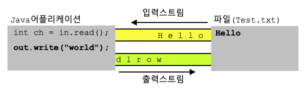

### 바이트기반 스트림 `InputStream`, `OutputStream`

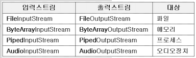

- 바이트 기반 스트림은 대상에 따라 선택해서 사용하게 됨
- 각각 `InputStream`, `OutputStream`의 자손으로 추상메서드를 구현한 구현체
- 추상메서드를 구현하는 방식으로 만들어놓은 이유는 입출력 대상이 달라져도 방법은 달라지지 않도록 표준화 하기 위함

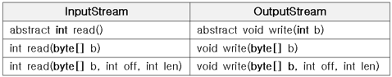

- `InputStream`의 `read()`
- `OutputStream`의 `write()`
- 추상메서드가 아닌 나머지 메서드들 또한 결국 추상메서드를 이용하여 구현해두었으므로 각각의 자손에서 `read`를 구현하지 않으면 의미가 없게 되어 있음

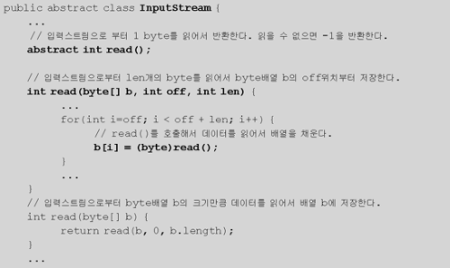

- 결국 오버로딩한 메서드에서 추상메서드를 참조하고 있기 때문에, 참조된 추상메서드를 각 대상에 맞게 구현하도록 되어 있음

### 보조 스트림

- 대상에 따라 나눠진 기반 스트림 외에도 기반 스트림의 기능을 보조하기 위해 보조 스트림이 제공됨
- 보조 스트림의 역할은 실제로 데이터를 주고받는 통로 역할이 아님
  - 보조 스트림을 생성하기 이전에 기반 스트림을 생성해야 함
  - 보조 스트림은 기반 스트림을 매개변수로 입력받아 생성함

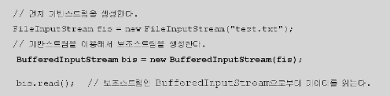

- 코드상으로는 보조 스트림을 이용해서 입출력을 수행하는 것 처럼 보이지만 실제 `BufferInputStream`은 버퍼만을 제공
- 보조 스트림을 사용하는 이유는 기반 스트림의 성능 개선이라던가, 새로운 기능이 필요하기 때문
  - 실제로 버퍼를 사용한 입출력과 그렇지 않은 경우에는 상당한 성능차이가 있음

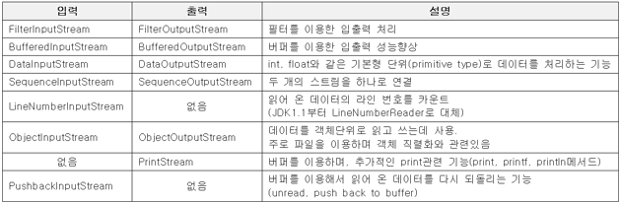

### 문자기반 스트림 Reader, Writer

- 바이트기반은 1바이트를 기준으로 데이터를 처리하는데, 자바에서는 문자를 2바이트 기준으로 처리하기 때문에 바이트 스트림으로는 문자를 처리하기가 곤란
- 따라서 문자데이터를 다루기 위해 별도의 문자기반 스트림을 제공

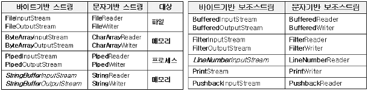

<aside>
💡 StringBufferInputStream, StringBufferOutputStream은 StringReader와 StringWriter로 대체됨

</aside>

- 기본적으로 문자기반 스트림은 바이트기반 스트림에서 InputSream을 Reader로, OutputStream을 Writer로 이름 변경하면 동일
  - 단, ByteArrayInputStream에 대응하는 문자기반 스트림의 이름이 CharArrayReader인것에 주의
- 내부적으로 바이트기반 스트림에서 int를 이용해서 데이터를 다루던 것과 달리 문자기반 스트림에서는 char를 기본 단위로 사용한다는 점이 다름

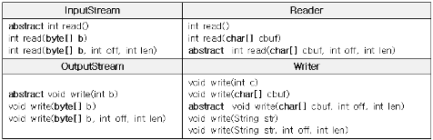

- 문자보조 스트림 또한 존재하며 사용법은 동일

## 바이트기반 스트림

### `InputStream`과 `OutputStream`

- `InputStream`과 `OutputStream`은 모두 바이트 기반 스트림

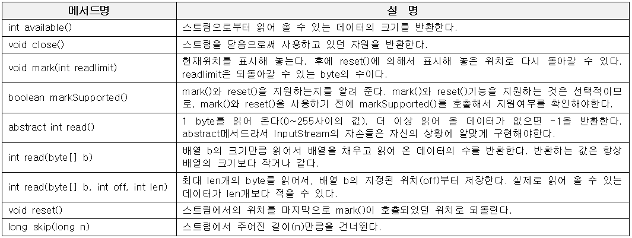

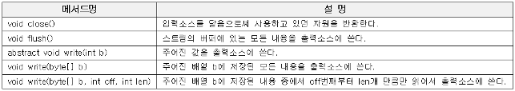

- 읽기전용 스트림을 사용할 때 `mark()`와 `reset()`을 사용하면 읽던 중이라도 다시 처음으로 돌아가서 읽기가 가능
  - 해당 기능을 지원하는지 확인하는 `markSupported()`가 존재
- 출력전용 스트림을 사용할 때 `flush()`는 버퍼가 있는 출력 스트림의 경우에만 의미가 있고, 버퍼 없이 사용하는 `flush()`는 아무 동작을 하지 않음
- 스트림을 사용하면 기본적으로 `close()`를 이용해서 닫는 습관을 들일것
  - 프로그램이 종료되기 전 `JVM`이 자동으로 닫긴 하지만, 그 이전에 계속 남겨두는 스트림은 계속 남음
  - `ByteArrayInputStream`과 같은 메모리를 사용하는 스트림과 `System.in`, `System.out`과 같은 표준 입출력 스트림은 닫을 필요 없음

### `ByteArrayInputStream`과 `ByteArrayOutputStream`

- 바이트 배열에 데이터를 입출력할 때 사용
- 주로 다른 곳에 입출력하기 전 데이터를 임시로 바이트 배열에 담아서 변환등을 하는데 사용

```java
byte[] inSrc = {0, 1, 2, 3, 4, 5, 6, 7, 8, 9};
byte[] outSrc = null;

ByteArrayInputStream input = new ByteArrayInputStream(inSrc);
ByteArrayOutputStream output = new ByteArrayOutputStream();

int data = 0;

while ((data = input.read()) != -1) {
    output.write(data);
}

outSrc = output.toByteArray();

System.out.println("input source: " + Arrays.toString(inSrc));
System.out.println("output source: " + Arrays.toString(outSrc));
```

```java
while ((data = input.read()) != -1) {
    output.write(data);
}

// 1. data = input.read() // read()를 호출한 반환값을 변수 data에 저장
// 2. data != -1 // data에 저장된 값이 -1이 아닌지 비교
```

- 바이트 배열은 사용하는 자원이 메모리밖에 없으므로 가비지 컬렉터에 의해 자동으로 회수됨 → close()하지 않아도 됨
- 상기 샘플은 한번에 1바이트씩 읽어서 쓰기 때문에 효율이 떨어짐

```java
byte[] temp = new byte[10];

input.read(temp, 0, temp.length);
output.write(temp, 5, 5);
```

- 한번에 여러개를 읽어올 수 있도록 버퍼(temp)를 마련하면 효율이 올라감
  - 단, 버퍼는 메모리를 소모하므로 버퍼의 크기가 무한정 증가하는 것은 또 다른 문제를 야기

### `FileInputStream`과 `FileOutputStream`

- 파일을 입출력 하기 위한 스트림으로, 실제 코딩에서 많이 사용되는 스트림 중 하나

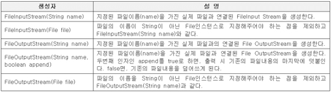

```java
import java.io.FileInputStream;
import java.io.IOException;

public class FileViewer {
    public static void main(String[] args) throws IOException {
        FileInputStream fis = new FileInputStream(args[0]);
        int data = 0;

        while ((data = fis.read()) != -1) {
            char c = (char) data;
            System.out.print(c);
        }
    }
}
```

- 심플한 파일 읽기 프로그램으로, `fis.read()`가 반환하는 값은 파일 내 문자열이므로 `0~255`와 값이 없을때 읽어오는 `-1`이면 충분하기 때문에 `int`로 입력받아 `char`로 형변환 하는것은 문제가 없음

## 바이트기반의 보조스트림

### `FilterInputStream`과 `FilterOutputStream`

- 모든 보조스트림의 조상
- 각각 `InputStream`과 `OutputStream`의 자손

```java
protected FilterInputStream(InputStream in)
public FilterOutputStream(OutputStream out)
```

- `FilterInputStream`은 생성자가 `protected`로 설정되어 있으므로 직접 생성할 수 없고, 상속을 통해 오버라이딩한 클래스의 인스턴스를 생성해야 함
- `FilterInputStream`의 자손
  - `BufferedInputStream`
  - `DataInputStream`
  - `PushbackInputStream`
  - …
- `FilterOutputStream`의 자손
  - `BufferedOutputStream`
  - `DataOutputStream`
  - `PrintStream`
  - …

### `BufferedInputStream`과 `BufferedOutputStream`

- 스트림의 입출력 효율을 높이기 위해 버퍼를 사용하는 보조스트림
- 한 바이트씩 입력/출력을 반복하는 것 보다는 버퍼(바이트배열)을 이용해서 한번에 여러 바이트씩 입출력 하는것이 빠름
- 버퍼 크기를 정하는 것이 핵심인데, 일반적으로는 입력소스가 파일인 경우 8K(8192)를 기본으로 지정하며, 버퍼의 크기를 변경해가면서 최적화가 가능함

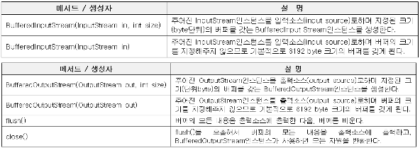

- 버퍼는 외부 입력소스에서 `InputStream`으로 계속 채워지고 (`read`) `OutputStream`의 `write`는 출력 내용을 계속해서 버퍼에 저장하고, 전부 채워지면 출력 소스에 저장
- 출력 소스에 저장한 뒤에는 버퍼를 클리어하게 됨
- 버퍼가 가득 찼을 때만 출력소스에 쓰기 때문에, 마지막 단계에서 버퍼 크기를 다 채우지 못하면 출력 소스에 해당 버퍼 부분만큼의 여분이 출력되지 않을 수 있음
  - 이럴때는 `flush()`를 통해 강제로 버퍼를 비우고, 출력소스에 기록해야 함

### `DataInputStream`과 `DataOutputStream`

- `FilterInputStream`, `FilterOutputStream`의 자손
- `DataInput` 인터페이스, `DataOutput` 인터페이스의 구현체
- 데이터를 읽고 쓰는것이 바이트 단위가 아닌, 8가지 기본 자료형 단위로 가능
  - 출력 형식은 각 기본 자료형을 16진수로 저장
  - 예를 들어 `int`값을 출력하면 4바이트 16진수로 출력
- 각 기본 자료형별로 크기가 다르기 때문에 입력과 출력시 염두해두어야 함

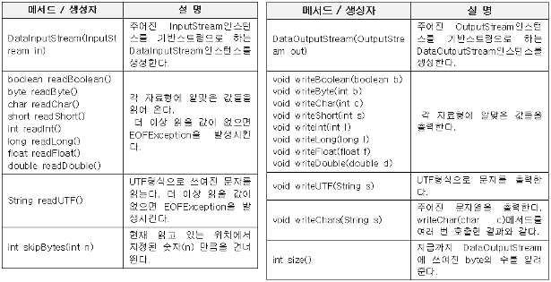

### `SequenceInputStream`

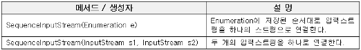

- 여러개의 입력 스트림을 연속적으로 연결해서 하나의 스트림으로부터 데이터를 읽는것과 같이 만들어줌
- `Vector`에 연결할 입력스트림을 저장한 뒤 `Vector`의 `elements()`를 매개변수로 생성자를 호출

```java
Vector files = new Vector();
files.add(new FileInputStream("file.001");
files.add(new FileInputStream("file.002");
SequenceInputStream in = new SequenceInputStream(files.elements());
```

- `Vector`에 추가된 입력스트림의 순서대로 입력되는 것에 주의

### `PrintStream`

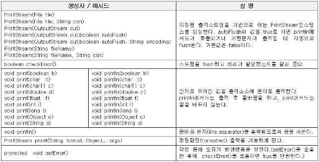

- 기반스트림의 데이터를 다양한 형태로 출력할수 있도록 `print`, `println`, `printf`와 같은 메서드를 제공
- 자바에서 자주 사용하고 있던 `System.out`이 대표적인 `PrintStream`
- 다만, `PrintWriter`가 더 다양한 문자를 처리하는데 적합하기 때문에 가능하면 `PrintWriter`를 사용하는것이 좋음

### `printf`의 다양한 표현식

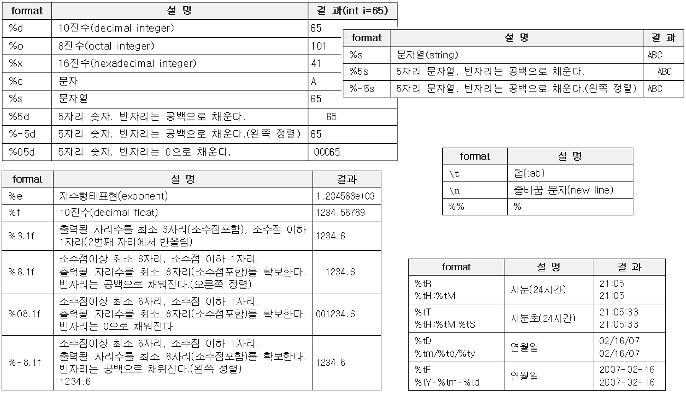
