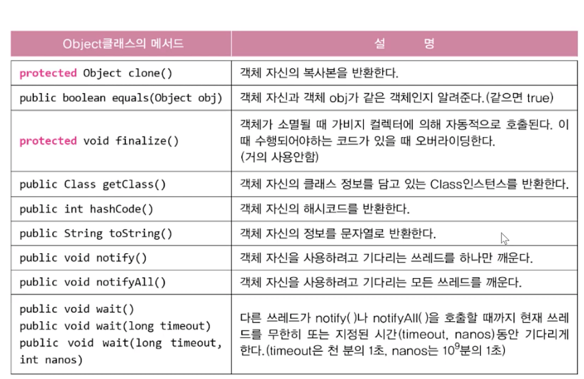

# java.lang 패키지

## `hashCode()`

- 객체의 해시코드(`hash code`)를 반환하는 메서드
- `Object` 클래스의 `hashCode()`는 객체의 주소를 `int`로 변환해서 반환
  - 해싱 알고리즘을 이용
  ```java
  public class Object {
  	...
  	public native int hashCode();
  	// native는 OS의 메서드로 C언어를 사용 (JNI - 자바와 다른 언어를 연결 java native interface)
  	// 이미 작성된 메서드이기 때문에 자바에서의 구현부가 없음 (내용을 볼 수 없음)
  	// 객체마다 다른 값을 반환
  }
  ```
- `equals()`를 오버라이딩하면, `hashCode()`도 오버라이딩 해야 함
  - 둘 다 객체의 주소를 가지고 작업을 하기 때문에, `equals()`의 결과가 `true`인 두 객체의 해시코드는 같아야 하기 때문임
  ```java
  // String은 equals를 값을 이용해서 판단하도록 오버라이딩 하기 때문에,
  // String 내부의 hashCode도 해당 값을 이용한 해싱을 하도록 오버라이딩 하였음
  String str1 = new String("abc");
  String str2 = new String("abc");
  System.out.println(str1.equals(str2)); // true
  System.out.println(str1.hashCode()); // 12345
  System.out.println(str2.hashCode()); // 12345
  ```
- `System.identityHashCode(Object obj)`는 `Object`클래스의 `hashCode()`와 동일
  - 즉, 원래 해당 객체의 `hashCode`를 오버라이딩 하여, 오리지널 해시코드(주소값을 이용한)를 알고 싶다면 이 함수를 사용 가능

## `toString()`과 `toString()`의 오버라이딩

- `toString()` → 객체를 문자열(`String`)으로 변환하기 위한 메서드

```java
public String toString() { // Object의 toString()
	return getClass().getName()+"@"+Integer.toHexString(hashCode());
}

// 디폴트: 클래스이름@<주소를 이용해 만든 해시값>
```

- 프로그램을 만들면 일반적으로 주소값을 이용한 `toString()`은 그다지 유용하지 못하기 때문에 오버라이딩을 많이 진행함 (인스턴스 변수를 이용한 값 출력 등)

## `Object` 클래스



- 모든 클래스의 최고 조상으로 오직 11개의 메서드만을 가지고 있음
- `getClass()`
  - 자신의 `class` 정보를 담고 있는 `Class` 객체(클래스의 정보를 담기 위한 클래스)를 반환
  - `Class` 객체를 이용하면 객체의 설계정보를 이용해서 `Reflection API`를 사용할 수 있게 됨
- `protected` 접근제어자를 가진 메서드들은 `public`으로 오버라이딩 해야 함
  - - 오버라이딩의 규칙 중 조상 클래스 메서드의 접근제어자보다 좁은 범위로 변경 불가능은 `protected` → `public`을 허용함

## `equals(Object obj)`

- 객체 자신(`this`)과 주어진 객체(`obj`)를 비교해서 같으면 `true`, 다르면 `false`를 반환
- `Object`클래스의 `equals()`는 객체의 주소를 비교(참조변수 값 비교)

```java
public boolean equals(Object obj) {
	return (this == obj);
}
```

- 따라서 “두 객체가 같다”라는 의미가 참조변수의 주소값이 같다는 의미가 아니라 각 “객체가 가진 특정 변수의 값이 같다”를 의미한다면 그에 맞게 오버라이딩이 필요

## `String` 클래스

- `String` 클래스는 문자열에 관한 데이터와 메서드를 다루고 있음

```java
public final class String implements java.io.Serializable, Comparable {
	...
	private char[] value;
}
```

- 내용을 변경할 수 없는 불변(`immutable`)클래스
  - `private char[] value;`는 외부에서 직접 접근이 불가능
  - `final class`를 이용해 상속 및 오버라이딩도 불가능
  - `value`의 추가조작을 할 수 있는 메서드를 지원하지 않기 때문

### `String` 결합의 오버헤드에 대해서

- 상기와 같이 불변의 특징이 있기 때문에 값을 직접 수정할 수 없으므로

```java
String a = "a";
String b = "b";
a = a + b;
// a와 b를 위한 공간, 그리고 이 둘을 결합한 새로운 공간이 만들어 지기 때문에 그만큼 오버헤드가 있음
```

- 따라서 문자열의 결합이나 변경이 잦으면, 내용이 변경 가능한 `StringBuffer` 사용을 고려할것

## 문자열의 비교

- `String str = “abc”;`와 `String str = new String(”abc”);`의 비교

```java
String str1 = "abc"; // 문자열 리터럴 "abc"의 주소가 str1에 저장됨
String str2 = "abc"; // 문자열 리터럴 "abc"의 주소가 str1에 저장됨
String str3 = new String("abc"); // 새로운 String 인스턴스를 생성
String str4 = new String("abc"); // 새로운 String 인스턴스를 생성
```

## 문자열 리터럴

- 문자열 리터럴은 프로그램 실행 시 자동으로 생성되어 `Constant pool`에 저장됨 (상수 저장소)
  - `JDK 1.7`부터는 `String`의 `Constant pool`이 `OOME`를 발생시킬 수 있는 위험이 있기 때문에, `Heap` 영역으로 `String Constant Pool`을 만들어 `GC`의 관리대상에 넣음
  - 왜 `OOME`가 발생?
    - `Constant pool`은 `GC`의 관리대상이 아니기 때문에 `String`을 여러번 결합하면서 쓰레기가 너무나도 많이 발생할 소지가 있음
- 자세한 정보는 해당 블로그를 참조

[자바의 String과 Constant Pool](https://jiwondev.tistory.com/114)

## `String` 클래스의 생성자와 메서드

### 생성자

```java
String(String s); // 사용안함
String(char[] value); // char 배열을 모아서 하나의 문자열로 만들어줌
String(StringBuffer buf); // StringBuffer가 가진 문자열과 같은 내용의 String 인스턴스를 생성
```

### 메서드

```java
char charAt(int index);
// String이 가진 문자열의 index번째 있는 문자 하나를 반환

int compareTo(String str);
// 문자열을 사전순서로 비교하여 같으면 0, 다르면 순서에 따라 비교대상보다 빠르면 음수를 느리면 양수를 반환
// 이러한 특성을 이용해서 문자열 비교 정렬에 활용되는 메서드

String concat(String str);
// 문자열 뒤에 str을 덧붙임 (결합)

boolean contains(CharSequence s);
// 지정된 문자열 s가 포함되어 있는지 확인
// Interface CharSequence <- StringBuffer, StringBuilder, String 등이 구현한 인터페이스
// 다형성을 이용해서 문자열 비슷한 것들을 전부 하나의 매개변수로 받기 위해 만들어진 인터페이스임

boolean endsWith(String suffix);
// 지정된 문자열 suffix로 끝나는지 확인
// startsWith(String prefix);

boolean equalsIgnoreCase(String str);
// 대소문자 관계없이 비교

int indexOf(int ch);
// 문자가 몇번째 인덱스 인지 번호를 반환해줌, 찾지 못하면 -1을 반환

int indexOf(int ch, int pos);
// 검색 시작위치를 지정

int lastIndexOf(int ch);
// 뒤에서 부터 찾기 뒤에서부터의 인덱스가 아닌, 원래 인덱스를 반환
// indexOf나 lastIndexOf 둘 다 처음 발견한 시점에 중지하고 해당 인덱스를 반환함

int length();
// 문자열 길이

String[] split(String regex);
// 문자열을 지정된 regex 표현식으로 나누어 배열에 담아 반환

String[] split(String regex, int limit);
// 문자열을 나눌때 최대 limit 개까지만 자름

String substring(int begin);
String substring(int begin, int end);
// 문자열 원본을 begin 인덱스부터 end 인덱스전까지 잘라서 반환 (end를 생략하면 끝까지)

String toLowerCase();
// 모두 소문자로
String toUpperCase();
// 모두 대문자로

String trim();
// 문자열의 양끝 공백관련 문자열을 전부 소거한 문자열을 반환

static String valueOf(boolean b);
static String valueOf(char c);
static String valueOf(int i);
static String valueOf(long l);
static String valueOf(float f);
static String valueOf(double d);
static String valueOf(Object o);
// primitive 형태의 경우에는 그대로 문자열로 변경해서 반환
// 참조변수 형태에서는 toString()을 문자열로 반환
// Wrapper를 이용하는것보다 속도가 빠름
// ToDo: 왜 그런지 알아보기
```

## `join()`과 `StringJoiner`

- `join()`은 여러 문자열 사이에 구분자를 넣어서 결합

```java
String animals = "dog,cat,bear";
String[] arr = animals.split(",");
animals = arr.join("-"); // dog-cat-bear
```

## 문자열과 기본형 간의 변환

- 숫자를 문자열로 바꾸는 방법

```java
int i = 100;
String str1 = i + ""; // 편함
String str2 = String.valueOf(i); // 빠름
```

- 문자열을 숫자로 바꾸는 방법

```java
int i = Integer.parseInt("100");
int i2 = Integer.valueOf("100");
Integer i2 = Integer.valueOf("100");

// 원래는 primitive 타입의 래퍼 클래스마다 parse<Type> 형태의 메서드를 가지고 있었는데,
// 이를 valueOf라는 하나의 메서드이름으로 통일했음

// valueOf를 사용하면 primitive 타입이 아닌 reference 타입의 래퍼 클래스를 반환함
// 그렇다고 해서 valueOf로 받아오는 변수를 참조형 래퍼 클래스에만 넣어야 할 필요는 없는데,
// 오토박싱 기능이 래퍼 클래스를 primitive 타입으로 변경해주기 때문임
```

## `StringBuffer` 클래스

- `String`처럼 문자열 배열(`char[]`)을 내부적으로 가지고 있음

```java
public final class StringBuffer implements java.io.Serializable {
	private char[] value;
	...
}
```

- 그러나 `String`과 달리 내용을 변경할 수 있음 (`mutable`)
- 문자열의 조작이 필요하다면 `StringBuffer`의 사용을 검토할 것

### `StringBuffer`의 생성자

- 배열은 길이 변경이 불가능하기 때문에, 공간이 부족하면 새로운 배열을 생성해야 함

1. 새로운 배열 만들기 (현재 길이 `* 2`)
2. 내용 복사
3. 참조값 변경

### `StringBuffer`의 변경

- `StringBuffer`는 `String`과 달리 내용 변경이 가능
- `StringBuffer`는 아무런 설정이 없다면 초기값 `+16`의 크기로 배열을 작성함
- `append()`는 지정된 내용을 `StringBuffer`에 추가 후 자기 자신의 참조를 반환
  - 따라서 `append()`는 체이닝이 가능함

### `StringBuffer`의 비교

- `StringBuffer`는 `equals()`가 값 비교로 오버라이딩 되어 있지 않음
  - 따라서 객체의 주소비교
- 값을 비교하고 싶으면, `String`으로 변경해서 비교하자

### `StringBuffer`의 생성자

```java
StringBuffer();
// 16문자를 담을 수 있는 버퍼를 가진 StringBuffer 인스턴스 생성

StringBuffer(int length);
// 지정된 개수의 문자를 담을 수 있는 버퍼를 가진 StringBuffer 인스턴스 생성

StringBuffer(String str);
// 지정된 문자열 값 str을 가진 StringBuffer 인스턴스를 생성 +16바이트
```

### `StringBuffer`의 메서드

```java
StringBuffer append(boolean b);
StringBuffer append(char c);
StringBuffer append(char[] str);
StringBuffer append(double d);
StringBuffer append(float f);
StringBuffer append(int i);
StringBuffer append(long l);
StringBuffer append(Object obj);
StringBuffer append(String str);
// 전부 문자열로 교환한 뒤에 StringBuffer 배열에 값을 추가하고,
// 참조변수는 toString()의 값을 추가함

int capacity();
// 버퍼의 크기를 알려줌
int length();
// 문자열이 담긴 컨텐츠의 길이를 알려줌

char charAt(int index);
// 해당 인덱스에 있는 문자 하나를 반환

StringBuffer delete(int start, int end);
// 시작위치부터 끝위치 (단, 끝위치 그 자체는 제외)까지의 문자를 제거하고 붙여서 반환

StringBuffer deleteCharAt(int index);
// 지정된 위치(index)의 문자를 제거

StringBuffer insert(int pos, boolean b);
// 두 번째 매개변수로 받은 값을 문자열로 변환한 뒤, 지정된 pos에 추가하고 반환
// 문자열의 중간일 경우 해당 pos부터 end까지 뒤로 밀림

StringBuffer replace(int start, int end, String str);
// start부터 end까지 (end 미포함)문자열을 제거하고 str을 삽입

StringBuffer reverse();
// StringBuffer 인스턴스에 저장된 문자열의 순서를 거꾸로 나열

StringBuffer setLength(int newLength);
// 버퍼의 수를 조절하는데, 기존보다 적으면 삭제되고, 많으면 널문자로 채워짐
// 널문자는 공백으로 String.trim()을 통해 삭제할 수 있음

String toString();
// String타입으로 변환

String substring(int start);
String substring(int start, int end);
// String과 완전 동일
```

## `StringBuilder`

- `StringBuffer`는 동기화되어 있기 때문에 멀티 쓰레드에 안전 (`thread-safe`)
- `StringBuilder`는 동기화되어 있지 않음

### 간단 쓰레드 개념

- 싱글 쓰레드 → 한번에 `1`개 작업
- 멀티 쓰레드 → 한번에 `n`개 작업 (처리에 효율적이지만 데이터 영역을 공유)
  - 동시에 여러개의 `worker`가 같은 데이터를 접근하기 때문에 데이터가 꼬일 수 있음
  - 각각의 `worker` 사이의 데이터의 정합을 맞춰주는 것을 동기화라고 하고, `StringBuffer`에는 이러한 작업이 내장되어 있음
    - `public *synchronized int methodName();*`

### `StringBuilder`

- 멀티 쓰레드에 안전한 동기화의 경우 데이터의 정합을 수시로 맞추기 때문에 싱글 쓰레드에서는 오히려 오버헤드가 될 수 있음
- 멀티 쓰레드 프로그램이 아닌 경우에는 `StringBuilder`를 사용하면 그 오버헤드 만큼 성능이 향상됨

## `Math` 클래스

- 수학관련 `static` 메서드의 집합

```java
public static final double E = 2.718...// 자연로그의 밑
public static final double PI = 3.141592...// 원주율
```

```java
static int abs(int i);
// 주어진 값의 절대값을 반환

static double ceil(double a);
// 주어진 값을 올림

static double floor(double a);
// 주어진 값을 버림

static double max(double a, double b);
// 주어진 두 값을 비교하여 큰 쪽을 반환

static double min(double a, double b);
// 주어진 두 값을 비교하여 작은 쪽을 반환

static double random();
// 0.0~1.0 범위의 임의의 double값을 반환한다. (1.0은 범위에 포함되지 않는다.)

static double rint(double a);
// 주어진 double값과 가장 가까운 정수값을 double형으로 반환한다
// 단, 두 정수의 정가운데 있는 값 (1.5, 2.5, 3.5)등은 짝수를 반환

static long round(double a);
// 소수점 첫째자리에서 반올림한 정수값 (long)을 반환
// 두 정수의 정 가운데있는 값은 항상 큰 정수를 반환
```

## 래퍼(`wrapper`) 클래스

- 8개의 기본형을 객체로 다뤄야 할 때 사용하는 클래스

```java
public final class Integer extends Nubmer implements Comparable {
	...
	private int value; // 기본 primitive 값을 가지고 있고 헬퍼 메서드들이 존재
	...
}
```

- 객체지향언어에서 기본형을 객체로 취급해야 할 경우가 생길때 활용 가능
- 자바에서 기본형을 둔 이유 → 성능 이슈
  - 기본형은 값을 담으면 메모리 공간 하나에 직접 담으면 되지만 참조형은 객체를 생성하고 시작 주소를 가리키는 값을 담는 공간이 별도로 필요
  - 직접 접근해서 값을 가져오는것이 아니고 한번 거치기 때문에 성능 이슈가 생길 수 밖에 없음

## `Number` 클래스

- 모든 숫자 래퍼 클래스의 조상


- `BigInteger`
  - `Long`보다도 큰 정수를 다룰 때 사용
  - `Long`은 `10`의 `19`제곱
- `BigDecimal`
  - `Double`보다 더 높은 정밀도를 요구할 때 사용
  - `Double`의 정밀도는 소수점 이하 `15`자리

## 문자열을 수자로 변환하기

- 문자열을 숫자로 변환하는 다양한 방법

```java
int i = new Integer("100").intValue(); // floatValue(), longValue(), ...
int i2 = Integer.parseInt("100"); // 주로 이 방법을 많이 사용
Integer i3 = Integer.valueOf("100");
int i4 = Integer.valueOf("100"); // OK
```

- `n`진법의 문자열을 숫자로 변환하는 방법

```java
int i5 = Integer.parseInt("100", 2); // 100을 2진수로 해석, 즉 4
int i6 = Integer.parseInt("FF", 16); // FF를 16진수로 해석, 255
int i7 = Integer.parseInt("FF"); // 생략하면 10진수로 해석하기 때문에 NumberFormatException 발생
```

## 오토박싱과 언박싱

- `primitive` 타입을 `wrapper` 클래스로 자동으로 변환하는 것을 오토박싱
  - `wrapper`로 감싸기 때문에 박싱한다라고 이해 하면 쉬움
- `wrapper` 클래스를 `primitive` 타입으로 자동으로 변환하는 것을 언박싱
  - `wrapper`로 감싼 박스를 해체한다고 생각하면 쉬움
- 이러한 개념은 `JDK 1.5`부터 등장했고, 이전에는 기본형과 참조형간의 연산이 불가능했음
- 그럼 내부에서는 어떻게 해주길래 `JDK 1.5`부터 가능하게 되었을까?

  - 컴파일러가 코드를 자동으로 변환함

    ```java
    int i = 5;
    Integer iObj = new Integer(7);

    int sum = i + iObj; // JDK 1.5 이전에는 에러로 종료
    // JDK 1.5 이후, 컴파일러에 의해
    int sum = i + iObj.intValue(); // 로 변환되어 처리됨
    ```

- 제네릭스 배열 리스트에서 오토박싱
  ```java
  ArrayList<Integer> list = new ArrayList<>();
  list.add(10); // 오토박싱에 의해 list.add(new Integer(10));
  int value = list.get(0); // 언박싱되어 list.get(0).intValue();
  ```
- 기본형을 참조형으로 형변환이 가능하게 됨

```java
int i = 10;

Integer intg = (Integer) i; // 원칙상 불가, 컴파일러가 내부적으로 소스코드를 변경해서 생성
// Integer intg = Integer.valueOf(i);
```
