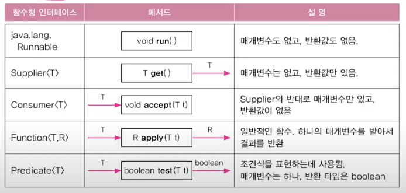
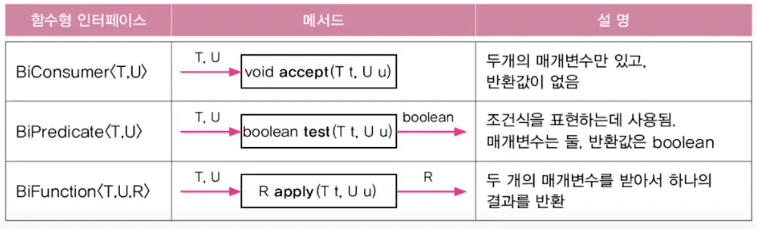
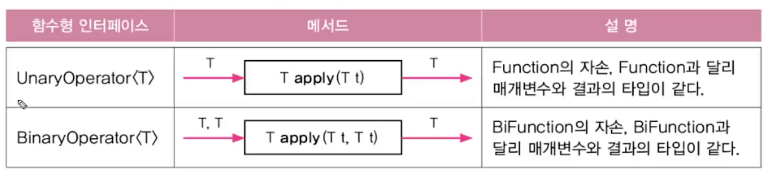
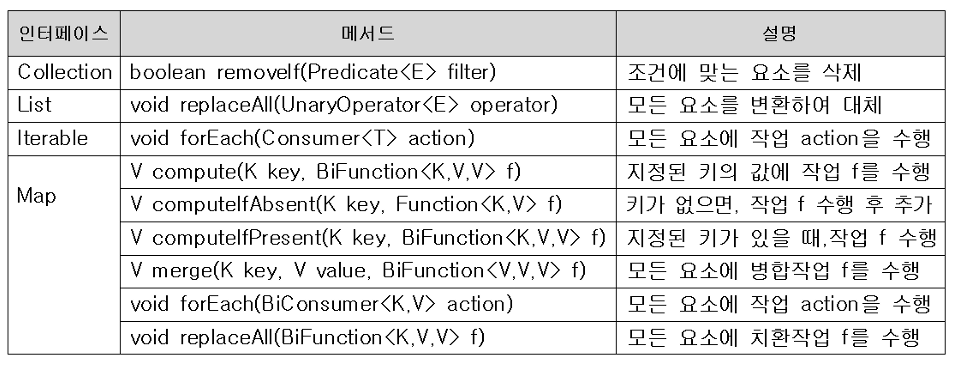

# Lambda Expression

## 함수형 언어

- 자바는 객체지향(`OOP`) 언어지만, `JDK 1.8`부터 함수형 언어의 기능을 포함했음
- 함수형 언어로 유명한것들 `Haskell`, `Scala`, …
- 빅데이터로 인해 함수형 언어들이 점점 필요하게 되고 있음
  - Side Effects(부작용)가 없음
    - 변수의 값이 변경됨
    - 자료구조를 제저리에서 수정
    - 객체의 필드값을 설정
    - 예외나 오류가 발생하며 실행이 중단
    - 콘솔 또는 파일 I/O가 발생
  - 부작용이 없는 이유
    - 함수는 값을 전달받아 스스로 내부에서 처리하고 어떤 결과만을 도출하면 되기 때문에, 한번 값을 전달받은 이후에는 외부에서의 어떠한 작업으로 인한 영향을 받지 않기 때문
  - 부작용이 없으면 공유상태 일관성(shared state consistency), 공유 데이터(shared memory) 접근과 잠금 과정에서 생기는 문제가 없다는 것이므로, 쓰레드에 안전하고 동시성, 병렬 프로그래밍이 가능함
  - 객체 지향적 접근방식에서는 복수의 쓰레드가 단일 공유 데이터에 접근하는 방식을 취하기 때문에, 이러한 부작용이 발생하며 동기화등의 방식을 추가로 제공해야 하는데, 이 자체가 오버헤드가 됨
- `Python`, `JavaScript`등이 `OOP`와 함수형 언어의 기능을 동시에 포함하고 있음

## 람다식

### 함수(메서드)를 간단한 “식(`expression`)”으로 표현하는 방법

```java
// normal method
int max(int a, int b) {
	return a > b ? a : b;
}

// to expression
(a, b) -> a > b ? a : b
```

### 익명 함수 (이름이 없는 함수, `anonymous function`)

```java
// normal method
int max(int a, int b) {
	return a > b ? a : b;
}

// to expression
~~int max~~(int a, int b) -> {
	return a > b ? a : b;
}
```

### 함수와 메서드의 차이

- 근본적으로는 동일
- 함수는 일반적 용어, 메서드는 객체지향개념 용어
- 함수는 클래스에 독립적, 메서드는 클래스에 종속적

## 람다식 작성하기

1. 메서드의 이름과 반환타입을 제거하고 “`→`”를 블록 `{}` 앞에 추가
   - 메서드를 간단하게 표현하기 위한 것이 람다식
2. 반환값이 있는 경우, 식이나 값만 적고 `return` 문을 생략 가능 (끝에 “`;`” 안붙임)

   ```java
   (int a, int b) -> {
   	return a > b ? a : b;
   }

   // to one line
   (int a, int b) -> a > b ? a : b
   ```

3. 매개변수의 타입이 추론 가능하면 생략 가능 (대부분의 경우 생략가능)

   ```java
   (int a, int b) -> a > b ? a : b

   // simplify
   (a, b) -> a > b ? a : b
   ```

### 주의사항

1. 매개변수가 하나인 경우 괄호`()` 생략 가능 (타입이 없을 때만)

   ```java
   (a) -> a * a
   (int a) -> a * a

   a -> a * a // OK
   int a -> a * a // Not OK
   ```

2. 블록안의 문장이 하나뿐일때, 블럭`{}` 생략 가능 (끝에 “`;`” 안붙임)
3. 단, 하나뿐인 문장이 `return`문이면 블럭`{}` 생략불가

## 람다식은 익명 함수가 아닌 익명 객체

### 람다식은 익명 함수가 아니라 익명 객체

```java
(a, b) -> a > b ? a : b

// Originally
new Object() {
	int max(int a, int b) {
		return a > b ? a : b;
	}
}
```

### 람다식(익명 객체)을 다루기 위한 참조변수의 타입은?

```java
Object obj = new Object() {
	int max(int a, int b) {
		return a > b ? a : b;
	}
}

int value = obj.max(3,5); // error
```

- `obj`는 `Object` 타입의 참조변수로 다형성의 원칙에 의해 모든 객체를 담을수는 있겠지만, `max()`는 새로운 익명 객체에서 추가된 메서드이기 때문에 호출이 불가함
- 자바에서의 룰에 의해 메서드는 항상 클래스 종속(객체 종속)이기 때문에 메서드 단일로만 존재할 수 없음
- 그래서 자바에서 람다식은 익명 객체를 생성하여 객체의 생성부를 생략하는 방식(컴파일러가 서포트)을 통해 람다식을 구현
- 하지만 상기의 에러를 해결하기 위해 함수형 인터페이스가 필요

### 외부 변수를 참조하는 람다식

- 람다식도 익명 객체이므로 외부에 선언된 변수에 접근하는 것은 익명 클래스의 권한과 동일
- 단, 람다식이 참조한 지역변수는 왜인지 final이거나 final 처럼 동작해야 함
  - 이러한 동작을 람다 캡쳐링이라고 부르며, 그렇게 해야 하는 이유는 JVM의 메모리 구조에 있음
  - JVM에서는 각 쓰레드마다 별도의 스택 영역이 생김
  - 또한 지역변수는 스택 영역에 생성됨
  - 람다는 별도의 쓰레드에서 동작하므로 고유한 스택 영역을 가지고 있음
  - 스택 영역은 각 쓰레드별로 공유가 불가능한 영역임
  - 고유 스택 영역에 생성된 지역변수를 람다의 스택 영역에서 참조할수 없기 때문에 람다가 참조하게 되면 해당 지역변수를 람다의 스택 영역으로 복사해서 사용함
  - 람다가 사용하는 도중 지역이 종료되고 참조가 사라질 수 있으며, 이렇게 되어도 람다는 실행이 가능함 (자기의 스택 영역으로 값을 복사해왔기 때문에)
  - 이러한 상태에서 변경을 허용해버리면 복사해온 값의 진위여부가 의심받기 때문에 람다식에서 참조한 지역변수를 불변으로 하기로 결정한 것임

## 함수형 인터페이스

### 함수형 인터페이스

- 단 하나의 추상 메서드만 선언된 인터페이스

```java
@FunctionalInterface
interface MyFunction {
	public abstract int max(int a, int b);
}
```

```java
// 익명 클래스의 구현
MyFunction f = new MyFunction() {
	public int max(int a, int b) {
		return a > b ? a : b;
	}
};
```

```java
int value = f.max(3, 5); // OK MyFunction에 max()가 있음
```

### 함수형 인터페이스 타입의 참조변수로 람다식 참조 가능

- 함수형 인터페이스의 메서드와 람다식의 매개변수, 반환 타입이 일치하는 조건

```java
MyFunction f = (a, b) -> a > b ? a : b;
int value = f.max(3, 5); // 실제로는 람다식이 호출됨
```

### 익명 객체를 람다식으로 대체

```java
List<String> list = Arrays.asList("abc", "aaa", "bbb", "ddd", "aaa");
Collections.sort(list, new Comparator<String>() {
	public int compare(String s1, String s2) {
		return s2.compareTo(s1);
	}
});
```

```java
List<String> list = Arrays.asList("abc", "aaa", "bbb", "ddd", "aaa");
Collections.sort(list, (s1, s2) -> s2.compareTo(s1));
```

### 함수형 인터페이스 타입의 매개변수

```java
void aMethod(MyFunction f) {
	f.myMethod(); // MyFunction에 정의된 추상메서드 호출
}

aMethod(() -> System.out.println("myMethod()"));
```

### 함수형 인터페이스 타입의 반환타입

```java
MyFunction myMethod() {
	return () -> {};
}
```

## java.util.function 패키지

### 자주 사용되는 다양한 함수형 인터페이스를 제공



```java
Predicate<String> isEmptyStr = s -> s.length() == 0;
String s = "";

// test가 메서드로 존재하고 있음
if(isEmptyStr.test(s)) {
	System.out.println("This is an empty String.");
}
```

### 매개변수가 2개인 함수형 인터페이스



- 매개변수가 3개인 함수형 인터페이스는 없으므로 직접 만들자

```java
@FunctionalInterface
interface TriFunction<T, U, V, R> {
	R apply(T t, U u, V v);
}
```

### 매개변수의 타입과 반환타입이 일치하는 함수형 인터페이스



### 컬렉션 프레임웍과 함수형 인터페이스



```java
import java.util.ArrayList;
import java.util.HashMap;
import java.util.Map;

public class LambdaEx4 {
    public static void main(String[] args) {
        ArrayList<Integer> list = new ArrayList<>();

        for (int i = 0; i < 10; i++) {
            list.add(i);
        }

        list.forEach(i -> System.out.print(i + ","));
        System.out.println();

        list.removeIf(x -> x % 2 == 0 || x % 3 == 0);
        System.out.println(list);

        list.replaceAll(i -> i * 10);
        System.out.println(list);

        Map<String, String> map = new HashMap<>();
        map.put("1", "1");
        map.put("2", "2");
        map.put("3", "3");
        map.put("4", "4");

        map.computeIfPresent("5", (k, v) -> k + v);
        System.out.println(map);

        map.forEach((k, v) -> System.out.println(k + ", " + v));
        System.out.println();
    }
}
```
