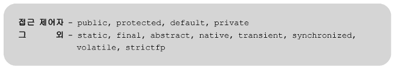
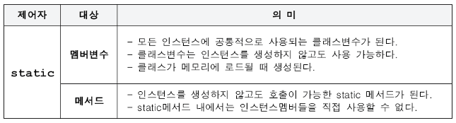
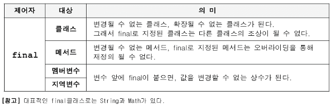
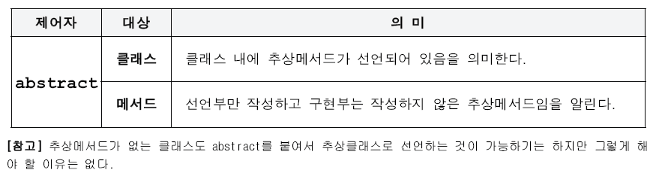
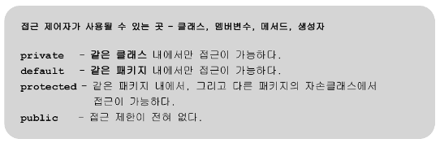
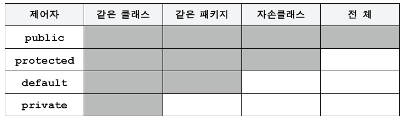
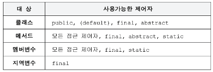

# 제어자 (modifier)

## 제어자란?

- 클래스, 변수 또는 메서드의 선언부에 사용되어 의미를 부여
- 접근제어자와 그 외 제어자로 구분됨
- 하나의 대상에 여러 제어자를 선언할 수 있지만, 접근제어자는 하나만 사용 가능



## `static` (클래스, 공통의)



## `final` (마지막, 변경될 수 없는)



### 생성자를 이용한 `final`멤버 변수의 초기화

- `final`이 붙은 변수는 상수이므로 선언과 초기화를 동시에 하는 것이 일반적
- 인스턴스 변수로 선언된 `final` 변수는 생성자에서 초기화 하는 것이 허용됨

## `abstract` (추상의, 미완성의)



## 접근제어자 (`access modifier`)

- 멤버 또는 클래스에 사용되어, 외부로부터의 접근을 제어





- 접근 범위가 넓은 쪽에서 좁은 쪽의 순

```java
public > protected > (default) > private
```

- `default` 접근제어자는 같은 패키지만 허용함
- `protected` 접근제어자는 같은 패키지와 더불어 다른 패키지일 경우 상속한 자손의 경우 접근을 허용함

### 접근제어자를 이용한 캡슐화

- 클래스 내부에서만 사용되는 변수의 경우에는 다른곳에서 접근할수 없도록 `private`을 사용하여 제한함 → 객체지향 개념의 캡슐화
- 캡슐화를 사용하면, 테스트의 범위가 확실하게 정해지기 때문에, 영향조사의 범위를 줄일 수 있음

```java
class Time {
	public int hour;
	public int minute;
	public int second;
}

// 이 경우에는 외부에서 Time클래스를 생성한 뒤, 직접 내부 변수에 접근하여 수정이 가능 (영향을 미침)
Time t = new Time();
t.hour = 12;
```

```java
class Time {
	private int hour;
	private int minute;
	private int second;

	public setHour(int hour) {
		// 필요한 경우 제어문을 수행 (0~24시 이내 등)
		this.hour = hour;
	}
}

// 이 경우에는 외부에서 Time클래스를 생성하더라도 멤버변수를 설정하기 위해 setHour에 접근이 필요
// setHour에 입력되는 매개변수는 setHour에서 제어가 가능
Time t = new Time();
t.setHour(25); // error
```

### 생성자의 접근제어자

- 생성자에 접근제어자를 사용하여 인스턴스의 생성을 제한할 수 있음
- 생성자가 `private`이면 인스턴스를 생성할 수 없음

  ```java
  class Singleton {
  	private static Singleton s = new Singleton();

  	private Singleton() {}

  	public static Singleton getInstance() {
  		return s;
  	}
  }
  ```

## 제어자(`modifier`)의 조합



1. 메서드에 `static`과 `abstract`를 함께 사용할 수 없음
   - `static` 메서드는 몸통이 있는 메서드에만 사용할 수 있기 때문
2. 클래스에 `abstract`와 `final`을 동시에 사용할 수 없음
   - 클래스에 사용되는 `final`은 클래스를 확장할 수 없다는 의미이고 `abstract`는 상속을 통해 완성시켜야 한다는 의미이므로 서로 모순임
3. `abstract` 메서드의 접근제어자가 `private`일 수 없음
   - `abstract`메서드는 자손클래스에서 구현해야 하는데, 접근제어자가 `private`이면 자손클래스에서도 접근이 불가하기 때문
4. 메서드에 `private`과 `final`을 같이 사용할 필요는 없음
   - 접근제어자가 `private`인 메서드는 오버라이딩 될 수 없기 때문임
   - 둘중 하나만 사용해도 의미가 충분
