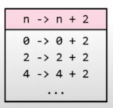
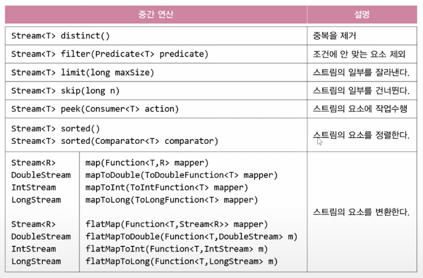
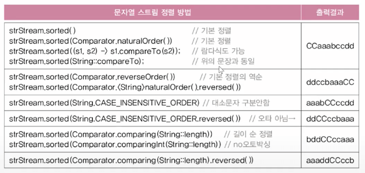
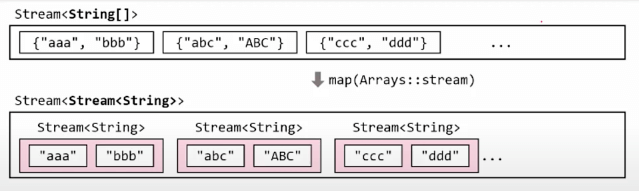
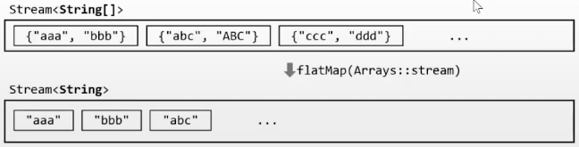
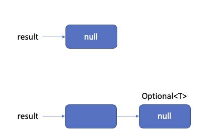
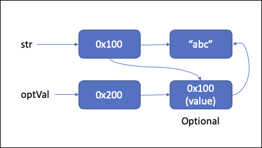
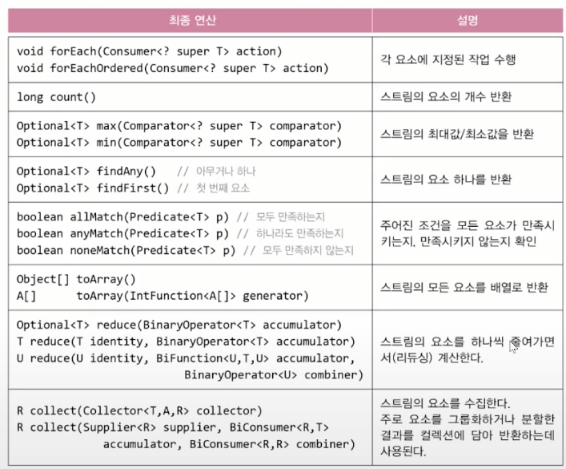

# Stream

## 스트림(`stream`)

### 다양한 데이터 소스를 표준화된 방법으로 다루기 위한 것

- 데이터 소스
  - 컬렉션 → 데이터셋을 표준화하여 관리하려고 하였으나, 실패 (`List`, `Set`, `Map` 성격이 다름, 사용방법이 다름 = 표준화되지 않음)
  - 배열

```java
List<Integer> list = Arrays.asList(1, 2, 3, 4, 5);
Stream<Integer> intStream = list.stream(); // 컬렉션
Stream<String> strStream = Stream.of(new String[]{"a", "b", "c"}); // 배열
Stream<Integer> evenStream = Stream.iterate(0, n->n+2); // 0, 2, 4, 6, ...
Stream<Double> randomStream = Stream.generate(Math::random); // 람다식
IntStream intStream = new Random().ints(5); // 난수 스트림
```

### 스트림이 제공하는 기능 (중간 연산과 최종 연산)

- 중간 연산
  - 연산 결과가 스트림인 연산
  - 반복적으로 적용 가능
- 최종 연산
  - 연산 결과가 스트림이 아닌 연산
  - 단 한번만 적용 가능 (스트림의 요소를 소모)
- 스트림 사용법
  1. 스트림 만들기
  2. 중간 연산(`0~n번`)
  3. 최종 연산(`0~1번`)

```java
stream.distinct().limit(5).sorted().forEach(System.out::println);

// distinct() 중복제거
// limit() 자르기
// sorted() 정렬
// forEach 각요소에 대해 실행
```

## 스트림(`stream`)의 특징

### 스트림은 데이터 소스로부터 데이터를 읽기만 할 뿐 변경하지 않음

```java
List<Integer> list = Arrays.asList(3,1,5,4,2);
List<Integer> sortedList = list.stream.sorted().collect(Collectors.toList()); // 새로운 List에 저장
System.out.println(list); // [3, 1, 5, 4, 2]
System.out.println(sortedList); // [1, 2, 3, 4, 5]
```

### 스트림은 `Iterator`처럼 일회용임 (필요하면 다시 스트림을 생성해야 함)

```java
strStream.forEach(System.out::println); // 모든 요소를 화면에 출력 (최종연산 끝)
int numOfStr = strStream.count(); // 에러, 스트림이 이미 닫힘
```

### 최종 연산 전까지 중간연산이 수행되지 않음 (지연 연산)

```java
IntStream intStream = new Random().ints(1, 46); // 1~45범위의 무한 스트림
intStream.distinct().limit(6).sorted() // 중간 연산
		.forEach(i -> System.out.print(i + ",")); // 최종 연산
```

### 스트림은 작업을 내부 반복으로 처리

```java
for(String str : strList) {
	System.out.println(str);
}

stream.forEach(System.out::println);

void forEach(Consumer<? super T> action) {
	Objects.requireNonNull(action); // 매개변수의 널 체크

	for (T t : src) { // 내부 반복 (for문을 메서드 안으로 넣음)
		action.accept(T);
	}
}
```

### 스트림의 작업을 병렬로 처리 (병렬 스트림) → 멀티 쓰레딩

```java
Stream<String> strStream = Stream.of("dd", "aaa", "CC", "cc", "b");
int sum = strStream.parallel()  // 병렬 스트림으로 전환(속성 변경)
  .mapToInt(s -> s.length()).sum(); // 모든 문자열의 길이의 합
```

### 기본형 스트림 - `IntStream`, `LongStream`, `DoubleStream` …

- 오토박싱 & 언박싱의 비효율이 제거됨 (`Stream<Integer>` 대신 `IntStream`사용)
  - 성능 개선이 필요한 경우에 사용하자
- 숫자와 관련된 유용한 메서드를 `Stream<T>` 보다 더 많이 제공

## 스트림 만들기 (컬렉션)

### `Collection` 인터페이스의 `stream()`으로 컬렉션을 스트림으로 변환

```java
// List, Set
Stream<E> stream(); // Collection 인터페이스의 메서드
```

```java
List<Integer> list = Arrays.asList(1,2,3,4,5);
Stream<Integer> intStream = list.stream(); // list를 stream으로 변환

// 스트림 출력
intStream.forEach(System.out::print); // 12345
intStream.forEach(System.out::print); // 에러, 스트림이 한번 최종연산 된 이후에는 사용 불가
```

## 스트림 만들기 (배열)

### 객체 배열로부터 스트림 생성

```java
Stream<T> Stream.of(T... values) // 가변 인자
Stream<T> Stream.of(T[])
Stream<T> Arrays.stream(T[])
Stream<T> Arrays.stream(T[] array, int startInclusive, int endExclusive)

// example
Stream<String> strStream = Stream.of("a", "b", "c");
Stream<String> strStream = Stream.of(new String[]{"a", "b", "c"});
Stream<String> strStream = Arrays.stream(new String[]{"a", "b", "c"});
Stream<String> strStream = Arrays.stream(new String[]{"a", "b", "c"}, 0, 3); // 0, 1, 2
```

### 기본형 배열로부터 스트림 생성

```java
IntStream IntStream.of(int... values)
IntStream IntStream.of(int[])
IntStream Arrays.stream(int[])
IntStream Arrays.stream(int[] array, int startInclusive, int endExclusive)
```

## 스트림 만들기 (난수)

### 난수를 요소로 갖는 스트림 생성

```java
IntStream intStream = new Random().ints(); // 무한 스트림
intStream.limit(5).forEach(System.out::println); // 5개의 요소만 출력

IntStream intStream = new Random().ints(5); // limit 5가 적용된 유한 스트림

// new Random()의 범위
Integer.MIN_VALUE <= ints() <= Integer.MAX_VALUE
Long.MIN_VALUE <= longs() <= Long.MAX_VALUE
0.0 <= doubles() < 1.0
```

### 지정된 범위의 난수를 요소로 갖는 스트림을 생성하는 메서드 (`Random` 클래스)

```java
// 무한 스트림
IntStream ints(int begin, int end);
LongStream longs(long begin, long end);
DoubleStream doubles(double begin, double end);

// 유한 스트림
IntStream ints(long streamSize, int begin, int end);
LongStream longs(long streamSize, long begin, long end);
DoubleStream doubles(long streamSize, double begin, double end);
```

## 스트림 만들기 (특정 범위의 정수)

### 특정 범위의 정수를 요소로 갖는 스트림 생성 (`IntStream`, `LongStream`)

```java
IntStream IntStream.range(int begin, int end);
IntStream IntStream.rangeClosed(int beginm int end);

// example
IntStream intStream = IntStream.range(1, 5); // 1,2,3,4
IntStream intStream = IntStream.rangeClosed(1,5); // 1,2,3,4,5
```

## 스트림 만들기 (람다식) - `iterator()`, `generate()`

### 람다식을 소스로 하는 스트림 생성 (동적 생성)

```java
static <T> Stream<T> iterator(T seed, UnaryOperator<T> f) // 이전 요소에 종속
static <T> Stream<T> generate(Supplier<T> s) // 이전 요소에 독립
```

### `iterator()`는 이전 요소를 `seed`로 해서 다음 요소를 계산

```java
Stream<Integer> evenStream = Stream.iterator(0, n->n+2);
```



### `generate()`는 `seed`를 사용하지 않음

```java
Stream<Double> randomStream = Stream.generate(Math::random); // Math.random() 무한
Stream<Integer> oneStream = Stream.generate(()->1); // 무한 1
```

## 스트림 만들기 (파일과 빈 스트림)

### 파일을 소스로 하는 스트림 생성

```java
Stream<Path> Files.list(Path dir) // Path는 파일 또는 디렉토리

Stream<String> Files.lines(Path path)
Stream<String> Files.lines(Path path, Charset cs)
Stream<String> lines() // BufferedReader클래스의 메서드
```

### 빈 스트림 생성

```java
Stream emptyStream = Stream.empty(); // empty()는 빈 스트림을 생성해서 반환
long count = emptyStream.count(); // 0
```

## 스트림의 연산 (중간 연산)



### 스트림 자르기 `skip()`, `limit()`

```java
Stream<T> skip(long n) // 앞에서부터 n개 건너뛰기
Stream<T> limit(long maxSize) // maxSize 이후를 생략

// example
IntStream intStream = IntStream.rangeClosed(1, 10); // 1~10까지 요소를 담은 스트림
intStream.skip(3).limit(5); // 4,5,6,7,8
```

### 스트림의 요소 걸러내기 `filter()`, `distinct()`

```java
Stream<T> filter(Predicate<? super T> predicate) // 조건에 맞지 않는 요소 제거
Stream<T> distinct() // 중복 제거

// example
IntStream intStream = IntStream.of(1,2,2,3,3,3,4,5,5,6);
intStream.distinct(); // 1,2,3,4,5,6

// example
IntStream intStream = IntStream.rangeClosed(1, 10); // 1~10까지 요소를 담은 스트림
intStream.filter(i->i%2==0); // check even (2,4,6,8,10)

// 중간연산은 연속으로 사용 가능
intStream.filter(i->i%2==0 && i%3!=0);
intStream.filter(i->i%2==0).filter(i%3!=0);
```

### 스트림 정렬 `sorted()`

```java
Stream<T> sorted() // 스트림 요소의 기본 정렬(Comparable)로 정렬
Stream<T> sorted(Comparator<? super T> comparator) // 지정된 Comparator로 정렬
```



### `Comparator`의 `comparing()`으로 정렬 기준을 제공

```java
comparing(Function<T, U> keyExtractor)
comparing(Function<T, U> keyExtractor, Comparator<U> keyComparator)

// example
studentStream.sorted(Comparator.comparing(Student::getBan)) // 반별로 정렬
```

### 추가 정렬 기준을 제공할 때는 `thenComparing()`을 사용

```java
thenComparing(Comparator<T> other)
thenComparing(Function<T, U> keyExtractor)
thenComparing(Function<T, U> keyExtractor, Comparator<U> keyComparator)

// example
studentStream.sorted(Comparator.comparing(Student::getBan) // 반별로 정렬
                               .thenComparing(Student::getTotalScore) // 그 다음 총점
                               .thenComparing(Student::getName)) // 그 다음 이름
```

### 스트림의 요소 변환 `map()`

```java
Stream<R> map(Function<? super T, ? extends R> mapper) // Stream<T> -> Stream<R>
```

- 이 연산의 실행으로 인해 스트림의 타입이 변경됨

```java
Stream<File> fileStream = Stream.of(new File("Ex1.java"), new File("Ex1"), new File("Ex1.bak"), new File("Ex2.java"), new File("Ex1.txt"));
Stream<String> filenameStream = fileStream.map(File::getName);
// 파일 스트림을 스트링 스트림으로 변경
// 정확하게는 파일 스트림에서 각 파일별로 제공하는 getName을 이용해서 새로운 스트림을 만든 것
filenameStream.forEach(System.out::println); // 스트림의 모든 파일의 이름을 출력

// example 파일 확장자 뽑아내기
fileStream.map(File::getName)
	.filter(s -> s.indexOf('.') != -1)
	.map(s -> s.substring(s.indexOf('.')+1))
	.map(String::toUpperCase)
	.distinct()
	.forEach(System.out::println);
```

### 스트림의 요소를 소비하지 않고 엿보기 `peek()`

```java
Stream<T> peek(Consumer<? super T> action) // 중간 연산 (스트림 소비 x)
void forEach(Consumer<? super T> action) // 최종 연산 (스트림 소비 o)

// example
fileStream.map(File::getName)
	.filter(s -> s.indexOf('.') != -1)
	.peek(System.out::println)
	.map(s -> s.substring(s.indexOf('.')+1))
	.peek(System.out::println);
	.map(String::toUpperCase)
	.distinct()
	.forEach(System.out::println);
```

### 기본형 스트림으로 변환 `mapToInt()`, `mapToLong()`, `mapToDouble()`

- `map()`은 연산의 결과로 `Stream<T>`를 반환
- 반환하는 타입이 기본형이고, 기본형을 이용해서 최종연산을 하는 경우 기본형 스트림으로 변환하는게 유리
  - `Integer`, `Long`과 같은 래퍼 클래스를 언박싱하는데 소요되는 오버헤드가 줄기 때문
- 기본형 스트림은 `sum()`, `average()`, `max()`, `min()`과 같은 기본형 타입에 특화된 최종 연산 메서드를 제공
- 최종연산을 반복적으로 사용할 수 없음 (예를 들면, `sum()`, `average()`를 연속적으로)
  - 예를 들면 `sum()`, `average()` 등을 전부 구하고 싶을 경우 (스트림이 닫혀버림)
  - 스트림이 닫히기 때문에, 별도 메서드를 제공하고 있음 `summaryStatistics()`

```java
import java.util.Comparator;
import java.util.IntSummaryStatistics;
import java.util.stream.IntStream;
import java.util.stream.Stream;

public class StreamEx3 {
    public static void main(String[] args) {
        Student[] students = {
                new Student("가자바", 3, 300)
                , new Student("나자바", 1, 200)
                , new Student("다자바", 2, 100)
                , new Student("라자바", 2, 150)
                , new Student("마자바", 1, 200)
                , new Student("바자바", 3, 290)
                , new Student("사자바", 3, 180)
        };
        Stream<Student> studentStream = Stream.of(students);

        studentStream.sorted(Comparator.comparing(Student::getClassNo)
                        .thenComparing(Comparator.naturalOrder()))
                .forEach(System.out::println);

        studentStream = Stream.of(students);
        IntStream scoreStream = studentStream.mapToInt(Student::getTotalScore);

        IntSummaryStatistics stat = scoreStream.summaryStatistics();
        System.out.println("count=" + stat.getCount());
        System.out.println("sum=" + stat.getSum());
        System.out.println("avg=" + stat.getAverage());
        System.out.println("min=" + stat.getMin());
        System.out.println("max=" + stat.getMax());
    }
}

class Student implements Comparable<Student> {
    private final String name;
    private final int classNo;
    private final int totalScore;

    public Student(String name, int classNo, int totalScore) {
        this.name = name;
        this.classNo = classNo;
        this.totalScore = totalScore;
    }

    public String getName() {
        return name;
    }

    public int getClassNo() {
        return classNo;
    }

    public int getTotalScore() {
        return totalScore;
    }

    @Override
    public String toString() {
        return String.format("[%s, %d, %d]", name, classNo, totalScore);
    }

    @Override
    public int compareTo(Student o) {
        return o.totalScore - totalScore;
    }
}
```

### 기본형 스트림을 객체형 스트림으로 변환 `mapToObj()`

- `IntStream`, `LongStream`과 같은 기본형 스트림을 다시 `Stream<T>` 같은 객체형 스트림으로 변경

### 스트림의 스트림을 스트림으로 변환 `flatMap()`

```java
Stream<String[]> strArrStrm = Stream.of(new String[]{"abc", "def", "ghi"}
                                       ,new String[]{"ABC", "DEF", "GHI"});

Stream<Stream<String>> strStrStrm = strArrStrm.map(Arrays::stream);
```



```java
Stream<String> strStream = strArrStrm.flatMap(Arrays::stream); // Arrays.stream(T[])
```



## `Optional<T>`

### `T`타입 객체의 래퍼클래스 `Optional<T>`

```java
public final class Optional<T> {
	private final T value; // 모든 종류의 객체를 저장 가능 or null
	...
}
```

### 왜 사용?

1. `null`을 직접 다루는 것은 위험 (`NPE`) → 객체에 담아서 간접적으로 `null`을 다루기 위함
2. `null`체크를 하려면 `if`문 필수, 코드가 지저분해짐

```java
Object result = getResult(); // 반환값은 1. null or 2. 객체
System.out.println(result.toString()); // null일 경우 NPE 발생

// 이렇게 코드가 지저분해짐
if(result != null) { // 항상 널체크 필요
	System.out.println(result.toString());
}
```

### 기존에는 `null`을 직접 참조했지만 이제는 `Optional`을 통해 `null`을 간접적으로 다룸

```java
String str = null; // ❌
String str = ""; // ✅

int[] nums = null; // ❌
int[] nums = new int[0]; // ✅
```



## `Optional<T>` 객체 생성하기

### `Optional<T>` 객체를 생성하는 다양한 방법

```java
String str = "abc";
Optional<String> optVal = Optional.of(str);
Optional<String> optVal = Optional.of("abc");
Optional<String> optVal = Optional.of(null); // NullPointerException 발생
Optional<String> optVal = Optional.ofNullable(null); // OK
```



### `null` 대신 빈 `Optional<T>`객체를 사용하자

```java
Optional<String> optVal = null; // ❌ 널로 초기화하는 것은 바람직하지 않음
Optional<String> optVal = Optional.empty();

Object[] obj = null; // ❌
Object[] obj = new Object[0]; // ✅
```

## `Optional<T>` 객체의 값 가져오기

### `Optional` 객체의 값 가져오기 `get()`, `orElse()`, `orElseGet()`, `orElseThrow()`

```java
Optional<String> optVal = Optional.of("abc");
String str1 = optVal.get(); // optVal에 저장된 값을 반환, null이면 예외발생
String str2 = optVal.orElse(""); // null일때 반환할 값을 줌
String str3 = optVal.orElseGet(String::new); // 람다식 사용가능 () -> new String()
String str4 = optVal.orElseThrow(NullPointerException::new); // 널이면 예외 발생

T orElseGet(Supplier<? extends T> other)
T orElseThrow(Supplier<? extends X> exceptionSupplier)
```

### `Optional` 객체의 값이 `null`이면 `false`, `null`이 아니면 `true`를 반환 `isPresent()`

```java
if(Optional.ofNullable(str).isPresent()) { // if(str != null) {
	System.out.println(str);
}

Optional.ofNullable(str).ifPresent(System.out::println);
```

## `Optional`의 기본형 `OptionalInt`, `OptionalLong`, `OptionalDouble`

### 기본형 값을 감싸는 래퍼클래스 → 성능만 (`Optional<Integer>`보다 나음)

```java
public final class OptionalInt {
	...
	private final boolean isPresent;
	private final int value;
}
```

### `OptionalInt`의 값 가져오기 `int getAsInt()`

```java
Optional<T> T get()
OptionalInt int getAsInt()
OptionalLong long getAsLong()
OptionalDouble double getAsDouble()
```

### 빈 `Optional` 객체와의 비교

```java
OptionalInt opt = OptionalInt.of(0); // isPresent() true
OptionalInt opt2 = OptionalInt.empty(); // isPresent() false
```

## 스트림의 연산 (최종 연산)



### 스트림의 연산

- 중간 연산
  - n번 수행 가능
  - Stream을 반환하기 때문에 연속해서 중간연산 수행 가능
- 최종 연산
  - 1번 수행 가능
  - 기본형 또는 Optional<T>를 반환하므로 더이상 스트림 연산 수행 불가

## forEach()

### 스트림의 모든 요소에 지정된 작업을 수행 forEach(), forEachOrdered()

```java
void forEach(Consumer<? super T> action) // 병렬스트림인 경우 순서가 보장되지 않음
void forEachOrdered(Consumer<? super T> action) // 병렬스트림인 경우에도 순서가 보장됨

IntStream.range(1, 10).sequantial().forEach(System.out::println); // ordered
IntStream.range(1, 10).sequantial().forEach(System.out::println); // ordered

IntStream.range(1, 10).parallel().forEach(System.out::println); // not ordered
IntStream.range(1, 10).parallel().forEach(System.out::println); // ordered
```

## 조건 검사

### allMatch(), anyMatch(), noneMatch()

```java
boolean allMatch(Predicate<? super T> predicate) // 모든 요소가 조건을 만족시키면 true
boolean anyMatch(Predicate<? super T> predicate) // 한 요소라도 조건을 만족시키면 true
boolean noneMatch(Predicate<? super T> predicate) // 모든 요소가 조건을 만족시키지 않으면 true

// example
boolean hasFailedStudent = studentStream.anyMatch(s -> s.getTotalScore() <= 100);
```

### 조건에 일치하는 요소 찾기 findFirst(), findAny()

```java
Optional<T> findFirst() // 첫 번째 요소를 반환, 순차 스트림에 사용
Optional<T> findAny() // 아무거나 하나를 반환, 병렬 스트림에 사용

// example
Optional<Student> result = studentStream.filter(s -> s.getTotalScore <= 100).findFirst();
Optional<Student> result = parallelStream.filter(s -> s.getTotalScore <= 100).findAny();
```

## 스트림 최종연산 (reduce)

### 스트림의 요소를 하나씩 줄여(reduce)가면서 연산을 수행

- 누적연산 accumulator (accumulate 누적하다

```java
Optional<T> reduce(BinaryOperator<T> accumulator)
T           reduce(T identity, BinaryOperator<T> accumulator)
U           reduce(U identity, BinaryOperator<T> accumulator, BinaryOperator<U> combiner)

// identity 초기값
// accumulator 이전 연산결과와 스트림의 요소에 수행할 연산
// combiner 병렬처리된 결과를 합치는데 사용할 연산 (병렬 스트림)
```

```java
// int reduce(int identity, IntBinaryOperator op)
int count = intStream.reduce(0, (a,b) -> a + 1);
int sum = intStream.reduce(0, (a,b) -> a + b);
int max = intStream.reduce(Integer.MIN_VALUE, (a,b) -> a > b ? a : b);
int min = intStream.reduce(Integer.MAX_VALUE, (a,b) -> a < b ? a : b);
```

## collect()와 Collectors

### collect()는 Collector를 매개변수로 하는 스트림의 최종연산

```java
Object collect(Collector collector) // Collector를 구현한 클래스의 객체를 매개변수로
Object collect(Supplier supplier, BiConsumer accumulator, BiConsumer combiner) // 잘 안쓰임
```

- reduce()와 collect()차이
  - 둘다 하는 역할은 비슷하지만 collect는 그룹별 리듀싱으로 이해
  - 스트림의 전체 요소에 대한 연산을 수행할때는 reduce()를 사용하고, 그룹화해서 연산을 수행할때는 collect()를 사용

### Collector는 수집(collect)에 필요한 메서드를 정의해놓은 인터페이스

```java
public interface Collector<T, A, R> { // T(요소)를 A에 누적한 다음, 결과를 R로 변환해서 반환
	Supplier<A>          supplier();        // StringBuilder::new 누적할 곳
	BiConsumer<A, T>     accumulator();     // (sb, s) -> sb.append(s) 누적방법
	BinaryOperator<A>    combiner();        // (sb1, sb2) -> sb1.append(sb2) 결합방법(병렬)
	Function<A, R>       finisher();        // sb -> sb.toString()
	Set<Characteristics> characteristics(); // 컬렉터의 특성이 담긴 Set을 반환
	//...
}
```

### Collectors클래스는 다양한 기능의 컬렉터(Collector를 구현한 클래스)를 제공

- 변환
  - mapping(), toList(), toSet(), toMap(), toCollection(), …
- 통계
  - counting(), summingInt(), averagingInt(), maxBy(), minBy(), summarizingInt(), …
- 문자열 결합
  - joining()
- 리듀싱
  - reducing()
- 그룹화와 분할
  - groupingBy(), partitioningBy(), collectingAndThen()

## 스트림을 컬렉션, 배열로 변환

### 스림을 컬렉션으로 변환 toList(), toSet(), toMap(), toCollection()

```java
List<String> names = stuStream.map(Student::getName).collect(Collectors.toList());
// Stream<Student> -> Stream<String> -> List<String>

ArrayList<String> list = names.stream().collect(Collectors.toCollection(ArrayList::new));

Map<String, Persion> map = personStream.collect(Collectors.toMap(p->p.getRegId(), p->p));
```

### 스트림을 배열로 변환 toArray()

```java
Student[] stuNames = studentStream.toArray(Student[]::new); // OK
Student[] stuNames = studentStream.toArray(); // 에러
// Student[] stuNames = (Student[])studentStream.toArray(); // OK
Object[] stuNames = studentStream.toArray(); // OK
```

## 스트림의 통계

### 스트림의 통계정보 제공 counting(), summingInt(), maxBy(), minBy()

```java
long count = studentStream.count() // 전체 대상 집계
// import static java.util.stream.Collectors.*;
long count = studentStream.collect(counting()); // Collectors.counting()
// 그룹 대상 집계

long totalScore = studentStream.mapToInt(Student::getTotalScore).sum();
long totalScore = studentStream.collect(summingInt(Student::getTotalScore));

OptionalInt topScore = studentStream.mapToInt(Student::getTotalScore).max();
Optional<Student> topStudent = studentStream.max(Comparator.comparingInt(Student::getTotalScore));
Optional<Student> topStudent = studentStream.collect(maxBy(Comparator.comparingInt(Student::getTotalScore)));
```

## 스트림을 리듀싱

### 스트림을 리듀싱 reducing()

```java
Collector reducing(BunaryOperator<T> op)
Collector reducing(T identity, BinaryOperator<T> op)
Collector reducing(U identity, Function<T, U> mapper, BinaryOperator<U> op) // map + reduce

// example
IntStream intStream = new Random().ints(1,46).distinct(). limit(6);

OptionalInt max = intStream.reduce(Integer::max);
Optional<Integer> max = intStream.boxed().collect(reducing(Integer::max));

long sum = intStream.reduce(0, (a,b) -> a+b);
long sum = intStream.boxed().collect(reducing(0, (a,b) -> a+b));

int grandTotal = studentStream.map(Student::getTotalScore).reduce(0, Integer::sum);
int grandTotal = studentStream.collect(reducing(0, Student::getTotalScore, Integer::sum));
```

### 문자열 스트림의 요소를 모두 연결 joining()

```java
String studentNames = studentStream.map(Student::getName).collect(joining());
String studentNames = studentStream.map(Student::getName).collect(joining(","));
String studentNames = studentStream.map(Student::getName).collect(joining(",", "[", "]"));
String studentNames = studentStream.collect(joining(","));
```

## 스트림의 그룹화와 분할

### partitioningBy()는 스트림을 2분할

```java
Collector partitioningBy(Predicate predicate)
Collector partitioningBy(Predicate predicate, Collector downstream)
```

### groupingBy()는 스트림을 n분할

```java
Collector groupingBy(Function classifier)
Collector groupingBy(Function classifier, Collector downstream)
Collector groupingBy(Function classifier, Supplier mapFactory, Collector downstream)
```

## 스트림의 분할

### 스트림의 요소를 2분할

```java
Collector partitioningBy(Predicate predicate)
Collector partitioningBy(Predicate predicate, Collector downstream)

// 남학생 여학생 리스트로 나누기
Map<Boolean, List<Student>> stuBySex = stuStream.collect(partitioningBy(Student::isMale));
List<Student> maleStudent = stuBySex.get(true);
List<Student> maleStudent = stuBySex.get(false);

// 성별로 나눈 뒤 통계 (합계) 구하기
Map<Boolean, Long> stuNumBySex = stuStream.collect(partitioningBy(Student::isMale, counting()));
System.out.println("남학생 수: " + stuNumBySex.get(true));
System.out.println("여학생 수: " + stuNumBySex.get(false));

// 성별로 나눈 뒤 통계 (최대값) 구하기
Map<Boolean, Optional<Student>> topScoreBySex = stuStream.collect(partitioningBy(Student::isMale, maxBy(comparingInt(Student::getScore))));
System.out.println("남학생 1등: " + topScoreBySex.get(true));
System.out.println("여학생 1등: " + topScoreBySex.get(false));

// 다중 분할
Map<Boolean, Map<Boolean, List<Student>>> failedStuBySex = stuStream
							.collect(partitioningBy(Student::isMale,  // 1. 성별로 분할
											.partitioningBy(s -> s.getScore() < 150))); // 2. 성적으로 분할
List<Student> failedMaleStu = failedStuBySex.get(true).get(true);
List<Student> failedFemaleStu = failedStuBySex.get(false).get(true);
```

## 스트림의 그룹화

### 스트림의 요소를 그룹화 groupingBy()

```java
Collector groupingBy(Function classifier)
Collector groupingBy(Function classifier, Collector downstream)
Collector groupingBy(Function classifier, Supplier mapFactory, Collector downstream)

Map<Integer, List<Student>> stuByBan = studentStream.collect(groupingBy(Student::getBan, toList())); // toList() 생략 가능
Map<Integer, Map<Integer, Set<Student.Level>>> stuByHakAndBan = stuStream
											.collect(groupingBy(Student::getHak, // 1. 학년별 그룹
															groupingBy(Student::getBan) // 2. 반별 그룹
											));

Map<Integer, Map<Integer, Set<Student.Level>>> stuByHakAndBan
	.collect(
		groupingBy(Student::getHak, groupingBy(Student::getBan,
			mapping(s -> {
				if (s.getScore() >= 200) return Student.Level.HIGH;
				else if (s.getScore() >= 100) return Student.Level.MID;
				else return Student.Level.LOW;
			}, toSet())
		))
	);
```
