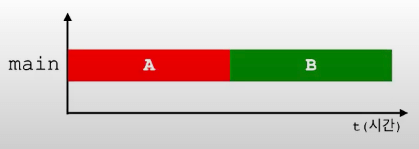
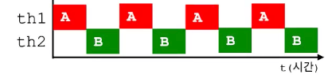
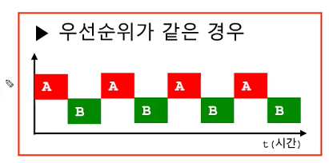
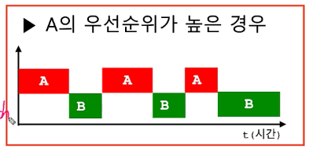

# Thread

## 프로세스와 쓰레드 (`process and thread`)

### 프로세스

- 실행 중인 프로그램
- 자원(`resource`)과 쓰레드(`thread`)로 구성

### 쓰레드

- 프로세스 내에서 실제 작업을 수행
- 모든 프로세스는 최소한 하나의 쓰레드를 가지고 있음

> 💡 process : thread = factory : worker
> 1 worker on 1 process → single thread process
> multiple worker on 1 process → multi thread process

> “하나의 새로운 프로세스를 생성하는 것보다 하나의 새로운 쓰레드를 생성하는 것이 더 적은 비용이 든다.”

### CGI vs Java Servlet (`Tomcat`)

- `CGI`는 사용자의 요청마다 프로세스를 생성
  - 요청 대비 자원의 소모가 많고, 오버헤드가 많아 효율적으로 처리 불가능
- `Java`는 사용자의 요청을 쓰레드를 생성해서 처리
  - 다중 사용자 요청을 기민하게, 효율적으로 처리 가능

## 멀티쓰레드의 장단점

- 대부분의 프로그램이 멀티쓰레드로 작성되어 있음
- 하지만 멀티쓰레드에는 장점만 있는것이 아님

### 장점

- 시스템 자원을 보다 효율적으로 사용할 수 있음
- 사용자에 대한 응답성(`responsibility`)이 향상됨
- 작업이 분리되어 코드가 간결해짐

### 단점

- 동기화(`synchronization`)에 주의해야 함
- 교착상태(`dead-lock`)가 발생하지 않도록 주의해야 함
  - 기아상태가 발생하여 특정 쓰레드가 계속 사용되지 않는 문제
- 각 쓰레드가 효율적으로 고르게 실행될 수 있도록 해야 함

> 프로그래밍 시 고려해야 할 사항이 많음 (유지보수)

## 쓰레드의 구현과 실행

### 멀티쓰레드의 구현 방식

1. `Thread` 클래스의 상속

   ```java
   class MyThread extends Thread {
   	@Override
   	public void run() { // Thread 클래스의 run()을 오버라이딩
   		// 작업내용
   	}
   }
   ```

2. `Runnable` 인터페이스를 구현

   ```java
   class MyThread implements Runnable {
   	@Override
   	public void run() { // Runnable 인터페이스의 run()을 구현
   		// 작업내용
   	}
   }
   ```

- 자바는 단일상속 프로그래밍 언어이기 때문에 `Thread`를 상속받으면 다른 클래스를 상속할 수 없음
- 따라서 `Runnable` 인터페이스를 구현하여 멀티쓰레드를 실현하는 것이 좀 더 나은 방식

### `Runnable` 인터페이스

```java
public interface Runnable {
	public abstract void run();
}
```

### 쓰레드의 실행 방법

- 쓰레드를 생성한 후에 `start()`를 호출하면 쓰레드가 작업을 시작
- OS 스케줄러가 알아서 판단해서 쓰레드의 실행권한을 부여함

```java
// 1. Thread 클래스를 상속 했을 경우
MyThread t1 = new MyThread();
t1.start();

// 2. Runnable 인터페이스를 구현했을 경우
Runnable r = new MyThread();
Thread t2 = new Thread(r); // Thread(Runnable r);
// Thread t2 = new Thread(new MyThread());
t2.start();
```

- 왜 `start()`를 해야 하는가?
  - `start()`는 실제로 새로운 콜스택을 생성한뒤 그곳에 `run()`을 올리는 작업을 수행
  - `instruction set`을 수행하려면 `instruction`을 가리킬 `pc`가 필요하기 때문에 해당 박스(콜 스택)를 새롭게 만들 필요가 있음

## `Main` 쓰레드

- `main` 메서드의 코드를 수행하는 쓰레드
- 쓰레드는 “사용자 쓰레드"와 “데몬 쓰레드" 두 종류가 있음
  - 사용자 쓰레드 → `main` 쓰레드와 같은 것들
  - 데몬 쓰레드 → `main`을 도와 보조로 처리하는 쓰레드
  - `run()`으로 구현된 새로운 콜스택은 **사용자 쓰레드**임

> 💡 실행 중인 “사용자 쓰레드가 하나도 없을 때 프로그램은 종료” 된다.

### 사용자 쓰레드의 처리관계 확인

```java
package com.solarsdev;

public class ThreadEx1 {
    static long startTime = 0;

    public static void main(String[] args) throws InterruptedException {
        Thread th1 = new Thread(new ThreadEx1_1());
        Thread th2 = new Thread(new ThreadEx1_2());

        th1.start();
        th2.start();
        startTime = System.currentTimeMillis();

				// join없이 수행할 경우 소요시간이 바로 출력됨
				// main 함수는 비동기로 소요시간을 출력하고 바로 종료되지만
				// 프로그램(프로세스)는 쓰레드가 전부 종료될때까지 기다렸다는 것을 알 수 있음
        th1.join();
        th2.join();

        System.out.println();
        System.out.println("소요시간: " + (System.currentTimeMillis() - startTime));
    }
}

class ThreadEx1_1 implements Runnable {
    @Override
    public void run() {
        for (int i = 0; i < 300; i++) {
            System.out.print("-");
        }
    }
}

class ThreadEx1_2 implements Runnable {
    @Override
    public void run() {
        for (int i = 0; i < 300; i++) {
            System.out.print("|");
        }
    }
}
```

## 싱글쓰레드와 멀티쓰레드

### 싱글쓰레드

```java
class ThreadTest {
	public static void main(String[] args) {
		for (int i=0; i<300; i++) {
			System.out.println("-");
		}

		for (int i=0; i<300; i++) {
			System.out.println("|");
		}
	}
}
```



### 멀티쓰레드

```java
package com.solarsdev;

public class ThreadTest {
    public static void main(String[] args) throws InterruptedException {
        Thread th1 = new Thread(new ThreadEx1_1());
        Thread th2 = new Thread(new ThreadEx1_2());
        th1.start();
        th2.start();
    }
}

class ThreadEx1_1 implements Runnable {
    @Override
    public void run() {
        for (int i = 0; i < 300; i++) {
            System.out.print("-");
        }
    }
}

class ThreadEx1_2 implements Runnable {
    @Override
    public void run() {
        for (int i = 0; i < 300; i++) {
            System.out.print("|");
        }
    }
}
```



## 쓰레드의 `I/O` 블록킹 (`blocking`)

- 싱글쓰레드로 작성한 코드의 경우 인풋을 기다리는 동안 아무 작업도 하지 않음

  ```java
  import javax.swing.*;

  public class MultiThreadTest {
      public static void main(String[] args) {

          String input = JOptionPane.showInputDialog("아무 값이나 입력하세요.");

          for (int i = 10; i > 0; i--) {
              System.out.println(i);
              try {
                  Thread.sleep(1000);
              } catch (InterruptedException e) {
                  throw new RuntimeException(e);
              }
          }

          System.out.println("입력하신 값은 " + input + "입니다.");
      }
  }
  ```

- 멀티쓰레드의 경우 `I/O`로 발생한 텀 동안 다른 쓰레드에 실행권한을 할당해서 계속 수행

  ```java
  import javax.swing.*;

  public class MultiThreadTest {
      public static void main(String[] args) {
  				String input = JOptionPane.showInputDialog("아무 값이나 입력하세요.");

  				Thread th1 = new Thread(new MultiThreadTest_1());
          th1.start();

          System.out.println("입력하신 값은 " + input + "입니다.");
      }
  }

  class MultiThreadTest_1 implements Runnable {
      @Override
      public void run() {
          for (int i = 10; i > 0; i--) {
              System.out.println(i);
              try {
                  Thread.sleep(1000);
              } catch (InterruptedException e) {
                  throw new RuntimeException(e);
              }
          }
      }
  }
  ```

## 쓰레드의 우선순위(priority of thread)

- 작업의 중요도에 따라 쓰레드의 우선순위를 다르게 하여 특정 쓰레드가 더 많은 작업시간을 같게 할 수 있음

  ```java
  void setPriority(int newPriority); // 쓰레드의 우선순위를 지정한 값으로 변경
  int getPriority(); // 쓰레드의 우선순위를 반환

  public static final int MAX_PRIORITY = 10; // 최대 우선순위
  public static final int MIN_PRIORITY = 1; // 최소 우선순위
  public static final int NROM_PRIORITY = 5; // 보통 우선순위
  ```





- 우선순위가 높은 작업이 보다 더 많은 실행시간을 보장받음
- 하지만 결국 OS 스케줄러에 의해 판단되기 때문에 반드시 그렇다고는 할 수 없음
  - OS 내에 다양한 프로세스, 쓰레드들이 항상 대기 상태에 있고 OS 스케줄러는 모든것을 고려함
  - 그래서 심지어 우선순위가 낮은 쓰레드가 먼저 종료되는 경우도 있음

## 쓰레드 그룹

- 서로 관련된 쓰레드를 그룹으로 묶어서 다루기 위한 것
- 모든 쓰레드는 반드시 하나의 쓰레드 그룹에 포함되어 있어야 함
- 쓰레드 그룹을 지정하지 않고 생성한 쓰레드는 “main 쓰레드 그룹”에 속함
- 자신을 생성한 쓰레드(부모 쓰레드)의 그룹과 우선순위를 상속받음

```java
// 생성자들
Thread(ThreadGroup group, String name);
Thread(ThreadGroup group, Runnable target);
Thread(ThreadGroup group, Runnable target, String name);
Thread(ThreadGroup group, Runnable target, String name, long stackSize);
```

```java
ThreadGroup getThreadGroup(); // 쓰레드 자신이 속한 쓰레드 그룹을 반환
void uncaughtException(Thread t, Throwable e); // 처리되지 않은 예외에 의해 쓰레드 그룹의 쓰레드가 종료되었을때, JVM에 의해 이 메서드가 자동으로 호출됨
```
