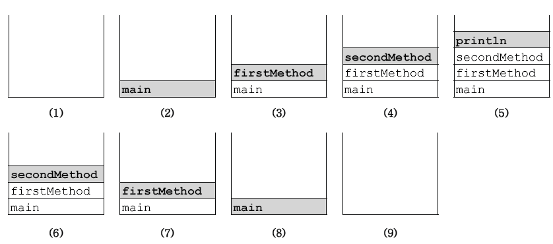

# 변수와 메서드

## 선언위치에 따른 변수의 종류

```java
class Variables {  // 클래스 영역
	int iv;          // 인스턴스 변수
	static int cv;   // 클래스 변수

	void method() {  // 메서드 영역
		int lv = 0;    // 지역변수
	}
}
```


### 인스턴스 변수

- 클래스 영역에 선언
- 인스턴스는 독립적인 저장공간을 가지는데, 인스턴스 마다 고유한 상태를 유지해야 할 경우 사용

### 클래스 변수

- 모든 인스턴스가 공유하는 공통된 저장공간을 사용하는 변수
- 인스턴스를 생성하지 않고 바로 사용 가능
  - 클래스가 메모리에 로딩될때 생성되어 프로그램이 종료될때까지 유지되기 때문임

### 지역 변수

- 메서드 내에 선언
- 메서드가 종료되면 반환되어 사용할 수 없게 됨

## 클래스 변수와 인스턴스 변수

- 카드 게임에 사용되는 카드를 예로 클래스 변수와 인스턴스 변수를 이해해보기


- 속성 (카드별로 다른 상태)
  - 무늬
  - 숫자
- 속성 (전체 카드의 공통 상태)
  - 폭
  - 높이

```java
class Card {
	String kind; // 무늬
	int number; // 숫자

	static int width = 100; // 폭
	static int height = 250; // 높이
}
```

## 메서드

### 메서드란?

- 작업을 수행하기 위한 명령의 집합 (= 함수)
- 어떤 값을 입력받아 처리하고 결과를 반환
  - 입력이 없을수도 있고, 결과를 반환하지 않을 수도 있음

### 메서드의 장점과 작성지침

- 반복적 코드를 줄이고 관리에 용이
- 반복되는 문장은 메서드로 작성
- 하나의 메서드는 하나의 기능을 수행하도록 작성

### 메서드를 사용하는 이유

1. 높은 재사용성
   - 프로그램을 작은 단위로 만들어두고 계속해서 재사용이 가능함
2. 중복된 코드의 제거
   - 코드의 중복을 제거하는 것은 유지보수에 큰 도움이 되기 때문에 중요
   - 반복적으로 사용되는 코드가 있다면 메서드 작성을 고려할것
3. 프로그램의 구조화
   - 예를 들어, main은 되도록이면 프로그램 전체 흐름이 한눈에 들어오게 간단하게 작성
   - main에서 호출하는 메서드를 처리 단위 단위로 잘라서 만들고, 이름을 잘 지어둔 뒤, 호출하는 식으로 프로그램의 가독성을 향상시킬 수 있음

## 메서드의 선언과 구현

### 메서드 선언부 (method declaration, method header)

- 메서드 선언부는 이름, 매개변수 선언, 반환 타입으로 구성됨
- 메서드가 작업을 수행하기 위해 어떤 것들을 필요로 하고 어떤 것을 반환하는 지 알 수 있음
- 메서드의 선언을 변경하면 호출하는 모든 곳에 영향을 미치므로 신중히 결정해서 작성할 것

```java
// 2가지 매개변수 int를 받아서 int로 결과를 반환하는 메서드 add임을 알수 있음
int add(int x, int y) {
	return x + y;
}
```

### 매개변수 선언 (parameter declaration)

- 매개변수는 메서드의 작업에 필요한 값들(입력)을 제공받기 위함
- 값을 입력받지 않을 수 있음
- 개수에는 거의 제한이 없음, 단 많아지면 가독성이 떨어지므로 배열이나 추후 나오는 인터페이스등을 고려

### 메서드의 이름 (method name)

- 메서드의 이름을 짓는것 자체에는 명명규칙 외에 특별한 제한은 없음
  - 키워드 금지
  - 숫자로 시작 금지
  - …
- 동사인 경우가 많으며, 메서드의 기능을 함축적으로 잘 표현한 워딩을 고려

### 반환 타입 (return type)

- 반환값의 타입을 작성
- 반환값이 없는 경우 void로 작성

### 구현부 (method body)

- 중괄호 {} 에 있는 메서드의 구현부

### return 문

- 메서드 내부에서 반환할 값을 지정하는 것
- 반환 타입이 void일 경우 불필요
- 자바에서 return은 단 하나만 허용

### 지역 변수 (local variable)

- 메서드 내에 선언된 변수
- 매개변수와 같이 메서드가 종료되면 더 이상 사용할 수 없게 됨

## 메서드의 호출

- 메서드를 정의만 하고 사용하지 않으면 아무 일도 일어나지 않음
- 메서드를 사용하는 것을 메서드의 호출이라고 하고, 메서드의 선언부에 맞도록 사용하면 됨

### 인자(argument)와 매개변수(parameter)

- 메서드를 호출하는 코드에서 메서드에 전달해주는 오리지널 값을 인자(argument)
- 메서드가 호출될때 값을 받아온 복사값을 매개변수(parameter)라고 함

### 메서드의 실행흐름

- 메서드를 호출하게 되면 현재 실행중이던 메서드는 중지됨
- 호출된 메서드가 return을 만나거나 끝까지 실행되면 호출한 메서드로 복귀
- 이러한 방식으로 반복하다가 main의 마지막 구문(statement)를 실행하면 최종적으로 프로그램이 종료됨

### return문

- 반환타입이 void인 경우 return을 생략할수 있는데, 이는 컴파일러가 return;를 마지막에 삽입하기 때문임

### 매개변수의 유효성 검사

- 메서드의 구현부를 작성할때, 매개변수가 반드시 정의된 타입, 적절한 값으로 입력될 것이라고 생각하면 안됨
- 타입만 맞으면 어떠한 값도 넘어올수 있으며, 타입은 자동으로 형변환이 되므로 정확한 타입으로 호출했다고 보장하지 않음
- 메서드를 실행할때 매개변수에 대한 타입, 값의 유효성 검사를 실시하는 것이 좋음

## JVM의 메모리 구조

- JVM의 세가지 주요 영역 (method area, call stack, heap)


1. 메서드 영역 (method area)

- 프로그램 실행 중 어떤 클래스가 사용되면, JVM은 해당 클래스의 .class 파일을 읽어 분석
- 클래스 정보와 클래스 변수가 저장되는 곳

1. 힙 (heap)

- 인스턴스가 생성되는 공간
- 프로그램 실행 중 생성되는 인스턴스는 모두 이곳에 생성됨

1. 호출스택 (call stack)

- 메서드의 작업공간
- 메서드가 호출되면 수행에 필요한 메모리 공간을 할당받고, 종료되면 메모리를 반환

### 실행과정

- 메서드가 호출되면 수행에 필요한 만큼 메모리를 스택에 할당받음
- 메서드가 종료되면 사용했던 메모리를 반환하고 스택에서 제거됨
- 호출스택의 제일 위에 있는 메서드가 현재 실행중인 메서드
- 바로 아래에 있는 메서드가 바로 위의 메서드를 호출한 메서드

```java
class CallStackTest {
	public static void main(String[] args) {
		firstMethod();
	}

	static void firstMethod() {
		secondMethod();
	}

	static void secondMethod() {
		System.out.println("secondMethod()");
	}
}
```



## 기본형 매개변수와 참조형 매개변수

### 기본형 매개변수

- 변수의 값을 읽기만 할 수 있음 (read only)

### 참조형 매개변수

- 변수의 값을 읽고 변경 가능 (read & write)

### 기본형 매개변수의 동작방식

```java
class Data { int x; }

class PrimitiveParamEx {
	public static void main(String args[]) {
		Data d = new Data();
		d.x = 10;
		System.out.println("main() : x = " + d.x);

		change(d.x);
		System.out.println("After change(d.x)");
		System.out.println("main() : x = " + d.x);
	}

	static void change(int x) {
		x = 1000;
		System.out.println("change() : x = " + x);
}
```


- change 메서드가 호출되면서 ‘d.x’가 change 메서드의 매개변수 x에 복사
- change 메서드에서 x의 값을 1000으로 변경
- change 메서드가 종료되면서 매개변수 x는 스택에서 제거됨

### 참조형 매개변수의 동작방식

```java
class Data { int x; }

class PrimitiveParamEx {
	public static void main(String args[]) {
		Data d = new Data();
		d.x = 10;
		System.out.println("main() : x = " + d.x);

		change(d);
		System.out.println("After change(d.x)");
		System.out.println("main() : x = " + d.x);
	}

	static void change(Data d) {
		d.x = 1000;
		System.out.println("change() : x = " + d.x);
}
```


- change 메서드가 호출되면서 참조변수 d의 값(주소)이 매개변수 d에 복사됨
- change 메서드에서 매개변수 d로 x의 값을 1000으로 변경
- change 메서드가 종료되면서 매개변수 d는 스택에서 제거됨

## 클래스 메서드(static method)와 인스턴스 메서드

### 클래스 메서드

- 메서드에 static이 정의되어 있음
- 인스턴스 변수에 접근이 필요하지 않다면 클래스 메서드로 정의

### 인스턴스 메서드

- 메서드에 static이 붙어있지 않음
- 인스턴스 변수에 접근이 필요한 경우 인스턴스 메서드로 정의

### 메서드 정의할때 생각해봐야 할 것들

1. 클래스를 설계할 때, 멤버변수 중 모든 인스턴스에 공통으로 사용하는 것에 static을 붙임
   - 클래스로부터 생성된 인스턴스가 가진 멤버변수는 독립적임
   - static을 붙여 클래스 변수로 정의하면 모든 인스턴스가 공통으로 사용하는 변수가 됨
2. 클래스 변수(static 변수)는 인스턴스를 생성하지 않아도 사용 가능
   - static이 붙은 클래스 변수는 클래스를 호출하는 시점에 이미 메모리에 적재되어 사용 가능
3. 클래스 메서드(static 메서드)는 인스턴스 변수를 사용할 수 없음
   - 인스턴스 메서드는 인스턴스를 생성해야 메모리를 할당받아 존재하게 됨
   - 클래스 메서드는 클래스를 호출하는 시점이므로 이 때는 인스턴스가 생성되었는지 판단 불가
   - 인스턴스 메서드의 경우에는 인스턴스를 생성하기 위해 클래스가 이미 메모리에 존재하기 때문에 클래스 변수에 접근 가능
4. 메서드 내에서 인스턴스 변수를 사용하지 않는다면, static을 붙이는 것을 고려
   - 클래스 메서드는 인스턴스 메모리에 접근이 생략되므로 메서드 호출시간이 짧아져 효율적
