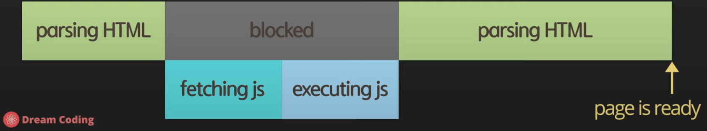
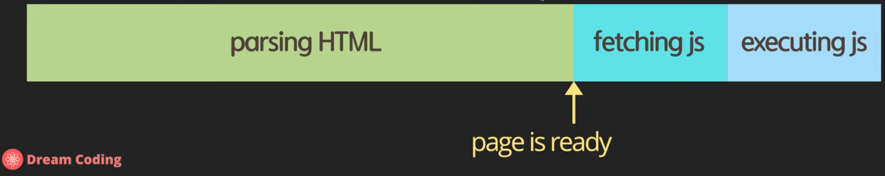
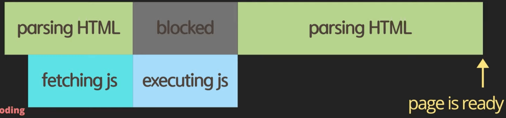
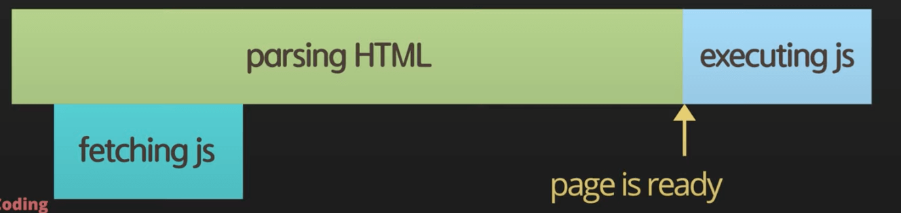

# 자바스크립트 환경설정, async vs defer

[자바스크립트 2. 콘솔에 출력, script async 와 defer의 차이점 및 앞으로 자바스크립트 공부 방향 | 프론트엔드 개발자 입문편 (JavaScript ES5+)](https://youtu.be/tJieVCgGzhs)

- 큰 그림을 이해하면서 전반적인 내용을 파악하고, 그 이후에 챕터를 꼼꼼하게 살펴보기
- 자바스크립트의 공식 문서를 확인하고자 할 때는?
  [MDN Web Docs](https://developer.mozilla.org/ko/)

## async vs defer

```tsx
<!DOCTYPE html>
<html lang="en">
  <head>
    <meta charset="UTF-8" />
    <title>Document</title>
    <script src="main.js"></script>
  </head>
  <body></body>
</html>
```



Image from Dream Coding

- 브라우저는 HTML을 파싱하던 중 script태그를 만났을 경우, 해당 스크립트를 다운로드 받아옴 (fetching)
- fetching과정이 끝난 후에는 해당 스크립트를 실행하게 되는데 (executing)
- 스크립트를 다운로드 받고, 실행이 완료될때까지 브라우저의 HTML 파싱과정이 중지되게 됨
  - 이렇게 되면 스크립트의 사이즈가 클 경우에는 HTML의 파싱이 정지하므로 사용자의 화면에서 DOM 요소의 표시가 정지하기 때문에 좋은 처리방식이라고 말하기는 힘듬

```tsx
<!DOCTYPE html>
<html lang="en">
  <head>
    <meta charset="UTF-8" />
    <title>Document</title>
  </head>
  <body>
    <script src="main.js"></script>
  </body>
</html>
```



- 두번째로는 body의 끝부분에 script를 두어 DOM 파싱이 완료된 이후에 스크립트를 실행하도록 만드는 방법
- 기본적인 DOM 요소의 로딩이 빠르게 완료된다는 점에서는 앞의 예제보다는 나을 수 있지만, 자바스크립트의 의존적인 웹사이트의 경우에는 js의 로딩이 느리기 때문에 영향을 받을 수 있음

```tsx
<!DOCTYPE html>
<html lang="en">
  <head>
    <meta charset="UTF-8" />
    <title>Document</title>
    <script async src="main.js"></script>
  </head>
  <body></body>
</html>
```



- DOM파싱 도중에 병렬적으로 js를 fetch하고 fetch 이후에 바로 실행함
- 데이터를 받아온다거나 하는 우선적으로 실행해야 하는 js의 경우에 활용 가능

```tsx
<!DOCTYPE html>
<html lang="en">
  <head>
    <meta charset="UTF-8" />
    <title>Document</title>
    <script defer src="main.js"></script>
  </head>
  <body></body>
</html>
```



- HTML이 파싱되는 동안 동시에 fetch과정이 병렬적으로 진행되며, 페이지가 로딩되고 나서 바로 js를 실행하게 됨
- 도중에 DOM 파싱을 끊는것도 아니고, 병렬적으로 처리되며, 페이지가 로딩된 순간 필요한 스크립트가 동작하니 그나마 제일 최선이라고 말할 수 있음

## use strict의 활용

- 순수 바닐라 js를 사용할때는 제일 위에 적용해주면 좋음

```tsx
// added ECMAScript 5
'use strict';
// javascript code
```
