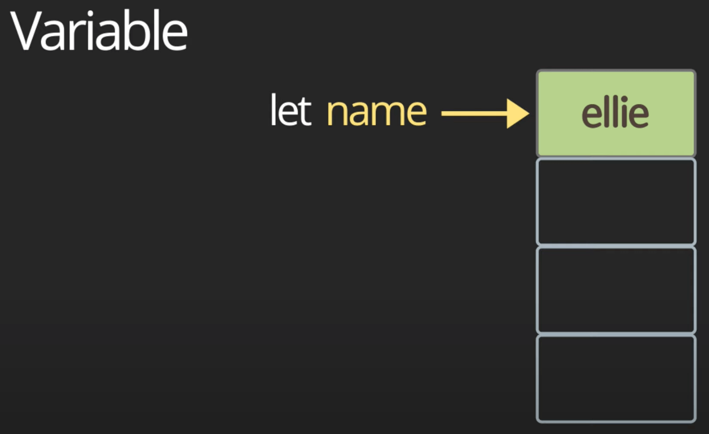
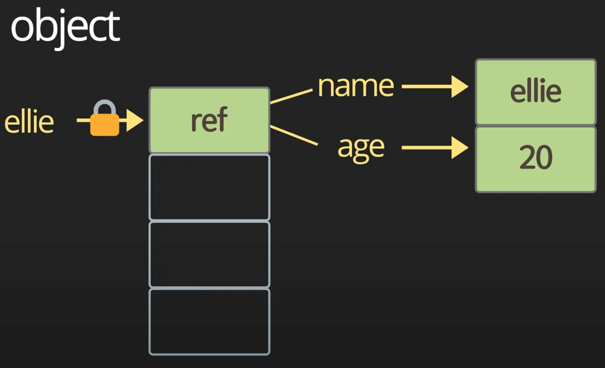

# 데이터타입, data types, let vs var, hoisting

[자바스크립트 3. 데이터타입, data types, let vs var, hoisting | 프론트엔드 개발자 입문편 (JavaScript ES5+)](https://youtu.be/OCCpGh4ujb8)

- 프로그래밍에서 가장 중요한것? 입력, 연산, 출력
- 사용자에게 콘솔이나 UI에서 입력받은 데이터를 잘 처리해서 출력해주는것이 제일 중요
- 데이터를 전송을 이용해서 서버로 전송해서 받아오는것도 포함
  - 연산을 포함해서 CPU에 최적화된 로직 작성
  - 메모리 사용을 최소화

## 변수

- 바닐라JS로 코딩할때는 ‘use strict’; 를 추가하여 활용하기 (ECMAScript 5에서 추가됨)
- let (ES6)

```tsx
let name = 'ellie';
console.log(name);
name = 'hello';
console.log(name);
```

- 어플리케이션을 실행하게 되면 어플리케이션이 사용할 수 있는 메모리가 할당됨
- let is mutable
- read / write

## Block Scope

- 버블을 이용해서 코드의 영역을 나눌 수 있음

```tsx
{
  let name = 'ellie';
  console.log(name);
  name = 'hello';
  console.log(name);
}
```

## var hoisting

```tsx
age = 4;
var age;
```

- 변수의 선언위치에 상관없이 선언부를 제일 상단으로 끌어올려줌
- var는 hoisting에 의해 블럭 스코프를 무시함

## Constant

- 한번 할당하면 값이 바뀌지 않는 상수
- let의 경우에는 메모리에 할당한 이후에 포인터를 이용해서 덮어쓰기가 가능
- const는 한번 선언한 뒤에는 값을 변경할 수 없음
- immutable
- read only
- const를 사용해야 하는 이유들
  - 보안성 (해커들이 변수의 특성을 이용해서 원하는 코드를 삽입하는것들을 많이 이용)
  - 쓰레드 안전성 (동시에 여러개의 쓰레드가 변수에 접근해서 값을 읽거나 할때 유연)
  - 휴먼 에러에 안전 (나중에 계속해서 값을 변경시킬 경우 미스에 의해 잘못 변경할 가능성이 있음)

## Variable types

- primitive
  - number
  - string
  - boolean
  - null
  - undefined
  - symbol
- object
- function
  - first-class function : 함수를 변수에 할당할수 있고, 해당 변수로 함수를 매개변수로 전달할 수도 있음

## C언어와의 비교

```c
int main() {
	short a = 12;    // 2 bytes
	int a = 12;      // 4 bytes
	long b = 1234;   // 8 bytes
	float d = 1.2f;  // 4 bytes
	double e = 8.2;  // 16 bytes
	return 0;
}
```

- C언어에서는 다양한 숫자형 primitive가 존재
- 정수, 실수등을 할당하는 primitive가 존재하며, 각각의 크기에 따라서 변수를 다르게 할당해야 함

## Java언어와의 비교

```java
class Main {
	public static void main(String[] args) {
		byte a = 12;
		short b = 12;
		long c = 12;
		int d = 12;
		float e = 1.2f;
		double f = 1.2;
	}
}
```

## JavaScript

- Primitive Type
  
  - 숫자형
    - 숫자형은 number 타입 하나로 종결
    - 타입스크립트에서는?
      - let a: number = 12;
    - number에서 특정 경우에 정해진 값이 있음
      - 1 / 0 → Infinity
      - -1 / 0 → -Infinity
      - ‘not a number’ / 2 → NaN
    - 자바스크립트에서 변수는 동적 할당을 통해 형태가 정해지기 때문에, 항상 어떤 연산을 수행할때는 몫을 확인하는것이 중요함
  - 문자열
    - 문자열은 모두 string으로 정의됨
    - 다른 언어에서 한글자의 문자인 경우 cha로 정의하는 경우가 있으나 자바스크립트에서는 모두 string임
    - string은 다른 string과 + 기호를 이용해서 결합 가능
    - 백틱 기호를 이용해서 string template을 사용 가능
      - ${}을 이용해서 변수를 그대로 string으로 출력 가능
  - boolean
    - false값은 0, null, undefined, NaN, ‘’으로 간주
    - true값은 값이 있다면 간주됨
  - null
    - let nothing = null;
    - 값 자체가 변수에 할당되어 있고, 값이 없다는 뜻
  - undefined
    - let x = undefined;
    - 값이 할당되어 있지 않음
  - symbol
    ```jsx
    // 유니크한 id를 가진 object를 만들어냄
    const symbol1 = Symbol('id');
    const symbol2 = Symbol('id');
    // symbol1 is not the same with symbol2
    ```
    ```jsx
    // 동일한 string을 이용해서 symbol 작성하기
    const symbol1 = Symbol.for('id');
    const symbol2 = Symbol.for('id');
    // 두개의 값은 동일함 (동일한 문자열로부터 심볼을 작성했기 때문)
    ```
    - 심볼을 직접 출력하려고 하면 에러가 발생하기 때문에, symbol1.description을 통해서 값을 구해와서 출력해야 함
- Object Type, real-life object, data structure

```jsx
const ellie = { name: 'ellie', age: 20 };
ellie.age = 21;
```



## JavaScript의 데이터 타입

- immutable
  - 데이터 자체를 절대 변경하지 못함
  - primitive 데이터 타입은 데이터 자체는 변경 가능하지만 데이터 타입을 변경할 수 있는것이 아님
  - object.freeze()를 설정한 오브젝트
- mutable
  - object는 전부 mutable
  - array는 mutable
  - 특정 언어에서는 array라고 하더라도, mutable과 immutable이 존재함 (튜플)

## Dynamically typed language

- 자바스크립트는 런타임에 변수에 할당되는 값에 의해서 형태가 정해지는것을 말함
- 소규모 환경에서 프로토타입을 작성할때는 유용하게 사용되는 방식이지만, 규모가 있거나 다수의 엔지니어들이 작업하는 환경에서는 다이나믹 타이핑 때문에 곤란한 경우가 있음

```jsx
let text = 'hello';
console.log(`value: ${text}, type: ${typeof text}`);
// value: hello, type: string
text = 1;
// value: 1, type: number
text = '7' + 5;
// value: 75, type: string
// 문자열에 어떤 것을 더하게 되면 다른 타입을 string으로 변환하고 결합하게 됨 (Java의 특성과 동일)
text = '8' / '2';
// value: 4, type: number
// 그외의 사칙연산에서는 string에 연산을 건다고 하더라도 실제로 내용이 number라면 number간의 연산이 됨
```
