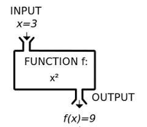

# 함수, 프로그래밍의 시작

## 함수란?

- 어떤 기능을 수행을 하는 프로그램을 만들었다고 했을때, 어떤 기능이 곧 함수이며 좋은 함수를 만드는것이 좋은 프로그래밍의 시작이라고 할 수 있음
- 어플리케이션의 주요한 일은 입력, 처리, 출력임
- 처리는 연산자를 이용하여 데이터를 가공하는 과정인데, 이러한 과정을 하나의 함수로 만들어보자
- 함수란 `특정한 일을 수행하는 코드의 집합` 이라고 정의할 수 있음
- 함수는 재사용이 가능하기 때문에, 가독성이 좋고 유지보수성이 좋은 함수가 좋은 함수라고 할 수 있음
- 코드를 작성할때 똑같은 코드를 계속해서 작성하기 보다는, `중복되는 부분이 있다면 그 부분을 함수로 작성`하여 필요할 때마다 재사용 하는것이 좋음
- 함수
  

  - 쉽게 생각하면, 어떠한 입력을 받아서 정의된 기능에 따라 처리된 데이터를 출력으로 내보내는 것을 말함
  - 자바스크립트에서의 함수 예

    ```jsx
    // 키워드, 함수명, 매개변수(입력)
    function add(a, b) {
      return a + b; // 결과값(출력) 반환
    }

    add(1, 2); // 3
    ```

- 함수를 정의하면 함수는 오브젝트가 되기 때문에, 함수가 담긴 변수에는 함수의 주소값이, 함수의 실질적인 데이터(처리 과정)는 힙 영역에 저장됨 (`함수의 이름은 함수를 참조`)

## 함수의 기본

[함수 선언 - JavaScript | MDN](https://developer.mozilla.org/ko/docs/Web/JavaScript/Reference/Statements/function)

```jsx
function add(a, b) {
  console.log('function add is called!');
  return a + b;
}

const result = add(1, 2);
console.log(result);

// 함수 사용 예제
function fullName(firstName, lastName) {
  return `${firstName} ${lastName}`;
}
let lastName = '김';
let firstName = '지수';
console.log(fullName(firstName, lastName));

let lastName2 = '이';
let firstName2 = '상국';
console.log(fullName(firstName2, lastName2));
```

## 함수와 메모리

- 함수를 선언한다는 것 (메모리 관점에서)
  ```jsx
  function add(a, b) {
    return a + b;
  }
  const sum = add;
  ```
  - 순서로 풀어보기
    1. add라는 함수의 별칭(변수)는 메모리의 스택 영역에 선언됨
    2. 함수의 내용은 별도의 공간에 정의되어 있음
    3. add 변수안에 내용은 2번의 주소가 저장됨
    4. sum 변수가 스택 영역에 선언됨
    5. sum 변수에 add 변수안에 있는 내용을 복사함 (2번의 주소)
    6. 결국 add와 sum은 동일한 주소 (return a + b)에 해당하는 처리절차를 가리키게 됨

## 반환이란?

```jsx
// return을 명시적으로 하지 않으면 자동으로 undefined이 반환됨!
function add(a, b) {
  //return a + b;
  return undefined;
}
const result = add(1, 2);
console.log(result);

// return을 함수 중간에 하게 되면 함수가 즉시 종료됨
// 사용예: 조건이 맞지 않는 경우 함수 도입부분에서 함수를 일찍이 종료함!
function print(num) {
  if (num < 0) {
    return;
  }
  console.log(num);
}
print(-1);
print(100);
print('text');
```

## 함수의 인자

```jsx
// 매개변수의 기본값은 무조건 undefined
// 매개변수의 정보는 함수 내부에서 접근 가능한 arguments 객체에 저장됨
// 매개변수의 기본값 Default Parameters a = 1, b = 1
function add(a = 1, b = 2) {
  console.log(a);
  console.log(b);
  console.log(arguments[0]);
  console.log(arguments[1]);
  return a + b;
}
add(1, 2, 3);
add();

// Rest 매개변수 Rest Parameters
function sum(a, b, ...numbers) {
  console.log(a);
  console.log(b);
  console.log(numbers);
}
sum(1, 2, 3, 4, 5, 6, 7, 8);
```

## 함수 표현식

```jsx
// 함수 선언문 function name() { }
// 함수 표현식 const name = function () { }
let add = function (a, b) {
  return a + b;
}; // 무명 함수
console.log(add(1, 2));
// 표현식으로 정의한 함수는 외부에서 접근이 불가능하기 때문에 무명함수를 많이 사용함

// 화살표 함수 const name = () => { }
add = (a, b) => a + b;
console.log(add(1, 2));

// 생성자 함수 const object = new Function(); // 객체파트에서 다룸

// IIFE - Immediately-Invoked Function Expressions
(function run() {
  console.log('😜');
})();
```

## 콜백함수

- 용어정리
  - 일급객체 (first-class object) = 일급 함수 (first-class function)
    - 일반 객체처럼 모든 연산이 가능한것
    - 함수의 매개변수로 전달
    - 함수의 반환값
    - 할당 명령문
    - 동일 비교 대상
  - 자바스크립트는 일급객체(일급함수)를 지원함
  - Java, Java8, Swift, Kotlin, Python
  - 고차함수 (Higher-order function)
    - 인자로 함수를 받거나 (콜백함수)
    - 함수를 반환하는 함수를 고차함수
    - 즉, 함수가 함수 자체를 인자로 받거나 출력이 가능한 것을 말함

```jsx
// 콜백함수
const add = (a, b) => a + b;
const multiply = (a, b) => a * b;

// 전달된 action은 콜백함수
// 전달된 당시의 함수를 바로 호출해서 반환된 값을 전달하는 것이 아니라
// 함수를 가리키고 있는 함수의 레퍼런스(참조값)이 전달됨
// 그래서 함수는 고차함수 안에서 필요한 순간에 나중에 호출됨
function calculator(a, b, action) {
  if (a < 0 || b < 0) {
    return;
  }
  let result = action(a, b);
  console.log(result);
  return result;
}

calculator(1, 2, add);
calculator(1, 2, multiply);
calculator(3, 3, multiply);
calculator(-1, 3, multiply);
```

## 퀴즈

```jsx
// 주어진 숫자만큼 0부터 순회하는 함수
// 순회하면서 주어진 특정한 일을 수행해야 함
// 5, 순회하는 숫자를 다 출력하고 싶음
// 5, 순회하는 숫자의 두배값을 출력하고 싶음
// function iterate(max, action)

function iterate(max, action) {
  for (let i = 0; i < max; i++) {
    action(i);
  }
}

const print = (num) => console.log(num);
const printDouble = (num) => console.log(num * 2);

iterate(5, print);
iterate(5, printDouble);
```

## 불변성 (Immutability = unchangable)
