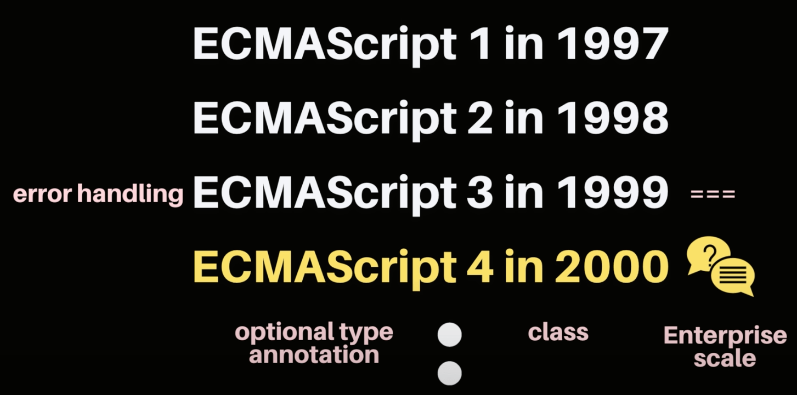
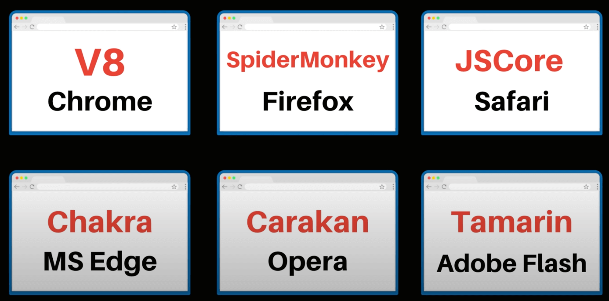

## 자바스크립트의 역사와 현재 그리고 미래

### 연대기별 정리

- 1993년
  - Mosaic 웹 브라우저의 등장
- 1994년
  - 마크 엔더슨이 설립한 넷스케이프
  - 넷스케이프 네비게이터
  - 하이퍼링크를 통한 정적 웹페이지 제작 가능
  - 이를 통해 브라우저 시장의 80%를 차지
  - 동적인 페이지를 표시하기 위해서 스크립트 언어를 추가하기로 결심
  - 고려되었던 언어들
    - 자바
    - 스킴 스크립트
    - 이 두가지가 합쳐진 새로운 언어를 개발
      - Mocha (LiveScript Interprete)
      - 넷스케이프 브라우저에 내장됨
  - 당시에 유행하던 Java언어의 인기에 편승하기 위해 LiveScript를 JavaScript로 변경
- 1995년
  - JavaScript를 이해할 수 있는 넷스케이프 네비게이터가 선전
  - 마이크로소프트에서 넷스케이프 네비게이터를 리버싱해서 JScript로 개명하여 탑재
- 1996년 11월
  - 넷스케이프에서 자바스크립트를 ECMA에 찾아가서 표준안 작성을 요구
- 1997년 7월
  - ECMAScript 1이 새롭게 표준안으로 발표됨
  - 언어 사양서라고 할 수 있음
  - 그 이후에도 ECMAScript는 계속해서 진화함
    
- 2000년
  - 95%의 사용자가 인터넷 익스플로러를 사용함
  - 3사(모질라, 마이크로소프트, 넷스케이프)가 서로 표준안을 놓고 갈등
- 2004년
  - 제시 제임스가 AJAX의 표준안을 제출
  - 비동기적으로 데이터를 서버로부터 받아오는 기술을 만들어냄
- jQuery, dojo, mootools와 같은 라이브러리가 등장
  - 라이브러리들의 목표는 개발자들에게 API를 제공하고, 라이브러리에서는 각 브라우저에 맞게 컨버팅을 해주는것을 목표로 잡음
  - 그 중에서도 jQuery가 강자로 발전
- 2008년에 Chrome 브라우저를 구글에서 출시
  - JIT(just-in-time compilation)이 탑재된 브라우저
  - 크롬의 획기적인 등장으로, 시장에 존재하는 다른 브라우저들은 자극을 받게 됨
  - 그에 따라 2008년 7월 각 브라우저들이 모여서 표준화를 논의하기 시작
- 2009년 ECMAScript 5가 등장
- 2015년 ECMAScript 6가 등장
  - const
  - let
  - arrow function
  - class
  - default parameter

### 자바스크립트의 진화

- 이제는 라이브러리의 도움 없이 바닐라JS로 충분히 제작 가능하게 됨
- 각 브라우저마다 사용하는 자바스크립트 엔진은 전부 다름
  
  - 크롬 브라우저에서 사용하는 V8은 Node와 Electron에서도 사용하고 있음
- 모든 사용자가 최신 브라우저와 기능을 사용하고 있는것은 아님, 개발자들은 반면, 최신 버전의 ECMAScript를 사용하고 싶어함
- 이에 따라서 개발자들이 사용한 최신 ECMA를 구버전도 호환되도록 변환해주는것이 바로 BABEL
- SPA (single page application)이 최근에 유행하고 있는데, React, Angular, Vue등이 등장
- 자바스크립트는 v8 엔진을 이용해서 node와 같이 백엔드에서도 사용할수 있도록 되었음
- mobile에서도, desktop에서도 각각 자바스크립트를 이용해서 다양한 플랫폼을 지원할 수 있도록 됨
- WA (Web Assembly)의 등장으로 다른 언어로 만들어진 것들도 컨버팅되어 웹에서 실행 가능하도록 됨
