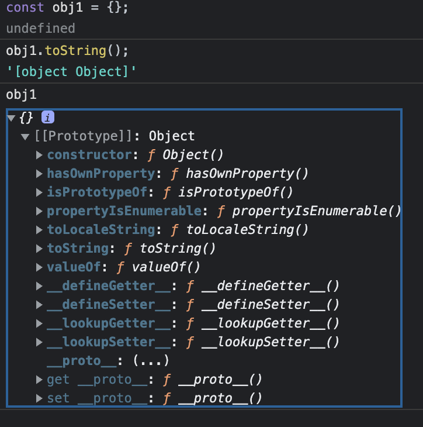
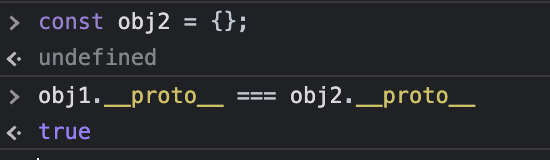
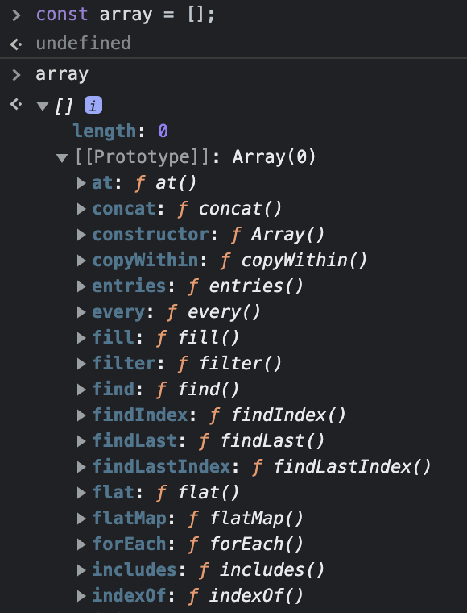

# 프로토타입

## 프로토타입이란? 용어정리

- 프로토타입 → 원형
  - 개발을 하기 시작할때 만들어진 오리지널 버전
  - 그룹에서 가지고 있는 공통적인 특징에 대한 것을 나타내는 것
  - 초기단계의 예제
  - 완성된 형태가 아니라 빠르게 대략적인 형태를 나타낸것
- 개발팀에서의 프로토타입이란?
  - 개발 후에 어떤식으로 보일지 대략적으로 디자인 한 것
  - 배포 전에 대략적으로 빠르게 만들어낸 어플리케이션
  - 자바스크립트에서는?
    - 비슷한 함수들을 하나의 프로토타입으로 만들어서 객체지향을 구현
  - 최신 버전에서는?
    - 클래스를 구현해서 프로토타이핑을 대체함

## 프로토타입 눈으로 확인하기



- 자바스크립트에서 모든 객체는 자신 이름으로 된 프로토타입 객체를 가지고 있음
  - [[Prototype]]
  - 객체간 상속을 위해, 외부에서 직접 접근은 불가
  - `__proto__` ← 직접 접근 불가
  - `Object.getPrototypeOf()`
  - `Object.setPrototypeOf()`
  - 함수에서는 `prototype`으로 접근 가능



- 새롭게 객체를 만들고 나서 내부의 `__proto__` 를 비교하면 동일한 것을 알 수 있음
  - 이를 통해 자바스크립트에서는 모든 객체가 하나의 `__proto__` 를 참조하는 것을 알 수 있음
- 배열에서는 어떻게 될까?



- 배열에서는 배열만의 prototype이 있음 array prototype
- array prototype또한 하나의 객체이므로 결국 object prototype을 상속함
- 그래서 자바스크립트에서 그 어떠한 객체도 결국 object prototype을 상속하고 있기 때문에 객체의 prototype에 정의되어 있는 모든 함수들을 사용할 수 있음
- 객체간 상속의 연결 고리는 프로토타입 체인으로 연결 되어 있다는점

### 객체의 원형이 존재한다는 것

- 객체의 원형이 존재한다는 것은 형태가 다른 모든 객체들이 동일한 함수를 이용할 수 있다는 것을 의미함
- 예를 들어, JavaScript에서 Array 또한 객체이며, Array 객체의 원형이 Array 함수들 (예를 들어, split, reduce, forEach 등) 을 가지고 있기 때문에 배열 객체를 선언하는 순간 모든 배열 함수를 사용할 수 있게 되는 것임

## 프로퍼티 디스크립터

[Object.defineProperties() - JavaScript | MDN](https://developer.mozilla.org/en-US/docs/Web/JavaScript/Reference/Global_Objects/Object/defineProperties)

```jsx
const dog = { name: '와우', emoji: '🐶' };
console.log(Object.keys(dog));
console.log(Object.values(dog));
console.log(Object.entries(dog));

console.log('name' in dog);
console.log(dog.hasOwnProperty('name'));

// 오브젝트 각각의 프로퍼티는 프로퍼티 디스크립터라고 하는 객체로 저장됨
const descriptors = Object.getOwnPropertyDescriptors(dog);
console.log(descriptors);

const desc = Object.getOwnPropertyDescriptor(dog, 'name');
console.log(desc);

Object.defineProperty(dog, 'name', {
  value: '멍멍',
  writable: false,
  enumerable: false,
  configurable: false,
});

console.log(dog.name);
console.log(Object.keys(dog));
console.log(Object.values(dog));
console.log(Object.entries(dog));

const student = {};
Object.defineProperties(student, {
  firstName: {
    value: '영희',
    writable: true,
    enumerable: true,
    configurable: true,
  },
  lastName: {
    value: '김',
    writable: true,
    enumerable: true,
    configurable: true,
  },
  fullName: {
    get() {
      return `${this.lastName} ${this.firstName}`;
    },
    set(name) {
      [this.lastName, this.firstName] = name.split(' ');
    },
    configurable: true,
  },
});
console.log(student.fullName);
```

## 객체 불변성을 위하여 (동결, 밀봉, 확장금지)

```jsx
// 동결! Object.freeze()
// 추가, 삭제, 쓰기, 속성 재정의 불가 ❌
// (단, 얕은 freeze로 작동함)
// -> 중첩되어 있는 객체의 경우에는 수정이 가능함 (딥하게 들어가면서 얼려주지 않음)
const lee = { name: 'lee' };
const dog = { name: '와우', emoji: '🐶', owner: lee };

Object.freeze(dog);
dog.name = '멍멍';
console.log(dog);
dog.age = 4;
console.log(dog);
delete dog.name;
console.log(dog);

// shallow
lee.name = '이상국';
console.log(dog);

// 밀봉 Object.seal()
// 값의 수정은 가능하나 ✅
// 키의 추가, 삭제, 속성 재정의 불가능 ❌
const cat = { ...dog };
//Object.assign(cat, dog);
Object.seal(cat);
cat.name = '냐옹';
console.log(cat);
delete cat.emoji;
console.log(cat);

// 동결여부 확인
console.log(Object.isFrozen(dog));
// 밀봉여부 확인
console.log(Object.isSealed(cat));

// 확장 금지 preventExtensions()
// 새로운 속성 추가 금지 ❌
// 그 외에는 전부 가능 ✅
const tiger = { name: '호랑' };
Object.preventExtensions(tiger);
console.log(Object.isExtensible(tiger));
tiger.name = '호랑호랑';
console.log(tiger);
delete tiger.name;
console.log(tiger);
```

## 프로토타입 레벨 함수

```jsx
// const dog1 = { name: '뭉치', emoji: '🐶' };
// const dog2 = { name: '코코', emoji: '🐕' };

function Dog(name, emoji) {
  this.name = name;
  this.emoji = emoji;

  // 생성자 함수 내에서 정의된 함수는
  // 인스턴스 레벨의 함수 (모든 객체가 같은 함수를 가지게 됨)
  // this.printName = () => {
  //   console.log(`${this.name} ${this.emoji}`);
  // };
}

// 프로토타입 레벨의 함수
Dog.prototype.printName = function () {
  console.log(`${this.name} ${this.emoji}`);
};
const dog1 = new Dog('뭉치', '🐶');
const dog2 = new Dog('코코', '🐕');
console.log(dog1, dog2);
dog1.printName();
dog2.printName();

// 오버라이딩
// 인스턴스 레벨에서 (자식 객체에서) 동일한 이름으로 함수를 재정의 하면 (오버라이딩)
// 프로토타입 레벨의 (부모) 함수의 프로퍼티는 가려짐 (shadowing)
dog1.printName = function () {
  console.log('안녕!');
};
dog1.printName();

// 정적 레벨
Dog.hello = () => {
  console.log('Hello!');
};
//dog1.hello();
Dog.hello();
Dog.MAX_AGE = 20;

// 정리
// 함수의 단계에는 3가지가 있음
// 클래스 단위에서 객체를 만들지 않아도 가질수 있는 함수의 경우에는 static 레벨에서 정의
// 인스턴스 단위에서 (생성자를 통한 객체 생성 후에 알 수 있는 정보) 필요한 정보를 이용하지만, 모든 인스턴스가 공유하는 프로토타입 레벨에서 정의할 수 있는 함수
// 개별 인스턴스 단위에서 필요한 함수 (프로토타입의 함수 재정의 포함)
```

## 프로토타입을 이용한 상속

```jsx
// 프로토타입을 베이스로 한 객체지향 프로그래밍
function Animal(name, emoji) {
  this.name = name;
  this.emoji = emoji;
}

Animal.prototype.printName = function () {
  console.log(`${this.name} ${this.emoji}`);
};

function Tiger(name, emoji) {
  Animal.call(this, name, emoji);
}
Tiger.prototype = Object.create(Animal.prototype);

function Dog(name, emoji, owner) {
  // super(name, emoji)
  Animal.call(this, name, emoji);
  this.owner = owner;
}
// Dog.prototype = Object.create(Object.prototype);
Dog.prototype = Object.create(Animal.prototype);

Dog.prototype.play = () => {
  console.log('같이 놀자!');
};
const dog1 = new Dog('멍멍', '🐶', 'lee');
dog1.play();
dog1.printName();
const tiger1 = new Tiger('어흥', '🐯');

console.log(dog1 instanceof Dog);
console.log(dog1 instanceof Animal);
console.log(tiger1 instanceof Animal);
console.log(tiger1 instanceof Tiger);
```

## Mixin 섞는다는 것

```jsx
// 오브젝트는 단 하나의 prototype을 가리킬 수 있음 (부모는 단 하나)
// 여러개의 함수들을 상속하고 싶을 경우에는 mixin을 사용
const play = {
  play: function () {
    console.log(`${this.name} 놀아요!`);
  },
};

const sleep = {
  sleep: function () {
    console.log(`${this.name} 자요!`);
  },
};

function Dog(name) {
  this.name = name;
}

Object.assign(Dog.prototype, play, sleep);
const dog = new Dog('멍멍');
console.log(dog);
dog.play();
dog.sleep();

// JavaScript의 클래스에서는 본질은 prototype이므로 mixin을 사용할 수 있음
class Animal {}
class Tiger extends Animal {
  constructor(name) {
    super();
    this.name = name;
  }
}
Object.assign(Tiger.prototype, play, sleep);
const tiger = new Tiger('하로');
tiger.sleep();
```

## 상속 구현해보기

```jsx
// 클래스를 베이스로 한 객체지향
class Animal {
  constructor(name, emoji) {
    this.name = name;
    this.emoji = emoji;
  }
  printName = () => {
    console.log(`${this.name} ${this.emoji}`);
  };
}

class Tiger extends Animal {
  hunt = () => {
    console.log('사냥!');
  };
}

class Dog extends Animal {
  constructor(name, emoji, owner) {
    super(name, emoji);
    this.owner = owner;
  }

  play = () => {
    console.log('같이 놀자!');
  };
}

const dog1 = new Dog('멍멍', '🐶', 'lee');
dog1.play();
dog1.printName();
const tiger1 = new Tiger('어흥', '🐯');

console.log(dog1 instanceof Dog);
console.log(dog1 instanceof Animal);
console.log(tiger1 instanceof Animal);
console.log(tiger1 instanceof Tiger);
```
