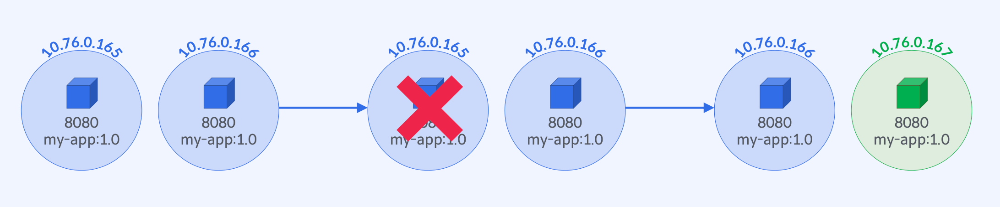

# [실습] Pod Template 변경

## 실습 과정



1. `ReplicaSet` 생성
2. `ReplicaSet`의 `Pod Template` 레이블 업데이트
3. 실행 중인 `Pod`에는 변화가 없음을 확인
4. `Pod` 개수 상태 변경
5. 변경한 `Pod Template`로 새로운 `Pod`이 생성되었는지 확인

## `RelicaSet` 선언 - `selector`, `replicas`, `Pod Template`

### `ReplicaSet`으로 `my-app:1.0` 배포

```yaml
spec:
  replicas: 2
  selector:
    matchLabels:
      app: my-app
  template:
    metadata:
      labels:
        app: my-app
    spec:
      containers:
        - name: my-app
          image: yoonjeong/my-app:1.0
          ports:
            - containerPort: 8080
```

## `ReplicaSet` `Pod Template` 변경

### `ReplicaSet` 생성 후 `Pod` 확인

```bash
$ kubectl get pod --show-labels
NAME                     READY   STATUS    RESTARTS   AGE   LABELS
myapp-replicaset-nf6w5   1/1     Running   0          17s   app=my-app
myapp-replicaset-zzccp   1/1     Running   0          17s   app=my-app
```

### `Pod Template` 변경 적용 후 `Pod` 확인 - 동일한 `Pod` 목록

```yaml
template:
  metadata:
    labels:
      app: my-app
      env: production
```

```bash
$ kubectl apply -f source/replicaset.yaml
replicaset.apps/myapp-replicaset configured

$ kubectl get pod --show-labels
NAME                     READY   STATUS    RESTARTS   AGE     LABELS
myapp-replicaset-nf6w5   1/1     Running   0          2m22s   app=my-app
myapp-replicaset-zzccp   1/1     Running   0          2m22s   app=my-app

$ kubectl delete pod myapp-replicaset-nf6w5
pod "myapp-replicaset-nf6w5" deleted

$ kubectl describe rs myapp-replicaset
Events:
  Type    Reason            Age    From                   Message
  ----    ------            ----   ----                   -------
  Normal  SuccessfulCreate  3m28s  replicaset-controller  Created pod: myapp-replicaset-nf6w5
  Normal  SuccessfulCreate  3m28s  replicaset-controller  Created pod: myapp-replicaset-zzccp
  Normal  SuccessfulCreate  43s    replicaset-controller  Created pod: myapp-replicaset-bhgk8

$ kubectl get pod --show-labels
NAME                     READY   STATUS    RESTARTS   AGE     LABELS
myapp-replicaset-bhgk8   1/1     Running   0          14s     app=my-app,env=production
myapp-replicaset-zzccp   1/1     Running   0          2m59s   app=my-app
```

## `ReplicaSet`의 `Pod` 상태 변경

### `Pod` 삭제 - 현재 `Pod` 상태 변경

```bash
$ kubectl delete pod myaapp-replicaset-nf6w5
```

### `ReplicaSet` 확인 및 새로운 `Pod` 생성 확인

```bash
$ kubectl get rs myapp-replicaset -o wide

$ kubectl get pod --show-labels
```

## `kubectl cheat sheet`

```bash
# ReplicaSet 생성
$ kubectl apply -f <yaml파일경로>

# Pod과 레이블 확인
$ kubectl get pod --show-labels

# Pod 삭제
$ kubectl delete pod <pod-name>

# ReplicaSet 이벤트 확인
$ kubectl describe rs <replicaset-name>
```
