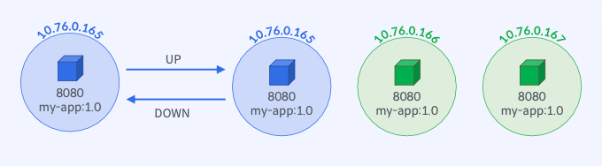

# [실습] ReplicaSet - 손쉽게 Pod 개수 조정

## 실습 과정



## `ReplicaSet` 선언 - `selector`, `replicas`, `Pod Template`

### `ReplicaSet`으로 `my-app:1.0` 배포

```yaml
spec:
  replicas: 1
  selector:
    matchLabels:
      app: my-app
  template:
    metadata:
      labels:
        app: my-app
    spec:
      containers:
        - name: my-app
          image: yoonjeong/my-app:1.0
          ports:
            - containerPort: 8080
```

## `ReplicaSet`의 `replicas` 변경

### `RelicaSet`과 `Pod` 확인

```bash
$ kubectl get pod --show-labels
NAME                     READY   STATUS    RESTARTS   AGE   LABELS
myapp-replicaset-t84ch   1/1     Running   0          21s   app=my-app

$ kubectl get rs myapp-replicaset -o wide
NAME               DESIRED   CURRENT   READY   AGE   CONTAINERS   IMAGES                 SELECTOR
myapp-replicaset   1         1         1       34s   my-app       yoonjeong/my-app:1.0   app=my-app
```

### `Replicas` 변경: `1 → 3`

```bash
$ kubectl scale rs myapp-replicaset --replicas=3
replicaset.apps/myapp-replicaset scaled

$ kubectl get rs myapp-replicaset -o wide
NAME               DESIRED   CURRENT   READY   AGE   CONTAINERS   IMAGES                 SELECTOR
myapp-replicaset   3         3         3       65s   my-app       yoonjeong/my-app:1.0   app=my-app

$ kubectl get pod --show-labels
NAME                     READY   STATUS    RESTARTS   AGE   LABELS
myapp-replicaset-n6bkt   1/1     Running   0          31s   app=my-app
myapp-replicaset-t84ch   1/1     Running   0          84s   app=my-app
myapp-replicaset-vksfl   1/1     Running   0          31s   app=my-app

$ kubectl describe rs myapp-replicaset
Events:
  Type    Reason            Age   From                   Message
  ----    ------            ----  ----                   -------
  Normal  SuccessfulCreate  105s  replicaset-controller  Created pod: myapp-replicaset-t84ch
  Normal  SuccessfulCreate  52s   replicaset-controller  Created pod: myapp-replicaset-n6bkt
  Normal  SuccessfulCreate  52s   replicaset-controller  Created pod: myapp-replicaset-vksfl
```

### `Replicas` 변경: `3 → 1`

```bash
$ kubectl scale rs myapp-replicaset --replicas=1
replicaset.apps/myapp-replicaset scaled

$ kubectl describe rs myapp-replicaset
Events:
  Type    Reason            Age    From                   Message
  ----    ------            ----   ----                   -------
  Normal  SuccessfulCreate  2m35s  replicaset-controller  Created pod: myapp-replicaset-t84ch
  Normal  SuccessfulCreate  102s   replicaset-controller  Created pod: myapp-replicaset-n6bkt
  Normal  SuccessfulCreate  102s   replicaset-controller  Created pod: myapp-replicaset-vksfl
  Normal  SuccessfulDelete  13s    replicaset-controller  Deleted pod: myapp-replicaset-vksfl
  Normal  SuccessfulDelete  13s    replicaset-controller  Deleted pod: myapp-replicaset-n6bkt
```

## `kubectl cheat sheet`

```bash
# ReplicaSet 생성
$ kubectl apply -f <yaml파일경로>

# ReplicaSet과 Pod Template 확인
$ kubectl get rs <replicaset-name> -o wide

# ReplicaSet 이벤트 확인
$ kubectl describe rs <replicaset-name>

# ReplicaSet replicas 수 변경
$ kubectl scale rs/<replicaset-name> --replicas <number of replicas>
```
