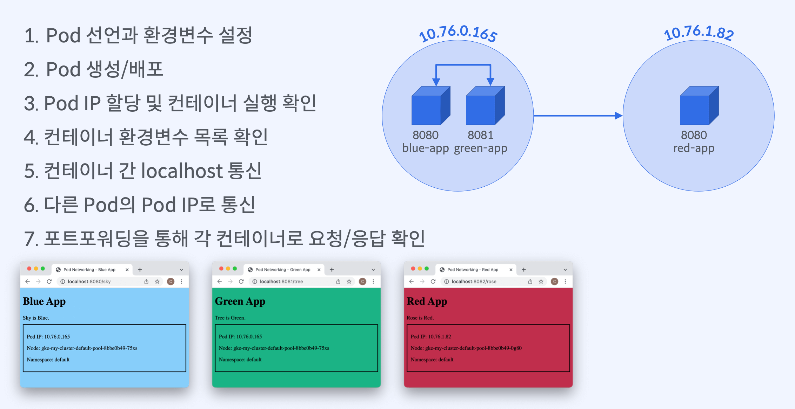
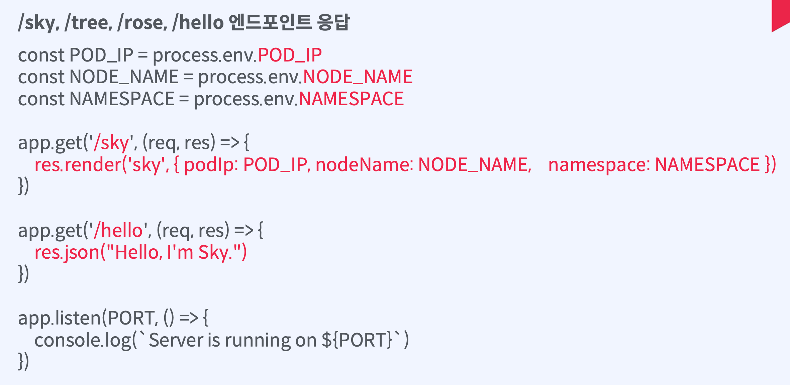

# Pod과 컨테이너들간의 통신

## 실습 목표



### Pod 안의 서로 다른 컨테이너끼리 localhost로 통신

- 하나의 Pod에 서로 다른 포트로 컨테이너 2개를 선언

### 서로 다른 Pod끼리 Pod IP로 통신

- Pod A에 있는 컨테이너 → Pod B에 있는 컨테이너로 요청 전송/응답 확인

## 실습 내용

### 도커 이미지 구성



### Pod 선언

```yaml
# blue-app 컨테이너 설정

apiVersion: v1
kind: Pod
metadata:
  name: blue-green-app
spec:
  containers:
    - name: blue-app
      image: yoonjeong/blue-app:1.0
      ports:
        - containerPort: 8080
      resources:
        limits:
          memory: 64Mi
          cpu: 250m
```

```yaml
# green-app 컨테이너 설정

apiVersion: v1
kind: Pod
metadata:
  name: blue-green-app
spec:
  containers:
    - name: green-app
      image: yoonjeong/green-app:1.0
      ports:
        - containerPort: 8081
```

```yaml
# red-app 컨테이너 설정

apiVersion: v1
kind: Pod
metadata:
  name: red-app
spec:
  containers:
    - name: red-app
      image: yoonjeong/red-app:1.0
      ports:
        - containerPort: 8080
```

```yaml
# red-app 컨테이너 설정

apiVersion: v1
kind: Pod
metadata:
  name: red-app
spec:
  containers:
    - name: red-app
      image: yoonjeong/red-app:1.0
      ports:
        - containerPort: 8080
```

```yaml
# blue-app, green-app, red-app 환경변수 설정

spec:
  containers:
    env:
      - name: NODE_NAME
        valueFrom:
          fieldRef:
            fieldPath: spec.nodeName
      - name: NAMESPACE
        valueFrom:
          fieldRef:
            fieldPath: metadata.namespace
      - name: POD_IP
        valueFrom:
          fieldRef:
            fieldPath: status.podIP
```

### 실습 명령어

```bash
$ kubectl apply ‒f <yaml파일경로>
# Pod 생성

$ kubectl get pod ‒o wide
# Pod 실행 및 IP확인

$ kubectl delete pod <pod-name>
$ kubectl delete pod --all
# Pod 종료

$ kubectl exec <pod-name> -c <container-name> -- curl -s localhost:<container-port>
# 컨테이너간 통신

$ kubectl exec <pod-name> -c <container-name> -- curl -s <pod- ip>:<container-port>
# Pod 간 통신

$ kubectl logs <pod-name> <container-name>
# 컨테이너 로그 출력

$ kubectl exec <pod-name> -c <container-name> -- ifconfig eth0
# 컨테이너 IP확인

$ kubectl exec <pod-name> -- printenv
# 컨테이너 환경변수 확인

$ kubectl port-forward <pod-name> <host-port>:<container-port>
# 포트포워딩
```
