# Deployment

## `ReplicaSet`을 사용하는 이유

### `ReplicaSet`을 왜 사용할까?

- `ReplicaSet`의 `Pod` 복제 기능을 이용해 여러 개의 `Pod`을 한 번에 실행할 수 있음
- 선언한 `replicas` 수 만큼 `Pod` 실행을 보장
- `ReplicaSet`이 사용자 대신 `Pod` 상태를 항상 감시
- `Pod` 실행 중에도 `replicas` 조정이 자유로움 (`scaling`)

## `ReplicaSet`을 이용한 배포 과정

### `ReplicaSet` - `Pod 1.0` 배포 명령을 내린 상황

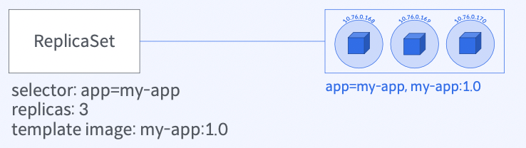

### `ReplicaSet` - `Pod Template` 이미지를 `2.0`으로 변경하고 적용한 상황

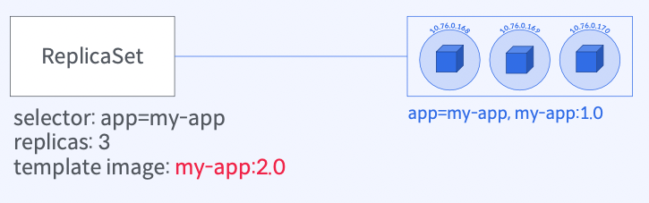

- 실행중인 `Pod`에는 아무런 영향이 없음 (이미 `replicas` 만큼의 `Pod`가 존재하기 때문)
- 새로 생성되는 `Pod`에만 `Template`이 적용됨

### `ReplicaSet` - 실행중인 모든 `Pod 1.0`을 삭제하는 명령을 내리면

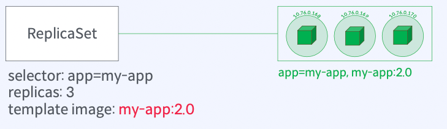

### 만약 배포한 새로운 `Pod`에 문제가 있어, 이전 버전으로 롤백을 하려면

- 새로운 `ReplicaSet`을 만들어 `Pod` 재배포 시도 또는 `Pod Template` 변경 후 전파
- 필요없는 `ReplicaSet`과 `Pod`를 수동 제거 또는 `scale`을 통한 제거
- 이 과정은 롤백 혹은 새로운 버전을 배포할 때마다 계속 반복되어야 함
  - 현재 실행중인 `Pod`에 영향을 바로 주지 않는것이 장점이자 단점
- 이러한 반복 작업을 필요한 경우 쿠버네티스에게 위임할 수 있을까?

## 배포 아이디어

### `Pod` 배포를 위한 3가지 정보

- `selector`
  - 어떤 `Pod` 집합을 대상으로 `replication` 해야 하는지
- `replicas`
  - 얼마나 `Pod`을 생성할지
- `template.spec.containers[].image`
  - `Pod`에서 어떤 컨테이너 이미지를 실행할지

### 배포할 때 바뀌는 부분은 정해져 있음에 착안

> `Pod Template` 이미지는 바뀔 때마다 쿠버네티스가 알아서 `ReplicaSet`을 생성하고 이전 `Pod`를 제거하면 되겠군!

## `Deployment`란 무엇인가?

### `Deployment`는 `Pod` 배포 자동화를 위한 오브젝트 (`ReplicaSet` + 배포 전략)

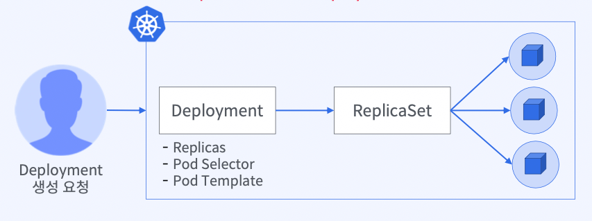

- 새로운 `Pod`을 롤아웃/롤백할 때 `ReplicaSet` 생성을 대신해줌 (+`Pod` 복제)
- 다양한 배포 전략을 제공하고 이전 파드에서 새로운 파드로의 전환 속도를 제어할 수 있음
- 이제는 `Pod`을 배포할 때 `ReplicaSet`이 아닌 `Deployment`를 사용

## `Deployment` 생성

```yaml
apiVersion: apps/v1 # Kubernetes API 버전
kind: Deployment # 오브젝트 타입 (배포)
metadata: # 오브젝트를 식별할 수 있은 정보
  name: my-app # 오브젝트 명
spec: # 오브젝트 사양
  selector: # ReplicaSet을 통해 관리할 Pod를 선택하기 위한 label query
    matchLabels:
      app: my-app
  replicas: 3 # 관리할 Pod 복제본 개수 선언
  template: # 생성할 Pod의 사양
    metadata:
      labels:
        app: my-app # matchLabels에서 식별하는 정보 (일치해야 함)
    spec:
      containers:
        - name: my-app
          image: yoonjeong/my-app:1.0
```

## 기본 컨셉

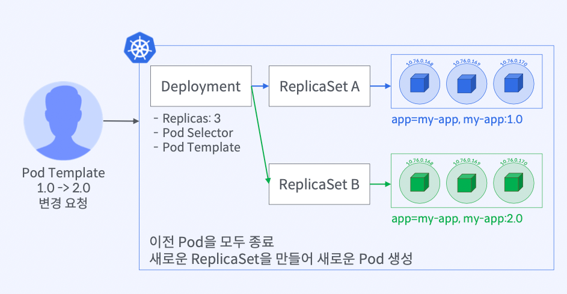

## 배포 전략`1` - `Recreate` 배포

### `Deployment replicas: 3`

- 이전 `Pod`을 모두 종료하고 새로운 `Pod`을 `replicas`만큼 생성

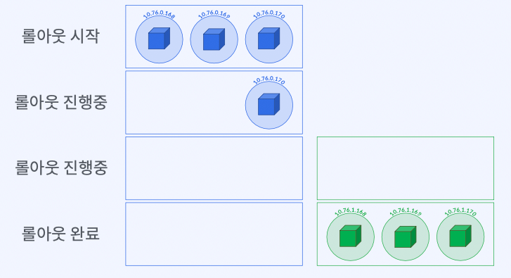

## 배포 전략`2` - `RollingUpdate` 배포

### `Deployment replicas: 3`

- 새로운 `Pod` 생성과 이전 `Pod` 종료가 동시에 일어나는 방식
- 모든 이전 `Pod`이 종료될때까지 반복

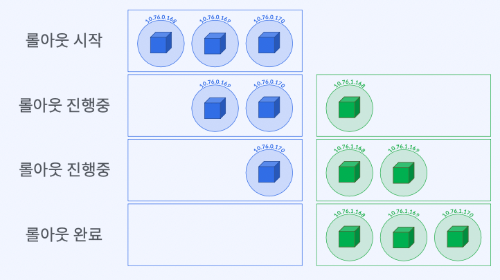

## 배포 전략 비교

### `Recreate`과 `RollingUpdate` 비교

| Recreate      | 1. 새로운 버전을 배포하기 전에 이전 버전이 즉시 종료됨 2. 컨테이너가 정상적으로 시작되기 전까지 서비스하지 못함 (팟이 존재하지 않으므로) 3. 최대 replicas 수 만큼의 컴퓨팅 리소스만 필요 4. 개발 단계에서 유용 |
| ------------- | -------------------------------------------------------------------------------------------------------------------------------------------------------------------------------------------------------------- |
| RollingUpdate | 1. 새로운 버전을 배포하면서 이전 버전을 종료 2. 서비스 다운타임 최소화 3. 동시에 실행되는 Pod의 개수가 replicas를 넘게 되므로 컴퓨팅 리소스가 추가적으로 필요                                                  |

## `RollingUpdate` 속도 제어 옵션

### `maxUnavailable`

- 롤링 업데이트를 수행하는 동안 유지하고자 하는 최소 `Pod`의 비율(수)을 지정할 수 있음
- 최소 `Pod` 유지 비율 = `100 - maxUnavailable` 값
- `ex) replicas: 10, maxUnavailable: 30%`
  - 이전 버전의 `Pod`을 `replicas` 수의 최대 `30%`까지 즉시 `Scale Down` 가능
  - `replicas`를 `10`으로 선언했을 때, 이전 버전의 `Pod`을 `3`개까지 즉시 종료할 수 있음
  - 새로운 버전의 `Pod` 생성과 이전 버전의 `Pod` 종료를 진행하면서, `replicas` 수의 `70%` 이상의 `Pod`을 항상 `Running` 상태로 유지해야 함

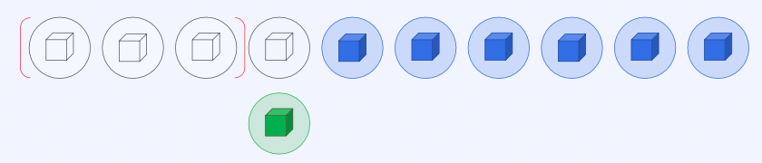

### `maxSurge`

- 롤링 업데이트를 수행하는 동안 허용할 수 있는 최대 `Pod`의 비율(수)을 지정할 수 있음
- 최대 `Pod` 허용 비율 = `maxSurge` 값
- `ex) replicas: 10, maxSurge: 30%`
  - 새로운 버전의 `Pod`을 `replicas` 수의 최대 `30%`까지 즉시 `Scale Up` 할 수 있음
  - 새로운 버전의 `Pod`을 `3`개까지 즉시 생성할 수 있음
  - 새로운 버전의 `Pod` 생성과 이전 버전의 `Pod` 종료를 진행하면서, 총 `Pod`의 수가 `replicas` 수의 `130%`를 넘지 않도록 유지해야 함

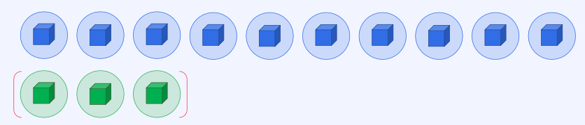

## `Revision`

### `Deployment`는 롤아웃 히스토리를 `Revision #` 으로 관리함

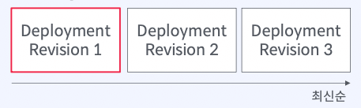

### 조회 결과

```bash
Pod Template:
  Labels: app=my-app
          version=v1
          pod-template-hash=xxx
  Annotations: kubernetes.io/change-cause: v1 배포
  Containers:
    my-app:
      image: nginx:1.16.1
      Port: 80/TCP
```

### `Revision #`를 이용한 손쉬운 롤백

```bash
$ kubectl rollout undo deployment <deployment-name> --to-revision=1
```

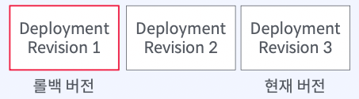

## `Conclusion`

### `Deployment` 배포 전략

- 배포 전략
  - `Recreate`
  - `RollingUpdate`
- `RollingUpdate`옵션
  - `maxUnavailable`
  - `maxSurge`
- `Rollback`과 `Revision`
