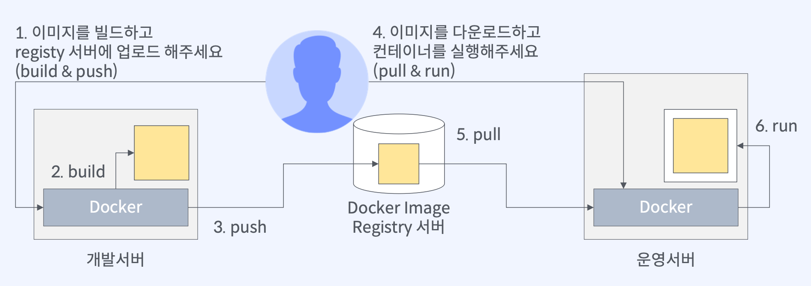
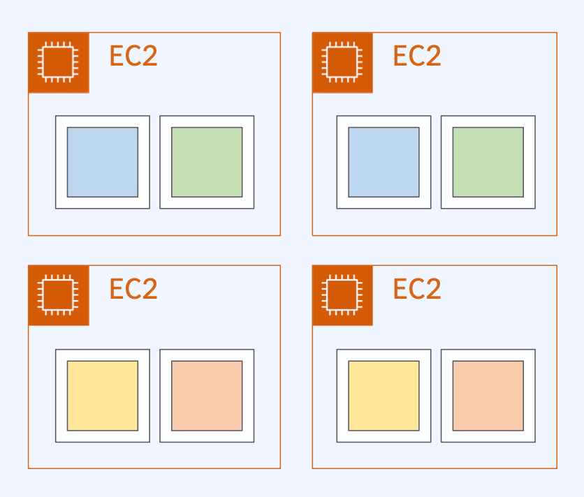
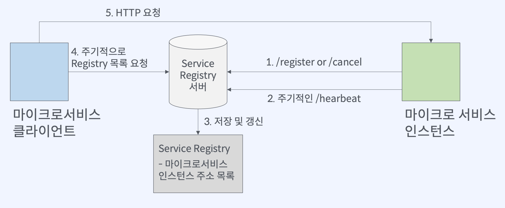
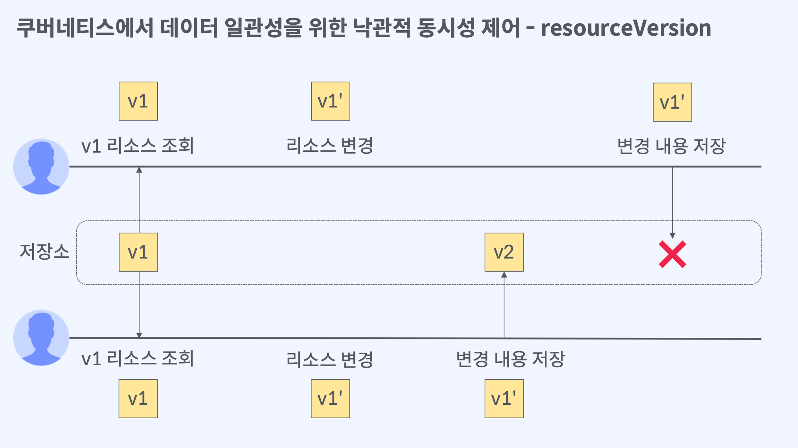
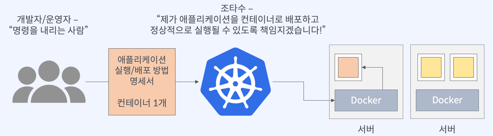
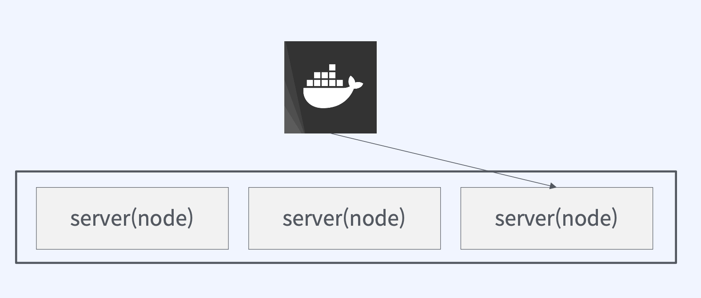
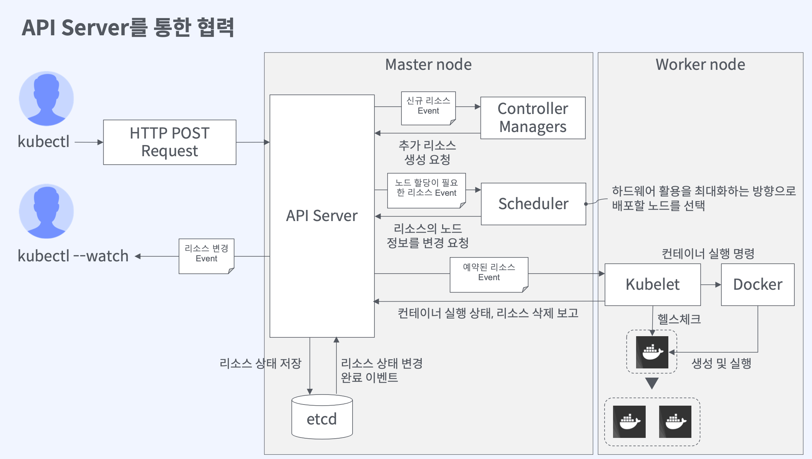
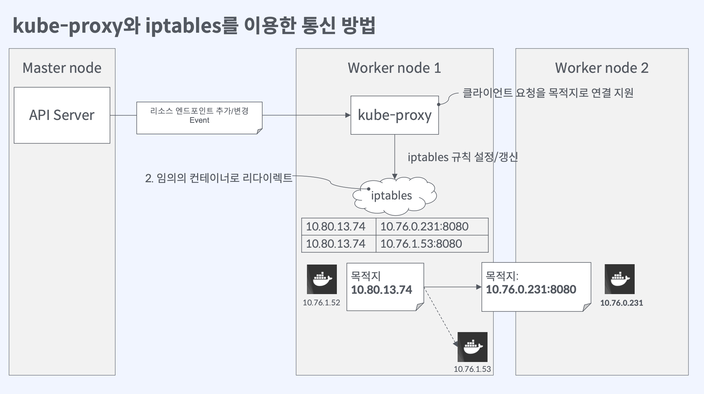
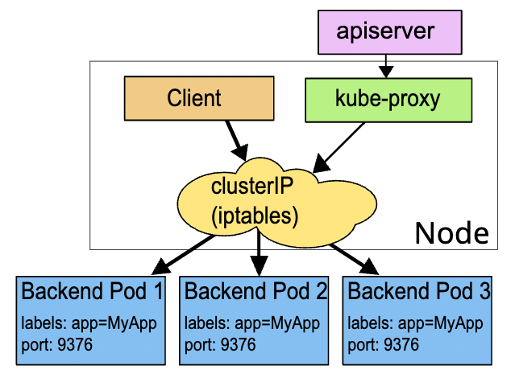

# 쿠버네티스와 클러스터 동작 방식

## 쿠버네티스가 왜 필요한가

### 도커를 이용한 어플리케이션 배포 과정

- 하나의 이미지라면 개발서버와 운영서버를 왕래하며 처리할수 있겠으나..
  - 배포해야 할 마이크로서비스가 수백 개인 경우에 사람이 처리할 수 있을까?
  - 수많은 마이크로서비스를 여러 서버에 효율적으로 배치하는 것은 어려움
  - 많은 컨테이너들이 정상적으로 작동하는지 모니터링은 어떻게?

### 모놀리식을 마이크로서비스 아키텍쳐로 전환하면서 본 인프라적 관점

- 마이크로서비스별 리소스 사용량을 예측하여 정해진 EC2 인스턴스에, 정해진 마이크로서비스 컨테이너를 배포/실행
- 배운점
  - 여러 서버와 마이크로서비스 배포 조합 수는 사람이 계산하기 힘듦
  - 계산이 불가능하다고 하여 충분한 리소스를 할당한다면 그만큼 리소스와 비용 낭비가 발생
  - 간단한 재시작만으로 해결되는 경우라고 하더라도, 복구에는 생각보다 많은 시간이 소요됨
    - 어떤 서버에서 어떤 서비스가 실행되고 있는지 추적, 서버 접속 후 재시작
    - 컨테이너 레이블(이름)만으로 해당 서비스 전체를 한번에 관리할 수 없을까?

### 쿠버네티스에서는 다음을 제공함

- 자동화된 빈 패킹 (`bin packing`)
  - 컨테이너화된 작업을 실행하는데 사용할 수 있는 쿠버네티스 클러스터 노드를 제공함
  - 각 컨테이너가 필요로 하는 `CPU`와 메모리(`RAM`)를 쿠버네티스에 지시
  - 쿠버네티스는 컨테이너를 노드에 맞추어 리소스를 가장 잘 사용할수 있도록 배포
- 자동화된 복구 (`self-healing`)
  - 쿠버네티스는 실패한 컨테이너를 다시 시작하고 컨테이너를 교체
  - 사용자 정의 상태 검사에 응답하지 않는 컨테이너를 죽이고, 서비스 준비가 끝날 때 까지 그러한 과정은 클라이언트에게는 보여주지 않음 (자동으로 복구)
- 자동화된 롤아웃과 롤백
  - 쿠버네티스를 사용하여 배포된 컨테이너의 원하는 상태를 서술(사양서)하고, 현재 상태를 원하는 상태로 설정한 속도에 따라 변경가능
  - 쿠버네티스를 자동화해서 배포용 컨테이너를 만들고 기존 컨테이너를 제거하며, 모든 리소스를 새 컨테이너에 적용 가능함

## 쿠버네티스란 무엇인가

### 쿠버네티스 히스토리

- `Borg. 7`
  - 구글에서 개발한 최초의 통합 컨테이너 관리 시스템
  - 자원 요구사항을 예측하여 리소스 활용도를 높이고 비용을 줄이는 방법을 제공
  - 그 외로 `Config` 파일을 실행중인 서비스에 동적으로 반영
  - 서비스 디스커버리, 로드밸런싱, 오토스케일링 등
- 컨셉
  - 마이크로 서비스 아키텍처에서 수많은 어플리케이션이 예고없이 종료되거나 재시작됨
  - 어플리케이션이 실행되는 노드는 매번 바뀜 (클라이언트 IP를 예측할 수 없음)
    
- Omega
  - 클러스터 상태의 일관성을 부여하기 위해 클러스터 상태를 저장하는 기능을 추가 (영구 저장소)
  - 낙관적 동시성 제어 (`optimistic concurrency control`) 방법을 이용하여 리소스 충돌을 해결
    
  - 리소스 버전을 통해서 쿠버네티스 상태의 일관성을 유지
  - 리소스에 업데이트가 발생했을때 구 버전을 이용해서 저장하려고 하는 경우 거절 (`reject`)
- `Kubernetes`
  - `Borg`, `Omega`와는 달리 오픈소스
  - 구글 퍼블릭 클라우드 인프라 사업을 성장시키기 위해 설계 및 개발
  - `Omega`처럼 리소스 변경사항을 저장하기 위한 공유 영구 저장소가 있지만, `Omega`는 이 저장소를 신뢰할 수 있는 구성요소들이 직접 접근할 수 있도록 개방한것과 달리, 쿠버네티스는 더 높은 수준의 추상화를 위해 `REST API`를 통해서만 접근할 수 있도록 변경
  - 쿠버네티스가 클러스터에서 실행되는 어플리케이션을 개발하는 개발자의 경험에 중점을 두고 개발했다는 반증
  - 따라서 쿠버네티스의 주요 설계 목표는 컨테이너로 향상된 리소스 활용의 이점을 누리면서도 복잡한 분산시스템을 더 쉽게 배포하고 관리할수 있도록 하고자 함

### 왜 이름은 쿠버네티스일까?

- 쿠버네티스 → 조타수 (그리스어)
  - 주어진 명령을 핸들하고 반복 실행하는 존재
- 운영자는 쿠버네티스에게 정확한 지시를 내리기 위한 명세서를 이해하고 작성법을 숙지해야 함
- 쿠버네티스는 **여러개의 컨테이너화된 어플리케이션**을 **여러 서버(쿠버네티스 클러스터)에** 자동으로 배포, 스케일링 및 관리해주는 오픈소스 시스템

## 쿠버네티스 클러스터 구성요소와 동작 방식

### 클러스터

- 여러 개의 서버를 하나로 묶은 집합, 하나의 서버처럼 동작

### 쿠버네티스 클러스터

- 어플리케이션 컨테이너를 배포하기 위한 서버 집합

### `Master` 노드의 `Control Plane`

- 클러스터의 상태를 저장하고 관리
  - `etcd` (`key-value data store`)
    → 클러스터에 배포된 어플리케이션 실행 정보를 저장
  - `API Server`
    → 클러스터 상태 조회, 변경을 위한 `API` 인터페이스 제공
  - `Scheduler`
    → 노드 스케줄
  - `Controller Managers`
    → 사용자가 요청한 컨테이너의 상태가 정상적으로 운영되고 있는지 감시하고, 정상적이지 않다면 API 서버에 추가적인 정보를 요청

### `Worker` 노드

- 컨테이너 실행을 담당
  - `Kubelet`, `Container Runtime` (`Docker`, …)
  - `kube-proxy`
    → 워커노드로 들어오는 트래픽을 팟으로 전달하기 위한 프록시

### “쿠버네티스에 어플리케이션 컨테이너를 배포한다” 라는 의미

- 쿠버네티스 오브젝트 `Manifest` 파일을 작성
- 마스터 노드에 있는 `API Server`에게 요청을 보내는 행위
- `Manifest` 파일
  - 쿠버네티스 오브젝트를 생성하기 위한 필수 정보
  - 일을 시키기 위한 지시서 → `“사양서”`

### API Server를 통한 협력 (like 옵저버 패턴)

- 옵저버 패턴 (`Observer Pattern`)
  - 구독하고자 하는 이벤트를 중앙장치에 등록하고, 이벤트가 발생할때마다 알림을 받는 것
  - 이벤트 드리븐(`Event-Driven`)이 구성의 핵심 방식임

### 핵심 동작 원리 (신규 리소스 작성에 대한 것이라고 가정)

1. 사용자는 `kubectl`에서 명령을 내리고, 이는 `HTTP POST` 요청으로 전환되어 `API` 서버로 전달됨
2. `Controller Manager`는 `API Server`로부터 신규 리소스에 대한 이벤트를 받게 됨
3. `Controller Manager`가 이벤트를 분석하여 신규 리소스 작성이 필요하다고 판단하면 `API Server`로 추가 리소스 생성에 대한 요청을 작성함
4. `API Server`는 추가 리소스에 대한 리소스 상태를 `etcd`에 저장함 (예를들면 팟 생성 요청일 경우 팟에 대한 설정 등을 저장)
5. 동시에 특정 리소스에 대한 이벤트가 발생했을때 알림을 받도록 설정된 일부 `Scheduler`는 3번에 대한 요청을 이벤트 방식으로 인지하게 됨
6. `Scheduler`는 아직 노드에 배포되지 않은 팟이 존재함을 `etcd`와 대조하여 파악한 뒤, 최적의 노드를 선정하여 `API Server`에 전달함
7. `API Server`는 최종적으로 `etcd`에 팟과 노드를 매칭하여 기록함
8. 노드에 배포된 `Kublet`은 매칭된 `etcd`를 보고 컨테이너 런타임을 이용해 생성, 실행
   1. `Kublet`은 생성, 실행 외에도 주기적으로 컨테이너들의 상태를 파악하여 `API Server`에 보고하는 역할도 수행함

### `kube-proxy`와 `iptables`를 이용한 통신 방법

- `kube-proxy`는 노드에 설치되어 있는 컴포넌트로서, `API Server`로부터의 요청을 처리함
- 내부적으로는 클러스터의 가상 주소를 관리하는 `iptables`가 존재하며, 해당 주소록을 항상 최신화함
- 요청이 들어오면 `kube-proxy`는 해당 테이블로부터 랜덤한 팟의 아이피를 검색/매칭 시킨뒤 요청을 전달함
