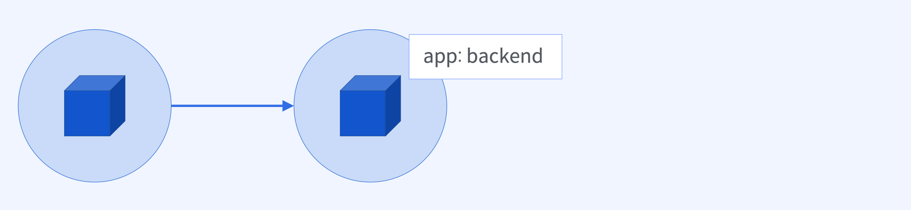

# Label과 Selector

# `Label`과 `Selector` 개념

## `Label`과 `Selector`란 무엇인가?


### `Label`

- 쿠버네티스 오브젝트를 식별하기 위한 `key/value` 쌍의 메타정보

### `Selector`

- `Label`을 이용해 쿠버네티스 리소스를 필터링하고 원하는 리소스 집합을 구하기 위한 `label query`

## `Label`과 `Selector`는 언제 필요할까?


- 클러스터에서 서로 다른 팀의 수백개 `Pod`이 동시에 실행되고 있는 상황
  - 주문 트래픽을 주문 `Pod`으로, 배달 트래픽을 배달 `Pod`으로 라우팅 해야 할 때
- 기능 추가로 배달 트래픽이 증가하는 상황
  - 클러스터에서 실행중인 배달 관련 `Pod`들을 수평 확장해야 할 때
- 어떤 리소스를 선택해서 명령을 실행하고자 하는 상황
  - 이 때 `Label`과 `Selector`를 사용

### `Label`

- 쿠버네티스 리소스를 논리적인 그룹으로 나누기 위해 붙이는 이름표

### `Selector`

- `Label`을 이용해 쿠버네티스 리소스를 선택하는 방법 (`label query`)


# `Label` 표현 방법

## `metadata.labels` 속성

```yaml
apiVersion: v1
kind: Pod
metadata:
  name: my-pod
  labels:
    app: backend
    version: v1
    env: prod
spec:
  containers:
    - name: my-pod
      image: my-pod
```

## `Label` 조회 명령어와 옵션

### 팟 정보를 가져오기


```bash
$ kubectl get pod my-pod --show-labels

NAME   READY STATUS  LABELS
my-pod 1/1   Running <none>
```

### 팟 정보에 레이블을 추가



```bash
$ kubectl label pod my-pod app=backend
$ kubectl get pod my-pod --show-labels

NAME   READY STATUS  LABELS
my-pod 1/1   Running app=backend
```

### 이미 붙어있는 레이블 수정


```bash
$ kubectl label pod my-pod version=v1
$ kubectl label pod my-pod version=v2 --overwrite
pod/my-pod labeled

# overwirte 옵션이 없을 경우에는 이미 존재하는 키값이므로 에러가 발생하게 됨
```

## `Label key` 선택 출력 명령어와 옵션

### 특정 레이블 칼럼을 선택해서 출력


```bash
$ kubectl get pod/my-pod --label-columns app,env
NAME   READY STATUS  APP     ENV
my-pod 1/1   Running backend prod

$ kubectl get pod/my-pod -L app,env
```

## `Label` 삭제 명령어와 옵션

### 특정 레이블 칼럼을 삭제


```bash
$ kubectl label pod/my-pod app-
$ kubectl get pod/my-pod --show-labels

NAME   READY STATUS  LABELS
my-pod 1/1   Running env=prod,version=v2
```

# `Selector` 표현 방법

## `Label`을 이용한 리소스 선택 명령어와 옵션

### `kubectl get` 명령어와 함께 `Selector`를 이용하는 방법

```bash
$ kubectl get <object-type> --selector <label query 1, ..., label query N>
$ kubectl get <object-type> -l <label query 1, ..., label query N>
# label query: key=value
```

## `Label query` 연산자

### `Equality-Based Selector`

- 같다(`=`)
- 같지 않다 (`!=`)
- `key=value` → `key`의 값이 `value`일 때
- `key!=value` → `key`의 값이 `value`가 아닐 때

### `Pod`의 `Label` 조회

```bash
$ kubectl get pod --show-labels

NAME READY STATUS  LABELS
pod1 1/1   Running env=dev
pod2 1/1   Running env=stage
pod3 1/1   Running env=prod
pod4 1/1   Running env=prod
pod5 1/1   Running
```

```bash
# Q1. kubectl get pod --selector env=prod

NAME READY STATUS  LABELS
pod3 1/1   Running env=prod
pod4 1/1   Running env=prod

# Q2. kubectl get pod --selector env!=prod

NAME READY STATUS  LABELS
pod1 1/1   Running env=dev
pod2 1/1   Running env=stage
pod5 1/1   Running
```

### 새로운 `Label` 추가

```bash
$ kubectl label pod pod1 pod2 pod3 app=backend

NAME READY STATUS  LABELS
pod1 1/1   Running app=backend, env=dev
pod2 1/1   Running app=backend, env=stage
pod3 1/1   Running app=backend, env=prod
pod4 1/1   Running env=prod
pod5 1/1   Running
```

```bash
# Q1. kubectl get pod --selector app=backend,env=prod

NAME READY STATUS  LABELS
pod3 1/1   Running app=backend, env=prod

# Q2. kubectl get pod --selector app!=backend,env= prod

NAME READY STATUS  LABELS
pod4 1/1   Running env=prod

# Q3. kubectl get pod --selector app!=backend,env!= prod

NAME READY STATUS  LABELS
pod5 1/1   Running
```

### `Set-Based Selector`

- 값이 어떤 집합에 속해 있음 / 속해 있지 않음 (`OR` 연산 가능)
  - `key in (value1, value2, …)` → `key`의 값이 `value1`이거나 `value2`일 때
  - `key notin (value1, value2, …)` → `key`의 값이 `value1`이 아니거나 `value2`가 아닐 때
- 키가 존재함/존재하지 않음
  - `key` → `label`에 `key`가 있을 때
  - `!key` → `label`에 `key`가 없을 때

```bash
$ kubectl get pod --show-labels

NAME READY STATUS  LABELS
pod1 1/1   Running app=backend, env=dev
pod2 1/1   Running app=backend, env=stage
pod3 1/1   Running app=backend, env=prod
pod4 1/1   Running env=prod
pod5 1/1   Running
```

```bash
# Q1. kubectl get pod --selector 'env in (dev,stage,prod)'

NAME READY STATUS  LABELS
pod1 1/1   Running app=backend, env=dev
pod2 1/1   Running app=backend, env=stage
pod3 1/1   Running app=backend, env=prod
pod4 1/1   Running env=prod

# Q2. kubectl get pod --selector ‘env notin (dev,stage,prod)’

NAME READY STATUS  LABELS
pod5 1/1   Running

# Q3. kubectl get pod --selector env

NAME READY STATUS  LABELS
pod1 1/1   Running app=backend, env=dev
pod2 1/1   Running app=backend, env=stage
pod3 1/1   Running app=backend, env=prod
pod4 1/1   Running env=prod

# Q4. kubectl get pod --selector ‘!env’

NAME READY STATUS  LABELS
pod5 1/1   Running

# Q5. kubectl get pod --selector ‘app=backend,env in (dev,stage)’

NAME READY STATUS  LABELS
pod1 1/1   Running app=backend, env=dev
pod2 1/1   Running app=backend, env=stage

# Q6. kubectl get pod --selector ‘env,env notin (dev,stage)’

NAME READY STATUS  LABELS
pod3 1/1   Running app=backend, env=prod
pod4 1/1   Running env=prod

# Q7. kubectl get pod --selector ‘env notin (dev,stage)’

NAME READY STATUS  LABELS
pod3 1/1   Running app=backend, env=prod
pod4 1/1   Running env=prod
pod5 1/1   Running
```

## `Conclusion`

### `Label`과 `Selector`

- 쿠버네티스 오브젝트 `metadata.labels` 속성으로 리소스에 `Label`을 추가할 수 있음
- `Label`은 `key/value` 쌍으로 선언
- 쿠버네티스 오브젝트에 선언한 `Label`의 `key/value`를 기준으로 원하는 리소스를 필터링 할 수 있음
- 필터링하기 위한 조건을 `Selector`로 정의 (`label query`)
- 즉, `Label`과 `Selector`를 사용하면 특정 리소스들의 집합을 구할 수 있음
- `kubectl get` 명령어를 사용할 때 `label query`를 지정하기 위해 `—selector` 또는 `-l` 옵션을 사용
