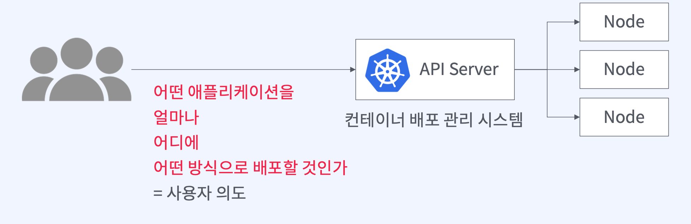
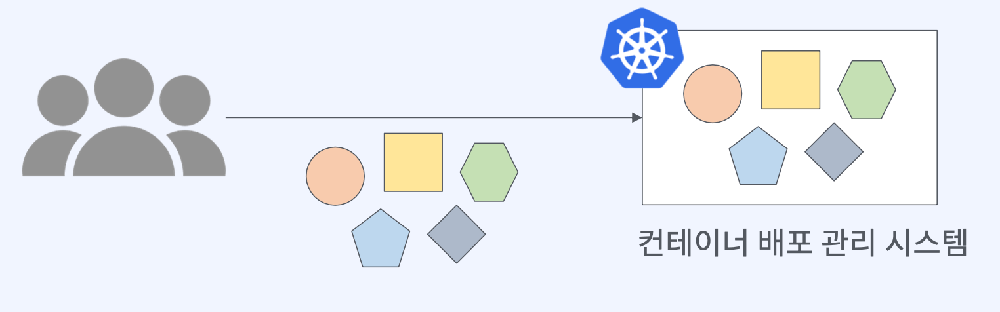

# 쿠버네티스 오브젝트

## 쿠버네티스 오브젝트와 클러스터 관계

### 쿠버네티스로 어플리케이션을 배포하고 관리하기



- 사용자의 의도를 어떻게 표현하는가?
  - 의도를 정의하는 방법
    - 쿠버네티스 오브젝트
    - 오브젝트 종류에 따라 정의할 수 있는 속성이 달라짐
  - 표현방식
    - YAML
  - 전달방식
    - REST API

### 쿠버네티스 오브젝트는 클러스터 상태를 결정한다



- 사용자가 어떻게 쿠버네티스 오브젝트를 정의하느냐에 따라 상태가 결정됨
- 쿠버네티스 오브젝트를 이용해서 개발팀의 구조, 배포 정책, 프로세스를 표현할 수 있음

## 쿠버네티스 개념

### 쿠버네티스 오브젝트

- 쿠버네티스 클러스터를 이용해 어플리케이션을 배포하고 운영하기 위해 필요한 모든 쿠버네티스 리소스

### 쿠버네티스 오브젝트가 될 수 있는것 (클러스터의 상태를 표현하는 객체들)

- 어떤 어플리케이션을 (Pod)
- 얼마나 (ReplicaSet)
- 어디에 (Node, Namespace)
- 어떤 방식으로 배포하고 (Deployment)
- 트래픽은 어떻게 로드밸런싱할지 (Service, Endpoints)

<aside>
💡 클러스터 내에서 리소스를 논리적으로 나누기 위한 그룹 (예시, 팀 단위, 프로젝트 단위 등등)

</aside>

> 우리 클러스터에는 10개의 Node에 5개의 Namespace가 있고, 100개의 Deployment를 이용해 어플리케이션을 배포하고 있군. 배포는 점진적 배포전략을 이용하고 있네? ReplicaSet을 보니 Pod를 2개씩 생성해서 어플리케이션을 실행하고 있구나. Service를 보니 서비스를 호출하려면 my-app이라는 도메인 이름으로 호출할수 있겠다!

## 오브젝트 표현 방법

### 의도가 담겨 있는 spec 빌드

```yaml
apiVersion: apps/v1 # 오브젝트를 생성할 때 사용하는 API 버전
kind: Deployment # 생성하고자 하는 오브젝트 종류
metadata: # 오브젝트를 구분지을수 있는 정보, name, resourceVersion, labels, namespace, ...
  name: nginx-deployment
spec: # 사용자가 원하는 오브젝트 상태로 선언할 수 있는 속성은 오브젝트 종류마다 다르다 *https://kubernetes.io/docs/reference/kubernetes-api/
  selector:
    matchLabels:
      app: nginx
  replicas: 2
  template:
    metadata:
      labels:
        app: nginx
      spec:
        containers:
          - name: nginx
          image: nginx:1.14.2
          ports:
          - containerPort: 80
```

### 쿠버네티스가 오브젝트 상태를 알려주는 status 필드

```yaml
status:
  availableReplicas: 2
  conditions:
    - lastTransitionTime: '2022-02-06T12:28:39Z'
      lastUpdateTime: '2022-02-06T12:28:39Z'
      message: Deployment has minimum availability.
      reason: MinimumReplicasAvailable
      status: 'True'
      type: Available
      - lastTransitionTime: '2022-02-06T12:28:16Z'
        lastUpdateTime: '2022-02-06T12:28:39Z'
        message: ReplicaSet "my-app-5b7548d6b" has successfully progressed.
        reason: NewReplicaSetAvailable
        status: 'True'
        type: Progressing
observedGeneration: 1
readyReplicas: 2
replicas: 2
updatedReplicas: 2
```

- 오브젝트가 쿠버네티스 클러스터에 생성되면 쿠버네티스는 오브젝트 정보에 status 필드를 추가하고 현재 실행중인 오브젝트의 상태 정보를 알려줌

## spec과 status간의 필드 관계

### 쿠버네티스가 달성해야 할 목표(spec)는 상태(status)와의 일치

1. 사용자가 쿠버네티스 오브젝트 YAML파일을 작성 (spec 작성)
2. 쿠버네티스 API를 이용해서 쿠버네티스에 생성을 요청
3. 쿠버네티스 API Server가 오브젝트 파일의 spec을 읽고 오브젝트를 생성
4. 쿠버네티스 ControllerManager가 spec과 status를 비교하면서 계속 조정하고 상태를 업데이트
