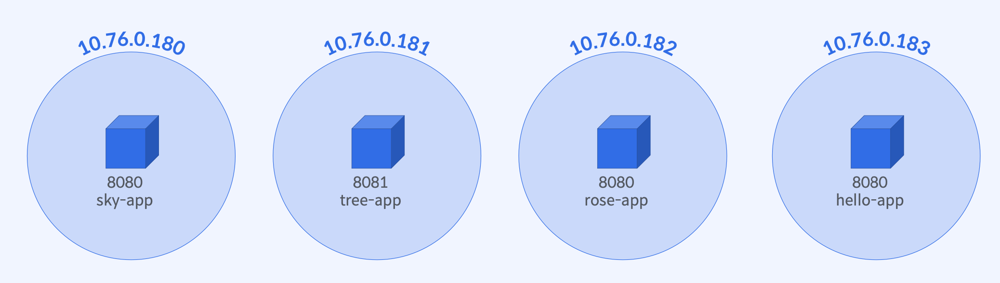
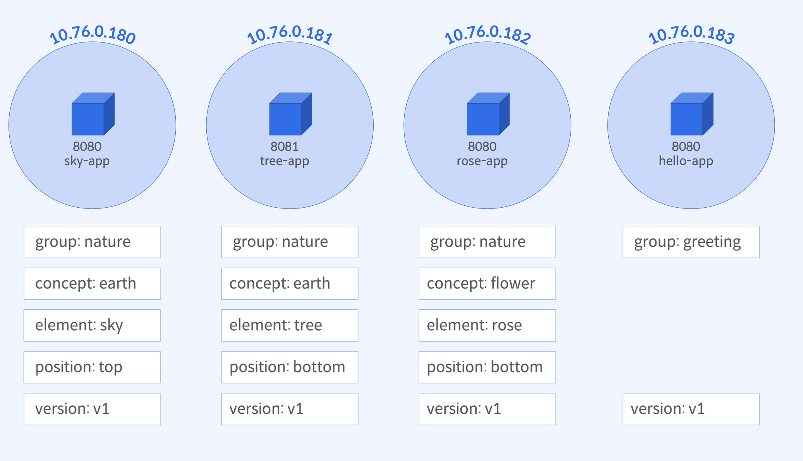

# `Pod Label`과 `Selector`

## 실습 목표



- `Label`가 정의된 `Pod` 선언
- `Pod` 생성/배포
- `kubectl` 명령어로 `Pod`에 `Label`을 추가/변경/삭제
- `Pod`에 선언한 `Label` 확인
- `Selector`로 배포한 `Pod`의 부분집합 조회

## `Label` 구성 계획



## `Label`과 함께 `Pod` 선언

### `Pod` : `rose-app` 선언

```yaml
apiVersion: v1
kind: Pod
metadata:
  name: rose-app
  labels:
    group: nature
spec:
  containers:
    - name: rose-app
      image: yoonjeong/red-app:1.0
      ports:
        - containerPort: 8080
```

### `Pod` : `sky-app` 선언

```yaml
apiVersion: v1
kind: Pod
metadata:
  name: sky-app
  labels:
    group: nature
spec:
  containers:
    - name: sky-app
      image: yoonjeong/blue-app:1.0
      ports:
        - containerPort: 8080
```

### `Pod` : `tree-app` 선언

```yaml
apiVersion: v1
kind: Pod
metadata:
  name: tree-app
  labels:
    group: nature
spec:
  containers:
    - name: tree-app
      image: yoonjeong/green-app:1.0
      ports:
        - containerPort: 8081
```

### `Pod` : `hello-app` 선언

```yaml
apiVersion: v1
kind: Pod
metadata:
  name: hello-app
  labels:
    group: greeting
spec:
  containers:
    - name: hello-app
      image: yoonjeong/hello-app:1.0
      ports:
        - containerPort: 8080
```

## `Label` 추가/변경/삭제, `Selector`로 `Pod` 조회

### `Label` 추가/조회

- 각 `Pod`에 `concept`, `position`, `version` 레이블 추가
- `group=nature` 레이블을 가진 모든 `Pod` 조회
- `concept`가 flower이거나 `earth`인 모든 `Pod` 조회
- `concept` 레이블이 없는 모든 `Pod` 조회 (`!`, `notin` 이용)

### 작업 실행을 위한 모든 Pod 조회

- 물을 주어야 하는 `group=nature` 레이블을 가진 모든 `Pod` 조회 (`position=bottom`)
- 손이 닿지 않는 `group=nature` 레이블을 가진 `Pod`의 `IP` 조회 (`position=top`)

### `Label` 변경/삭제

- `element=tree` 레이블을 가진 모든 `Pod`를 `concept=mountain` 레이블로 변경
- `group=greeting` 레이블을 가진 `Pod`에서 `version` 레이블 삭제

## `kubectl` 명령어

```bash
# Pod 생성 (폴더도 지정 가능)
$ kubectl apply ‒f <yaml파일경로>

# Label 확인
$ kubectl get pods --show-labels
$ kubectl get pods -L <label-key>

# Label 추가
$ kubectl label pod <pod-name> <label-key>=<label-value>

# Label 변경
$ kubectl label pod <pod-name> <label-key>=<label-value> --overwrite

# Label 삭제
$ kubectl label pod <pod-name> <label-key>-

# Pod 조회 withSelector
$ kubectl get pod --selector <labelquery>

# Pod 종료
$ kubectl delete pod --selector <labelquery>
```

## `Conclusion`

### `Label` 선언

- `metadata.labels` 속성

### `Label` 추가/변경/확인 명령어

```bash
$ kubectl label <resource-type>/<resource-name> key=value (--overwrite)
$ kubectl get <resource-type>/<resource-name> --show-labels
$ kubectl get <resource-type>/<resource-name> -L <key,...>
```

### `Label Selector`로 리소스 집합을 선택하는 명령어

```bash
$ kubectl get <resource-type> --select <key=value,...>
$ kubectl get <resource-type> --selector <'key in/notin (value,...)>
$ kubectl get <resource-type> --selector <key|!key>
```
