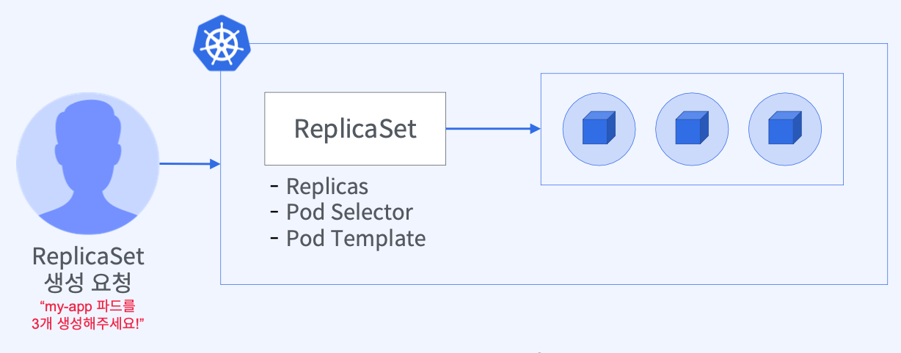
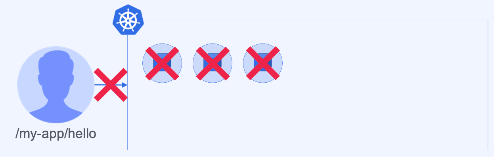
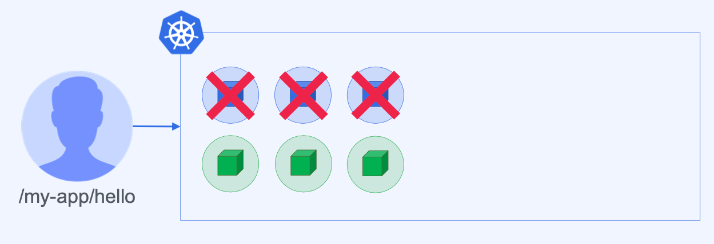
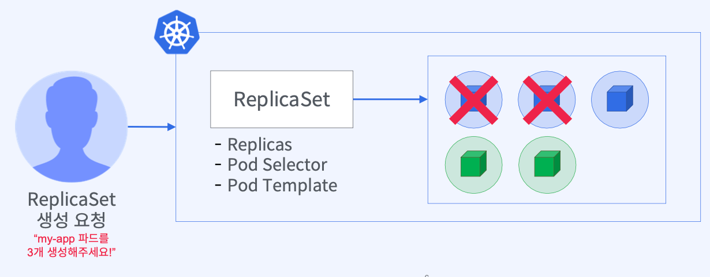
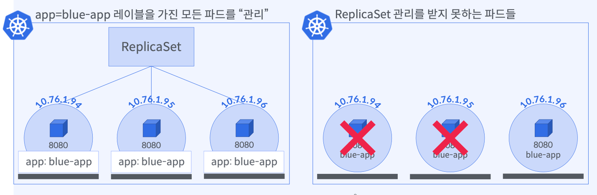

# `ReplicaSet` 개념과 특징

## `ReplicaSet`은 무엇인가?

### `ReplicaSet`은 `Pod` 복제본을 생성하고 관리한다



- 더 이상 `N`개의 `Pod`을 생성하기 위해 생성 명령을 `N`번 실행할 필요가 없음
- **`ReplicaSet` 오브젝트를 정의**하고 **원하는 `Pod`의 개수를 `replicas` 속성을 선언**
- 클러스터 관리자 대신 `Pod` 수가 부족하거나 넘치지 않게 Pod 수를 조정

## `ReplicaSet`의 필요성

### `Pod`에 문제가 생겼을 때



- `**Pod`은 즉시 종료되고 클라이언트 요청을 처리할 수 없음\*\* (`No Self-Healing`)
- 클러스터 관리자가 `24/7` 동안 `Pod` 상태를 감시하고 정상 복구해야 함
- `N`개의 `Pod`을 실행한다면 상태 이상에 대비할 필요가 있음

## 결함에 내성을 가진 서비스 환경 만들기

### ‘소프트웨어가 내결함성을 가진다’ `fault tolerance`



- **소프트웨어나 하드웨어 실패가 발생하더라도 소프트웨어가 정상적인 기능을 수행**할 수 있어야 함
- 소프트웨어가 내결함성이 없으면 고객 요구사항을 만족시킬 수 없음
- **사람의 개입없이 내결함성을 가진 소프트웨어를 구성할 수는 없을까?**

### `Pod`/노드 상태에 따라 `Pod`의 수를 조정할 수 있도록 `ReplicaSet`에게 역할을 위임



- `**ReplicaSet`을 이용해 `Pod` 복제 및 복구 작업을 자동화\*\*
- 클러스터 관리자는 `ReplicaSet`을 만들어 **필요한 `Pod`의 개수를 쿠버네티스에 선언**
- 쿠버네티스가 `ReplicaSet` 요청서에 선언된 `replicas`를 읽고 그 수 만큼 `Pod` 실행을 보장

# 오브젝트 표현 방법

### `ReplicaSet`이 관리하는 `Pod` 생성하기 (`managed pod`)

```yaml
apiVersion: apps/v1 # Kubernetes API 버전
kind: ReplicaSet # 오브젝트 타입
metadata: # 오브젝트를 유일하게 식별하기 위한 정보
  name: blue-app-rs # 오브젝트 이름
  labels: # 오브젝트 집합을 구할 때 사용할 이름표
    app: blue-app
spec: # 사용자가 원하는 Pod의 상태
  selector: # ReplicaSet이 관리해야 하는 Pod을 선택하기 위한 label query
  replicas: # 실행하고자 하는 Pod 복제본 개수 선언
  template: # Pod 실행 정보 - Pod Template과 동일 (metadata, spec, ...)
```

```yaml
spec:
  selector: # ReplicaSet이 관리할 Pod 집합 선택
    matchLabels:
      app: blue-app # Pod label query 작성
    replicas: 3 # 유지할 Pod 복제본 수
```



```yaml
spec:
  selector: # ReplicaSet이 관리할 Pod 집합 선택
    matchLabels:
      app: blue-app
    replicas: 3
    template: # Pod Template 정의
      metadata:
        labels:
          app: blue-app # ReplicaSet selector에 정의한 label을 포함해야 함
      spec:
        containers:
          - name: blue-app
            image: blue-app:1.0
```

### `ReplicaSet`으로 `Pod` 레플리케이션 설정 방법

- `ReplicaSet`을 이용해서 `Pod` 복제본(`replicas`)을 생성하고 관리한다
  → 여러 노드에 걸쳐 배포된 `Pod Up/Down` 상태를 감시하고 `replicas` 수만큼 실행을 보장한다
- `ReplicaSet`의 `spec.selector.matchLabels`는 `Pod`의 `Template` 부분의 `spec.template.metadata.labels`와 같아야 한다
- `spec.replicas`를 선언하지 않으면 기본값은 `1`이다
