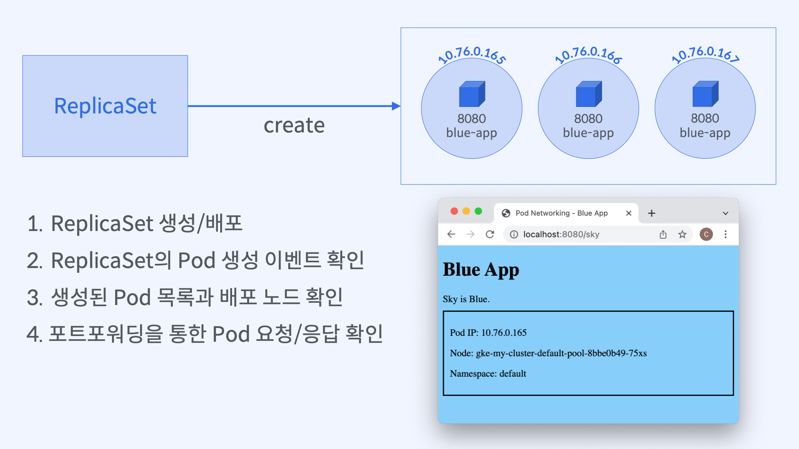
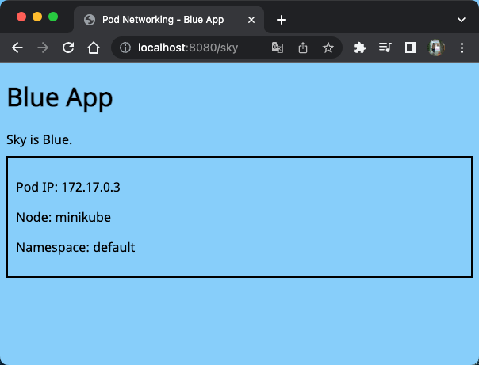

# [실습] `Pod` 복제를 위해 태어난 `ReplicaSet`

## 실습 과정



## `ReplicaSet` 생성과 배포

### `ReplicaSet` 선언

```yaml
spec:
  selector:
    matchLabels:
      app: blue-app
  replicas: 3
  template:
    metadata:
      labels:
        app: blue-app
    spec:
      containers:
        - name: blue-app
          image: yoonjeong/blue-app:1.0
          ports:
            - containerPort: 8080
```

### `ReplicaSet` 생성 결과 - `Pod` 목록 조회

```bash
$ kubectl get rs blue-replicaset -o wide
NAME              DESIRED   CURRENT   READY   AGE   CONTAINERS   IMAGES                   SELECTOR
blue-replicaset   3         3         1       21s   blue-app     yoonjeong/blue-app:1.0   app=blue-app

$ kubectl get pods -o wide
NAME                    READY   STATUS    RESTARTS   AGE     IP           NODE       NOMINATED NODE   READINESS GATES
blue-replicaset-4286q   1/1     Running   0          13m     172.17.0.3   minikube   <none>           <none>
blue-replicaset-ggzgr   1/1     Running   0          3m59s   172.17.0.4   minikube   <none>           <none>
blue-replicaset-zwwq8   1/1     Running   0          3m59s   172.17.0.5   minikube   <none>           <none>
```

### `ReplicaSet`의 `Pod` 생성 과정 확인

```bash
$ kubectl describe rs blue-replicaset

Name:         blue-replicaset
Namespace:    default
Selector:     app=blue-app
Labels:       <none>
Annotations:  <none>
Replicas:     3 current / 3 desired
Pods Status:  1 Running / 2 Waiting / 0 Succeeded / 0 Failed
Pod Template:
  Labels:  app=blue-app
  Containers:
   blue-app:
    Image:      yoonjeong/blue-app:1.0
    Port:       8080/TCP
    Host Port:  0/TCP
    Limits:
      cpu:     50m
      memory:  64Mi
    Environment:
      NODE_NAME:   (v1:spec.nodeName)
      NAMESPACE:   (v1:metadata.namespace)
      POD_IP:      (v1:status.podIP)
    Mounts:       <none>
  Volumes:        <none>
Events:
  Type    Reason            Age    From                   Message
  ----    ------            ----   ----                   -------
  Normal  SuccessfulCreate  2m15s  replicaset-controller  Created pod: blue-replicaset-gfvjg
  Normal  SuccessfulCreate  2m15s  replicaset-controller  Created pod: blue-replicaset-gs98s
  Normal  SuccessfulCreate  2m15s  replicaset-controller  Created pod: blue-replicaset-4286q
```

### `ReplicaSet`의 `Pod` 생성 과정 확인 (`Pod` 생성 이후)

```bash
$ kubectl get events --sort-by=.metadata.creationTimestamp
LAST SEEN   TYPE      REASON                    OBJECT                       MESSAGE
3m33s       Normal    SuccessfulCreate          replicaset/blue-replicaset   Created pod: blue-replicaset-gfvjg
3m33s       Normal    SuccessfulCreate          replicaset/blue-replicaset   Created pod: blue-replicaset-4286q
3m33s       Normal    Created                   pod/blue-replicaset-4286q    Created container blue-app
3m33s       Normal    SuccessfulCreate          replicaset/blue-replicaset   Created pod: blue-replicaset-gs98s
3m33s       Normal    Pulled                    pod/blue-replicaset-4286q    Container image "yoonjeong/blue-app:1.0" already present on machine
82s         Normal    Pulling                   pod/blue-replicaset-gfvjg    Pulling image "yoonjeong/blue-app:1.0"
3m33s       Normal    Scheduled                 pod/blue-replicaset-gs98s    Successfully assigned default/blue-replicaset-gs98s to minikube-m02
79s         Normal    Pulling                   pod/blue-replicaset-gs98s    Pulling image "yoonjeong/blue-app:1.0"
3m33s       Normal    Scheduled                 pod/blue-replicaset-gfvjg    Successfully assigned default/blue-replicaset-gfvjg to minikube-m03
3m33s       Normal    Scheduled                 pod/blue-replicaset-4286q    Successfully assigned default/blue-replicaset-4286q to minikube
3m32s       Normal    Started                   pod/blue-replicaset-4286q    Started container blue-app
94s         Warning   Failed                    pod/blue-replicaset-gfvjg    Error: ErrImagePull
94s         Warning   Failed                    pod/blue-replicaset-gfvjg    Failed to pull image "yoonjeong/blue-app:1.0": rpc error: code = Unknown desc = context deadline exceeded
94s         Warning   Failed                    pod/blue-replicaset-gs98s    Failed to pull image "yoonjeong/blue-app:1.0": rpc error: code = Unknown desc = context deadline exceeded
94s         Warning   Failed                    pod/blue-replicaset-gs98s    Error: ErrImagePull
93s         Normal    BackOff                   pod/blue-replicaset-gfvjg    Back-off pulling image "yoonjeong/blue-app:1.0"
93s         Warning   Failed                    pod/blue-replicaset-gfvjg    Error: ImagePullBackOff
93s         Normal    BackOff                   pod/blue-replicaset-gs98s    Back-off pulling image "yoonjeong/blue-app:1.0"
93s         Warning   Failed                    pod/blue-replicaset-gs98s    Error: ImagePullBackOff
```

### `Pod` `/sky` 요청 및 응답 확인

```bash
$ kubectl port-forward rs/blue-replicaset 8080:8080
Forwarding from 127.0.0.1:8080 -> 8080
Forwarding from [::1]:8080 -> 8080
```



- `blue-replicaset` 이라는 `ReplicaSet`에 의해 생성된 `Pod`로 트래픽 전달
- 첫번째 생성된 `Pod`로만 요청이 전달됨 (**로드밸런싱이 일어나지 않음**)
  → `ReplicaSet`은 로드밸런싱에 대한 책임을 지고 있지 않음

## `kubectl` 명령어

```bash
# ReplicaSet 생성
$ kubectl apply -f <rs object에 대한 yaml파일 경로>

# ReplicaSet과 배포 이미지 확인
$ kubectl get rs <replicaset-name> -o wide

# Pod 목록과 배포된 노드 확인
$ kubectl get pods -o wide

# ReplicaSet의 Pod 생성 기록 확인
$ kubectl describe rs <replicaset-name>

# ReplicaSet의 Pod 생성 이후 과정 확인 (Pod 생성 이후 시간의 이벤트 출력)
$ kubectl get events --sort-by=.metadata.creationTimestamp

# ReplicaSet Pod로 트래픽 전달
$ kubectl port-forward rs/<replicaset-name> 8080:8080
```

## 기존에 생성한 Pod을 ReplicaSet으로 관리하기

### app=blue-app 레이블을 가진 단독 Pod 생성

```bash
$ kubectl apply -f blue-app.yaml
pod/blue-app created

$ kubectl get pods
NAME                    READY   STATUS    RESTARTS   AGE
blue-app                1/1     Running   0          55s
```

### app=blue-app 레이블의 Pod을 관리하는 ReplicaSet 생성

```bash
$ kubectl apply -f replicaset.yaml
replicaset.apps/blue-replicaset created

$ kubectl get rs blue-replicaset -o wide
NAME              DESIRED   CURRENT   READY   AGE   CONTAINERS   IMAGES                   SELECTOR
blue-replicaset   3         3         3       68s   blue-app     yoonjeong/blue-app:1.0   app=blue-app

$ kubectl get pods
NAME                    READY   STATUS    RESTARTS   AGE
blue-app                1/1     Running   0          55s
blue-replicaset-d9p2f   1/1     Running   0          48s
blue-replicaset-pz7cz   1/1     Running   0          48s
```

### ReplicaSet은 몇 개의 Pod을 생성했을까?

```bash
$ kubectl describe rs blue-replicaset
Events:
  Type    Reason            Age   From                   Message
  ----    ------            ----  ----                   -------
  Normal  SuccessfulCreate  20s   replicaset-controller  Created pod: blue-replicaset-pz7cz
  Normal  SuccessfulCreate  20s   replicaset-controller  Created pod: blue-replicaset-d9p2f
```

### 알 수 있는 사실

- `ReplicaSet`이 `Pod`을 2개만 작성
- `ReplicaSet`은 자신이 관리하는 Pod의 수를 `replicas`가 넘지 않게 관리
- 주의사항
  - 이미 생성된 `Pod`의 레이블이 `ReplicaSet`의 `Pod Selector`와 같다면 관리 범주에 들어가므로 Pod `Selector`를 설계할 때는 조건이 이미 존재하는 관리대상과 일치하는지 등을 파악하고 나서 해야 함
