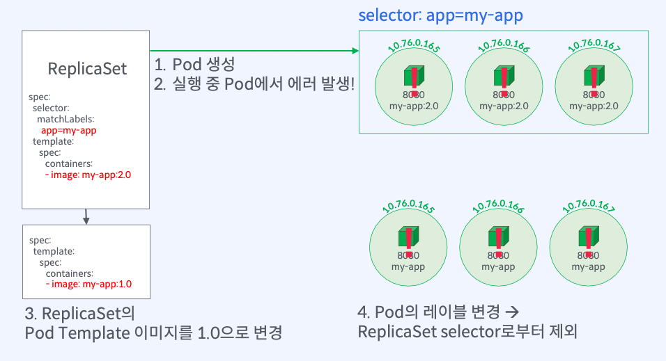
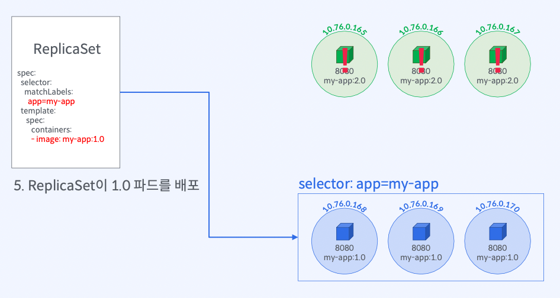

# [실습] Pod Template 이미지 변경을 통한 롤백

## 실습 과정





## `ReplicaSet` 선언 - `selector`, `replicas`, `Pod Template`

### `ReplicaSet`으로 `my-app:2.0` 배포

```yaml
metadata:
  name: myapp-replicaset
  labels:
    app: my-app
  spec:
    selector:
      matchLabels:
        app: my-app
    replicas: 3
    template:
      metadata:
        labels:
          app: my-app
      spec:
        containers:
          - name: my-app
            image: yoonjeong/my-app:2.0-unhealthy
            ports:
              - containerPort: 8080
```

## `ReplicaSet`이 생성한 파드로 통신하기

### `ReplicaSet`에 의해 생성된 파드로 트래픽 전달

```bash
$ kubectl port-forward rs/myapp-replicaset 8080:8080
Forwarding from 127.0.0.1:8080 -> 8080
Forwarding from [::1]:8080 -> 8080
```

### `5`번 요청 실행 후 결과

```bash
$ for i in {0..5};
$ do curl localhost:8080;
$ done
* Mark bundle as not supporting multiuse
< HTTP/1.1 500 Internal Server Error
< X-Powered-By: Express
< Content-Type: application/json; charset=utf-8
< Content-Length: 25
< ETag: W/"19-eTPtSkfMoAo+ZTZd32TQ0fC0w6M"
< Date: Thu, 01 Sep 2022 22:01:03 GMT
< Connection: keep-alive
< Keep-Alive: timeout=5
<
* Connection #0 to host localhost left intact
"Crashed! Please fix me."%
```

## `ReplicaSet`으로 파드 `2.0 → 1.0` 롤백하기

### `1.0` 버전으로 롤백을 위해 `ReplicaSet`의 `Pod Template` 변경

```bash
$ kubectl set image rs/myapp-replicaset my-app=yoonjeong/my-app:1.0
replicaset.apps/myapp-replicaset image updated
```

- `myapp-replicaset` 레플리카셋의 `my-app` 컨테이너 이미지를 `my-app:1.0`으로 변경
- 실행 중인 `Pod`은 변경하지 않고 `Pod Template`의 이미지만 변경됨

### `ReplicaSet`과 `Pod Template` 확인

```bash
$ kubectl get rs myapp-replicaset -o wide
kubectl get rs myapp-replicaset -o wide
NAME               DESIRED   CURRENT   READY   AGE    CONTAINERS   IMAGES                 SELECTOR
myapp-replicaset   3         3         3       4m1s   my-app       yoonjeong/my-app:1.0   app=my-app
```

### 실행 중인 `2.0` 버전의 모든 파드 `Label` 변경

```bash
$ kubectl label pod -l app=my-app app=to-be-fixed --overwrite
pod/myapp-replicaset-8lq59 labeled
pod/myapp-replicaset-t56r8 labeled
pod/myapp-replicaset-zrc2p labeled

$ kubectl get pod -L app
NAME                     READY   STATUS    RESTARTS   AGE    APP
myapp-replicaset-8lq59   1/1     Running   0          8m3s   to-be-fixed
myapp-replicaset-l8v26   1/1     Running   0          44s    my-app
myapp-replicaset-n9r84   1/1     Running   0          44s    my-app
myapp-replicaset-t56r8   1/1     Running   0          8m3s   to-be-fixed
myapp-replicaset-tmkcs   1/1     Running   0          44s    my-app
myapp-replicaset-zrc2p   1/1     Running   0          8m3s   to-be-fixed
```

### 레이블을 변경한 `Pod`의 `owner` 확인

```bash
$ kubectl get pod myapp-replicaset-8lq59 -o jsonpath="{.metadata.ownerReferences[0].name}"
[nothing...]

# 파드 Label 변경으로 ReplicaSet 관리 대상에서 제외되었기 때문에 owner 오브젝트가 존재하지 않음
```

### `ReplicaSet` 조회 및 `Pod` 목록 조회

```bash
$ kubectl get rs myapp-replicaset -o wide
NAME               DESIRED   CURRENT   READY   AGE   CONTAINERS   IMAGES                 SELECTOR
myapp-replicaset   3         3         3       10m   my-app       yoonjeong/my-app:1.0   app=my-app

$ kubectl get pod -L app
NAME                     READY   STATUS    RESTARTS   AGE     APP
myapp-replicaset-8lq59   1/1     Running   0          11m     to-be-fixed
myapp-replicaset-l8v26   1/1     Running   0          4m14s   my-app
myapp-replicaset-n9r84   1/1     Running   0          4m14s   my-app
myapp-replicaset-t56r8   1/1     Running   0          11m     to-be-fixed
myapp-replicaset-tmkcs   1/1     Running   0          4m14s   my-app
myapp-replicaset-zrc2p   1/1     Running   0          11m     to-be-fixed
```

## 롤백한 파드로 요청 전송 및 응답 확인

### `ReplicaSet`에 의해 생성된 파드로 트래픽 전달

```bash
$ kubectl port-forward rs/myapp-replicaset 8080:8080
Forwarding from 127.0.0.1:8080 -> 8080
Forwarding from [::1]:8080 -> 8080

$ curl localhost:8080
Welcome to Version 1!

===== Host Info =====
HostIP: 172.17.0.10
HostName: myapp-replicaset-l8v26
```

## `ReplicaSet`의 `replicas` 조정을 통한 롤백

### `ReplicaSet`이 생성한 `Pod`의 수를 `0`으로 변경

```bash
$ kubectl scale rs myapp-replicaset --replicas=0
```

### `ReplicaSet`의 `Pod Template` 변경 후 `replicas`를 재변경

```bash
$ kubectl scale rs myapp-replicaset --replicas=<number-of-pods>
```

## `kubectl cheat sheet`

```bash
# ReplicaSet 생성
$ kubectl apply -f <yaml파일경로>

# ReplicaSet과 Pod Template 확인
$ kubectl get rs <replicaset-name> -o wide

# ReplicaSet 이벤트 확인
$ kubectl describe rs <replicaset-name>

# ReplicaSet 이미지 변경
$ kubectl set image rs/<replicaset-name> <container-name>=<image>

# ReplicaSet replicas 수 변경
$ kubectl scale rs/<replicaset-name> --replicas=<number-of-pods>

# ReplicaSet이 생성한 Pod와의 통신
$ kubectl port-forward rs/<replicaset-name> <host-port>:<container-port>

# Pod 레이블 변경
$ kubectl label pod <pod-name> <label-key>=<label-value> --overwrite

# Pod의 Owner 오브젝트 확인
$ kubectl get pod <pod-name> -o jsonpath="{.metadata.ownerReferences[0].name}"
```

## `Conclusion`

### 이렇게 하면 장애가 발생한 `Pod`을 제거하고 이전 버전으로 롤백은 가능하지만

- 롤백에 시간이 오래걸림
  1. 롤백 버전으로 `Pod Template` 변경
  2. 배포된 버전의 레이블 변경
- 관리해야 하는 버전이 많을 경우 어떤 버전으로 롤백 해야 할지 고민해봐야 함
- 새로운 버전의 `Pod`을 배포하고 컨테이너가 시작되고 트래픽을 받기까지 준비가 필요
  → 서비스 중단이 발생
- 롤백과 배포를 더 쉽게 하는 방법이 있을까?
