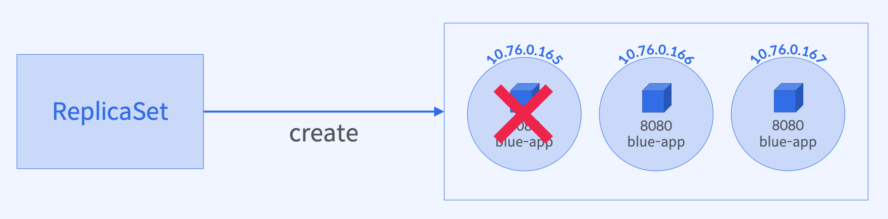

# [실습] Pod 종료 시 ReplicaSet 행동 실험

## 실습 과정



1. `ReplicaSet` 생성/배포
2. 생성된 `Pod` 목록 확인
3. `Pod` 삭제
4. `Pod` 목록 재확인
5. `RelicaSet`의 이벤트 확인

## `ReplicaSet`의 `Pod` 복구 자동화 (`fault-tolerance`)

### `ReplicaSet` 선언

```yaml
spec:
  selector:
    matchLabels:
      app: blue-app
    replicas: 3
    template:
      metadata:
        labels:
          app: blue-app
      spec:
        containers:
          - name: blue-app
            image: yoonjeong/blue-app:1.0
            ports:
              - containerPort: 8080
```

### `ReplicaSet` 생성 결과 - `Pod` 목록 조회

```bash
$ kubectl get rs blue-replicaset -o wide
NAME              DESIRED   CURRENT   READY   AGE   CONTAINERS   IMAGES                   SELECTOR
blue-replicaset   3         3         3       28s   blue-app     yoonjeong/blue-app:1.0   app=blue-app

$ kubectl get pod -o wide
NAME                    READY   STATUS    RESTARTS   AGE   IP           NODE       NOMINATED NODE   READINESS GATES
blue-replicaset-6v25w   1/1     Running   0          46s   172.17.0.5   minikube   <none>           <none>
blue-replicaset-c9d57   1/1     Running   0          46s   172.17.0.4   minikube   <none>           <none>
blue-replicaset-tzmf6   1/1     Running   0          46s   172.17.0.3   minikube   <none>           <none>
```

### `ReplicaSet`의 `Pod` 삭제

```bash
$ kubectl delete pod blue-replicaset-6v25w
pod "blue-replicaset-6v25w" deleted

$ kubectl get pod -o wide
NAME                    READY   STATUS    RESTARTS   AGE    IP           NODE       NOMINATED NODE   READINESS GATES
blue-replicaset-c9d57   1/1     Running   0          115s   172.17.0.4   minikube   <none>           <none>
***blue-replicaset-j947n***   1/1     Running   0          28s    172.17.0.8   minikube   <none>           <none>
blue-replicaset-tzmf6   1/1     Running   0          115s   172.17.0.3   minikube   <none>           <none>
```

### `Pod` 제거 후 `ReplicaSet`의 행동 확인

```bash
$ kubectl describe rs blue-replicaset
Events:
  Type    Reason            Age    From                   Message
  ----    ------            ----   ----                   -------
  Normal  SuccessfulCreate  2m42s  replicaset-controller  Created pod: blue-replicaset-tzmf6
  Normal  SuccessfulCreate  2m42s  replicaset-controller  Created pod: blue-replicaset-6v25w
  Normal  SuccessfulCreate  2m42s  replicaset-controller  Created pod: blue-replicaset-c9d57
  Normal  SuccessfulCreate  75s    replicaset-controller  Created pod: blue-replicaset-j947n
```

### 알 수 있는 사실: `ReplicaSet`을 통한 `Pod` 생성/복구 자동화 가능

- `Pod` 삭제시 `ReplicaSet`의 행동
  → `Pod` 개수가 선언된 `replicas`와 일치하지 않으면 새로운 `Pod`을 생성하여 `replicas`를 맞춤
- 노드 실패 시 `ReplicaSet`의 행동
  → 노드 실패 시 `UP`상태의 `Pod`개수가 변경되었음을 인지하고 새로운 `Pod`를 건강한 노드에 생성하여 `replicas`를 맞춤

## `ReplicaSet`(`Owner`)과 `Pod`(`Dependent`)오브젝트 삭제 전략

### 비슷해 보이는 두가지 `ReplicaSet` 삭제 명령어 비교

```bash
# ReplicaSet과 관리하던 Pod을 전부 삭제
$ kubectl delete rs blue-replicaset
replicaset.apps "blue-replicaset" deleted

# ReplicaSet만 삭제 후, 관리하던 Pod을 전부 고아(orphan) 객체로 만듦
$ kubectl delete rs blue-replicaset --cascade=orphan
replicaset.apps "blue-replicaset" deleted

$ kubectl get pod
NAME                    READY   STATUS    RESTARTS   AGE
blue-replicaset-mfk2k   1/1     Running   0          23s
blue-replicaset-r9qrh   1/1     Running   0          23s
blue-replicaset-rgx24   1/1     Running   0          23s

$ kubectl get pod blue-replicaset-mfk2k -o jsonpath='{.metadata.ownerReferences[0].name}'
[nothing...]
```

### `Gracefully`하게 `ReplicaSet`과 `Pod` 삭제

```bash
$ kubectl scale rs/blue-replicaset --replicas 0
$ kubectl delete rs/blue-replicaset
```

### `ReplicaSet`으로 관리되지 않는 `Pod`을 `Managed Pod`으로 만들기

- 기존 `ReplicaSet`만 삭제 (`—cascade=orphan`)
- 고아가 된 `Pod`의 `Label`을 추가/변경
  → `kubectl label pod <pod-name> version=v2`
- `Pod Label`을 `Selector`로 갖는 새로운 `ReplicaSet` 배포 (`unmanaged` → `managed` 상태)
  → 이미 실행 중인 `Pod`과 `replicas` 수가 같다면 새로운 `Pod`을 생성하지 않음
- `Pod`의 `Owner` 정보 확인
  → `kubectl get pod <pod-name> -o jsonpath=”{.metadata.ownerReferences[0].name}”`

## `kubectl` 명령어

```bash
# ReplicaSet 생성
$ kubectl apply -f <yaml파일경로>

# ReplicaSet과 배포 이미지 확인
$ kubectl get rs <replicaset-name> -o wide

# Pod 목록과 배포된 노드 확인
$ kubectl get pod -o wide

# ReplicaSet의 Pod 생성 기록 확인
$ kubectl describe rs <replicaset-name>

# Pod 삭제
$ kubectl delete pod <pod-name>

# ReplicaSet만 삭제
$ kubectl delete rs <replicaset-name> --cascade=orphan
```
