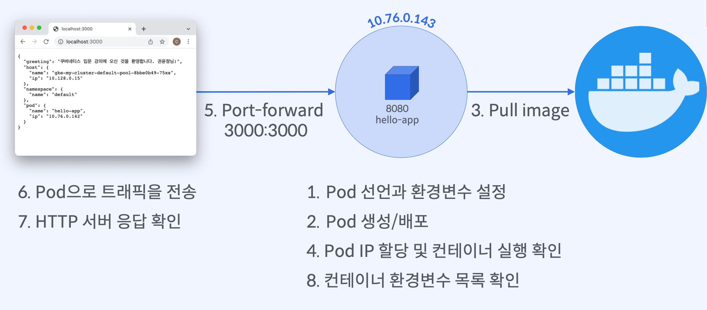
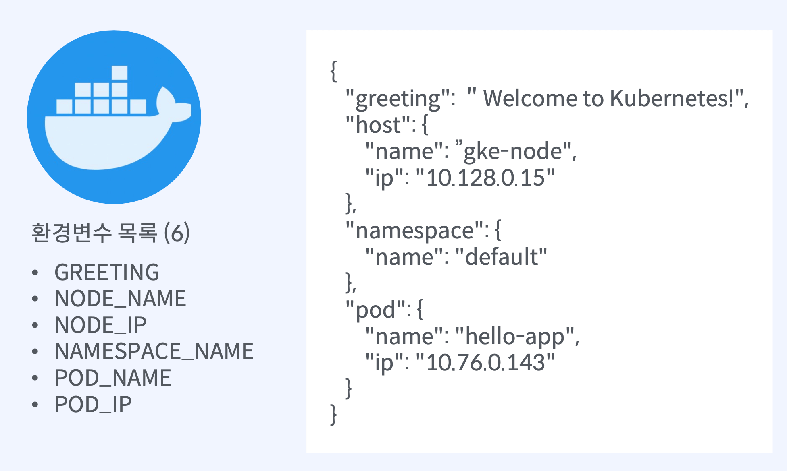

# Pod - 컨테이너로 환경변수 전달

## 실습 목표



### Pod YAML 파일에 컨테이너에서 사용할 환경변수를 선언

- 새로운 환경변수 정의
- 환경변수를 참조해서 새로운 환경변수 정의
- Pod의 metadata, spec, status 정보를 환경변수 값으로 정의

### Pod 실행 후 컨테이너에 접속하여 선언한 환경변수가 설정되었는지 확인

- 컨테이너에 설정된 환경변수를 출력
- 컨테이너 어플리케이션이 환경변수를 읽고 응답해주는 요청을 실행

## Pod 컨테이너 환경변수

### 도커 이미지 구성



### Pod 선언과 환경변수 설정

```yaml
apiVersion: v1
kind: Pod
metadata:
  name: hello-app
spec:
  containers:
    - name: hello-app
      image: yoonjeong/hello-app:1.0
      ports:
        - containerPort: 3000
```

### 추가적인 환경변수 키와 값을 설정

```yaml
spec:
  containers:
  - env: hello-app
    - name: STUDENT_NAME        # 환경변수 이름
      value: 홍길동               # 환경변수 값
    - name: GREETING
      value: 쿠버네티스 강의에 오신 것을 환영합니다 $(STUDENT_NAME)님!
```

### Pod 오브젝트 값을 환경변수 값으로 설정

```yaml
spec:
  containers:
  - env: hello-app
    - name: NODE_NAME
      valueFrom:                          # 쿠버네티스 오브젝트로부터 환경변수 값 참조
        fieldRef:                         # Pod spec, status의 field를 환경변수로 참조
          fieldPath: spec.nodeName        # 참조할 field의 경로 선택
    - name: NODE_IP
      valueFrom:
        fieldRef:
          fieldPath: status.hostIP
```

### `kubectl` 명령어

```bash
$ kubectl apply -f <yaml파일경로>
# Pod 생성

$ kubectl get pod -o wide
# Pod 실행 및 IP 확인

$ kubectl delete pod --all
$ kubectl delete pod <pod-name>
# Pod 종료

$ kubectl exec <pod-name> [-c <container-name>] -- ifconfig eth0
# 컨테이너 IP 확인

$ kubectl exec <pod-name> -- env
# 컨테이너 환경변수 확인

$ kubectl port-forward <pod-name> <host-port>:<container-port>
# 포트 포워딩
```

## Pod 정의파일 작성 연습

```yaml
# Pod API 버전: v1
# Pod 이름: hello-app
# Pod 네임스페이스: default
# 컨테이너 이름/포트: hello-app(8080)
# 도커 이미지: yoonjeong/hello-app:1.0
# 환경변수:
# -- POD_NAME(metadata.name), POD_IP(status.podIP)
# -- NAMESPACE_NAME(metadata.namespace)
# -- NODE_NAME(spec.nodeName), NODE_IP(status.hostIP)
# -- STUDENT_NAME(본인이름), GREETING(STUDENT_NAME을 참조한 인삿말)

apiVersion: v1
kind: Pod
metadata:
  name: hello-app
  namespace: default # 선언하지 않아도 default가 기본으로 설정됨
spec:
  containers:
    - name: hello-app
      image: yoonjeong/hello-app:1.0
      ports:
        - containerPort: 8080
      resources:
        limits:
          memory: 128Mi
          cpu: 100m
      env:
        - name: POD_NAME
          valueFrom:
            fieldRef:
              fieldPath: metadata.name
        - name: POD_IP
          valueFrom:
            fieldRef:
              fieldPath: status.podIP
        - name: NAMESPACE_NAME
          valueFrom:
            fieldRef:
              fieldPath: metadata.namespace
        - name: NODE_NAME
          valueFrom:
            fieldRef:
              fieldPath: spec.nodeName
        - name: NODE_IP
          valueFrom:
            fieldRef:
              fieldPath: status.hostIP
        - name: STUDENT_NAME
          value: 이상국
        - name: GREETING
          value: 안녕하세요! 반갑습니다 $(STUDENT_NAME)님!
```
