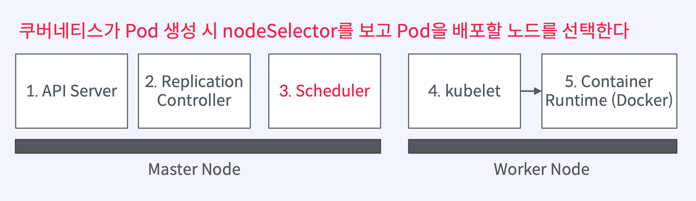
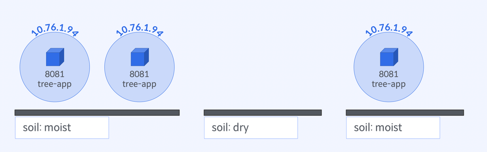

# nodeSelector로 선택한 노드집합에 Pod 배포

# 실습 목표

## 무엇을 배우게 되나?



### `Pod`을 원하는 노드 집합에 배포할 수 있음

- 노드에 `Label` 추가
- `Pod` `YAML` 파일에 `spec.nodeSelector`를 선언



1. 노드에 `Label` 추가
2. `kubectl` 명령어로 노드 레이블 확인
3. `Pod` 선언 시 `nodeSelector` 정의
4. `Pod` 생성/배포
5. `Pod`이 배포된 노드 확인

## 노드 설정

### 노드 목록 조회

```bash
$ kubectl get nodes

NAME           STATUS   ROLES           AGE    VERSION
minikube       Ready    control-plane   44d    v1.24.1
minikube-m02   Ready    <none>          112s   v1.24.1
minikube-m03   Ready    <none>          73s    v1.24.1
```

### 노드에 `Label` 추가

```bash
$ kubectl label node minikube minikube-m03 soil=moist
$ kubectl label node minikube-m02 soil=dry

$ kubectl get nodes -L soil
NAME           STATUS   ROLES           AGE     VERSION   SOIL
minikube       Ready    control-plane   44d     v1.24.1   moist
minikube-m02   Ready    <none>          3m18s   v1.24.1   dry
minikube-m03   Ready    <none>          2m39s   v1.24.1   moist
```

## `Pod` `nodeSelector` 선언 및 생성

### `kubectl run` 명령어를 통한 `Pod` 선언과 생성

```bash
$ kubectl run <pod-name> --image <image-name>
# 특정한 이미지를 Pod으로 생성하고 YAML 파일 정의없이 간편하게 실행할 수 있다
```

### `soil=moist` 레이블을 가진 모든 노드에 `Pod` 배포

```bash
$ kubectl run tree-app-1 \
--labels="element=tree" \
--image=yoonjeong/green-app:1.0 \
--port=8081 \
--overrides='{"spec":{"nodeSelector":{"soil":"moist"}}}'
```

### `Pod`이 배포된 노드 확인

```bash
$ kubectl get pod -o wide
```

### `kubectl` 명령어

```bash
# Pod 생성
$ kubectl run --image <image> --overrides=<오버라이드할 pod 선언 JSON>

# 노드 Label 확인
$ kubectl get nodes --show-labels
$ kubectl get nodes -L <label-key>

# 노드 Label 추가
$ kubectl label node <node-name> <label-key>=<label-value>

# Pod이 배포된 노드 조회
$ kubectl get pods -o wide

# Pod 종료
$ kubectl delete pod --selector <label query>
```
