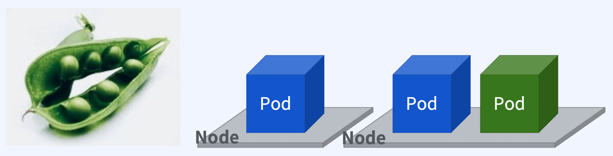
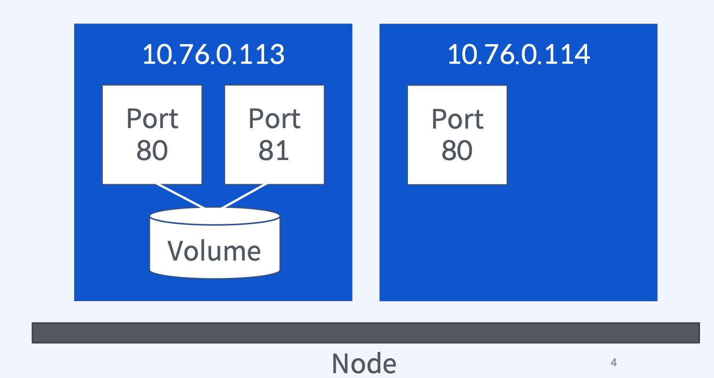
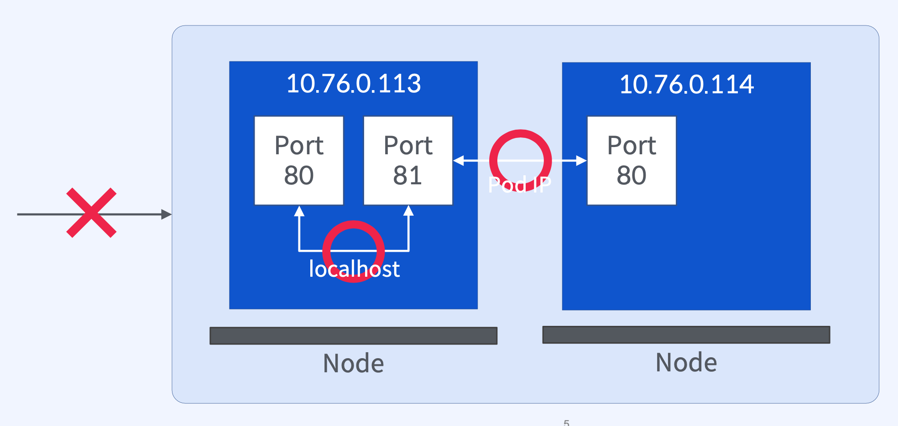
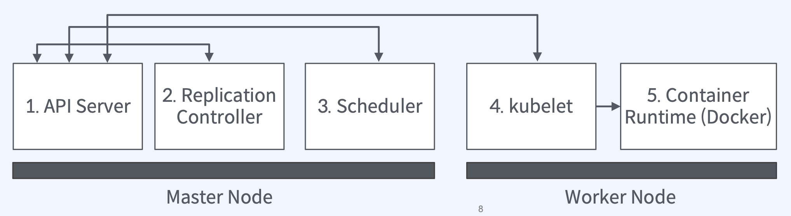

# Pod 개념과 특징

## `Pod`은 무엇일까?

### `Pod`은 여러 컨테이너를 감싸고 있는 콩껍질과 같다

- 노드에서 컨테이너를 실행하기 위한 가장 기본적인 배포 단위
- 여러 노드에 1개 이상의 `Pod`을 분산 배포/실행 가능 (`Pod Replicas`)
- `Pod`안에 여러개의 컨테이너를 실행할 수 있음



- 쿠버네티스에 전달하는것은 `Pod`의 도면이고, 쿠버네티스는 하나의 정의를 통해 여러개의 노드에 복사해서 배포하기 때문에 복제본이라고 부름
- 쿠버네티스에서는 `Pod`을 기본 단위로 여러 기능을 제공하는 컴포넌트가 구성되어 있음

## Pod 내부 구조

### 쿠버네티스가 생성하는 `Pod`의 특징

- 쿠버네티스는 `Pod`을 생성할 때 노드에서 유일한 `IP`를 할당 (서버 분리 효과)
- `Pod` 내부 컨테이너 간에 `localhost`로 통신 가능, **포트 충돌 주의 (컨테이너간에 서로 다른 포트를 부여해야 함)**
- `Pod` 안에서 네트워크와 볼륨 등 자원을 공유



## 내부 컨테이너, 다른 `Pod` 간의 통신

### `Pod IP`는 클러스터 안에서만 접근할 수 있음

- 클러스터 외부 트래픽을 받기 위해서는 `Service` 혹은 `Ingress` 오브젝트가 필요



- 개발자의 로컬 머신에서 `Pod`에 접근하기 위해서는 별도의 수신 서비스가 필요함

## `Pod Replicas` 생성을 위한 명령어

### 단 하나의 명령어로 원하는 수만큼 `Pod` 생성

```bash
$ kubectl scale deployment orderapp --replicas=3
deployment.apps/orderapp scaled

$ kubectl get pod
NAME                         READY  STATUS
orderapp-7df45d697d-f4wkp    1/1    Running
orderapp-7df45d697d-l5drn    1/1    Running
orderapp-7df45d697d-r2rfr    1/1    Running
```

## Pod과 컨테이너 설계 시 고려할 점

### `Pod` : `Container` = `1:1` or `1:N` 결정시 고려사항

1. 컨테이너들의 라이프사이클이 같은가?
   - Pod 라이프사이클 = 컨테이너들의 라이프사이클
   - 컨테이너 A가 종료되었을때 컨테이너 B 실행이 의미가 있는가
     - B가 A컨테이너의 로그 수집기라면 A가 종료되었을때 B를 실행하는것이 의미가 없음
2. 스케일링 요구사항이 같은가?
   - 웹 서버 vs 데이터베이스
     - 웹 서버와 데이터베이스는 스케일링 방법에 큰 차이가 있음
     - 웹 서버는 스케일 아웃이 가능한 반면, 데이터베이스는 스케일 아웃과 스케일 업을 적절하게 사용할 필요가 있음
   - 트래픽이 많은 vs 그렇지 않은
     - 트래픽이 많은 컨테이너 A와 그렇지 않은 컨테이너 B를 묶어두면, A컨테이너의 스케일 아웃으로 인해 불필요하게 B컨테이너까지 스케일 아웃되는 상황이 발생
3. 인프라 활용도가 더 높아지는 방향으로
   - 쿠버네티스가 노드 리소스 등 여러가지 상태를 고려하여 `Pod`을 배치 (스케줄링)

## 클러스터 구성요소들의 역할과 협력

### 노드에 배포되는 과정

1. 사용자로부터 `Pod` 배포 요청을 수락
2. 요청 받은 수 만큼 `Pod Replica`를 생성 (`Pod desired state = current state`)
3. Pod을 배포할 적절한 노드를 선택 (`node selector`)
4. 5에게 이미지 다운로드를 명령하고 `Pod` 실행을 준비, `Pod` 상태 업데이트
5. 이미지를 다운로드 하고 컨테이너를 실행



## `Pod` 오브젝트 표현 방법

### 기본 속성

```yaml
apiVersion: v1 # Kubernetes API 버전
kind: Pod # 오브젝트 타입
metadata: # 오브젝트를 유일하게 식별하기 위한 정보
  name: kube-basic # 오브젝트 이름
  labels:
    app: kube-basic
    project: fastcampus
spec: # 사용자가 원하는 오브젝트의 형태
  nodeSelector: # Pod을 배포할 노드를 지정
  containers: # Pod 안에서 실행할 컨테이너 목록
  volume: # 컨테이너가 사용할 수 있는 볼륨 목록
```

### `spec.nodeSelector` 속성 - 노드 선택

```yaml
spec:
  nodeSelector: # Pod 배포를 위한 노드를 선택
    gpu: true # 노드 집합을 구하기 위한 식별자 (key: value)
```

- 노드 키값을 확인하고, 해당 노드가 키값을 가지고 있으면 선택

### `spec.containers` 속성 - 컨테이너 정보

```yaml
spec:
  containers:
    - name: kube-basic # 컨테이너 이름
      image: kube-basic:1.0 # 도커 이미지 주소
      imagePullPolicy: Always # 도커 이미지 다운로드 정책 (Always/IfNotPresent/Never)
      ports:
        - containerPort: 80 # 통신에 사용할 컨테이너 포트
```

### `spec.containers` 속성 - 환경 변수

```yaml
spec:
  containers:
    - name: kube-basic
      image: kube-basic:1.0
      env: # 컨테이너에 설정할 환경변수 목록
        - name: PROFILE # 환경변수 이름
          value: production # 환경변수 값
        - name: LOG_DIRECTORY
          value: /logs
        - name: MESSAGE
          value: This application is running on $(PROFILE) # 다른 환경변수 참조
```

### `spec.containers` 속성 - 마운트할 볼륨 `volumeMounts`

```yaml
spec:
  containers:
    - name: kube-basic
      image: kube-basic:1.0
      volumeMounts: # 컨테이너에서 사용할 Pod 볼륨 목록
        - name: html # Pod 볼륨 이름
          mountPath: /var/html # 마운트할 컨테이너 경로
    - name: web-server
      image: nginx
      volumeMounts:
        - name: html
          mountPath: /usr/share/nginx/html # 같은 Pod 볼륨을 다른 경로로 마운트
          readOnly: true
```

### `spec.volumes` 속성 - `Pod Volume`

```yaml
spec:
  containers:
  volumes: # 컨테이너가 사용할 수 있는 볼륨 목록
    - name: host-volume # 볼륨 이름
      hostPath: # 볼륨 타입, 노드에 있는 파일이나 디렉토리를 마운트할 때
        path: /data/mysql
```

- `Pod` 볼륨 라이프사이클 = `Pod` 라이프사이클
- `Container`에서 볼륨 마운트 방법
  - `volumeMounts` 속성
- 목적에 맞는 볼륨 선택
  - `hostPath`
  - `gitRepo`
  - `configMap`
  - `secret`
    [Volumes](https://kubernetes.io/docs/concepts/storage/volumes/)

## `Pod`의 한계점

### `Self-Healing, External Networking`

1. `Pod`이 나도 모르는 사이에 종료되었다면?
   1. 기본적으로 자가 치유 능력 (`Self-Healing`)이 없음, `Pod`이나 노드 이상으로 종료되면 끝
   2. 대신 **사용자가 선언한 수 만큼 `Pod`수를 유지**해주는 `ReplicaSet` 오브젝트 도입
2. `Pod IP`는 외부에서 접근할수 없으며, 생성할 때 마다 `IP`가 변경됨
   1. 클러스터 **외부에서 접근할 수 있는 고정적인 엔드포인트**가 필요
   2. **`Pod` 집합을 클러스터 외부로 노출**하기 위한 **`Service` 오브젝트** 도입

## `Conclusion`

### `Pod` 생성과 배포

- `Pod`은 여러 개의 컨테이너를 포함할 수 있고, 하나의 노드에 배포됨
- `Pod`을 `YAML` 파일로 정의해두면 필요할 때 원하는 수 만큼 노드에 배포 할 수 있음 (`ReplicaSet`)
- `Pod`과 컨테이너를 `1:1`로 기본 설계하고 특별한 이유가 있는 경우에는 `1:N` 구조를 고민

### `Pod IP`

- 쿠버네티스는 `Pod`을 생성할 때 클러스터 내부에서만 접근할 수 있는 `IP`를 할당
- `Pod IP`는 컨테이너와 공유되기 때문에 컨테이너 간 포트 충돌에 주의
- 하나의 `Pod`에 속한 컨테이너들끼리는 `localhost`로 통신 가능
- 다른 `Pod`(컨테이너)와의 통신은 `Pod IP`를 이용
