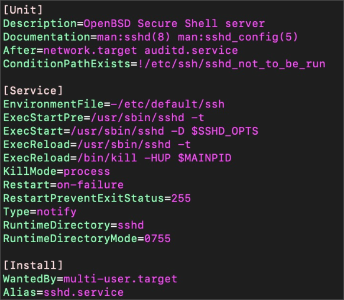

# systemd 소개

## systemd 좀 더 알아보기

### systemd 주요 역할

- 기존 init 프로세스의 기능을 지원 및 통합
- 동작 모드에 따른 시작 서비스 관리 (기존 run level)
- 병렬 실행 및 종속성 모델 관리
- 커널 로그 엔트리 관리 (journald)
- 네트워크 연결 관리 (networkd)
- 로그인 관리 (logind)

### Unit, Unit 파일

- systemd가 관리하는 **기본 개체 단위**
- Unit 유형
  - **service**, **socket**, device, mount, automount, swap, target, path, timer, slice, scope
  - **unit 파일의 suffix로 활용** (예: ssh.service)
- Unit별로 수행할 작업의 정의나 설정은 unit에 정의
- Unit 파일 형식 (INI 파일형식)
  - **Unit 섹션: Unit의 기본 정보 정의**
    - Description: 사람이 읽을 수 있는 Unit 정보, 레이블로 활용
    - After, Requires, Wants: Unit의 종속성을 지정
  - **Unit 유형 섹션: Unit유형에 따른 속성들 정의**
    - ExecStart: 구동할 명령어를 지정 (!! 절대경로 사용)
    - Restart: 서비스 재시작 여부 지정
  - **Install 섹션: Unit 설치와 관련된 정보 정의**
    - Alias: Unit을 등록할 때 사용하는 이름 (예: systemctl enable sshd.service)
    - WantedBy: Unit간 종속성 지정 (예: multi-user.target: 해당 실행 모드 구동시 자동실행)



### systemd 관리용 도구: **systemctl**

- systemd의 상태를 조사하고 설정을 변경하는데 사용되는 도구
  - 현재 load되어 있고 active 상태의 서비스 확인
    ```
    $ systemctl **list-units** --type=service
    ```
  - 활성화(active)여부와 관계없이 모든 설치된 서비스 확인
    ```
    $ systemctl **list-unit-files** --type=service
    ```
- 자주 사용되는 systemctl 서브 명령어
  ```
  $ systemctl list-unit-files [pattern]   # 설치된 Unit 목록 확인
  **$ systemctl enable unit**                 # unut이 부팅시 자동 활성화
  $ systemctl disable unit                # unit이 부팅 시 자동 활성화 방지
  $ systemctl isolate target              # 타겟의 실행 모드를 변경
  **$ systemctl start unit**                  # unit을 즉시 활성화
  **$ systemctl stop unit**                   # unit을 즉시 비활성화
  **$ systemctl restart unit**                # unit을 재시작. 실행되지 않은 상태였다면 start
  **$ systemctl status unit**                 # unit의 상태 및 최근 로그 내용을 확인
  $ systemctl kill pattern                # 패턴과 일치하는 unit에 시그널을 보냄
  $ systemctl reboot                      # 컴퓨터를 재시작
  **$ systemctl daemon-reload**               # unit 파일들과 systemd 설정 정보를 다시 로드
  ```
