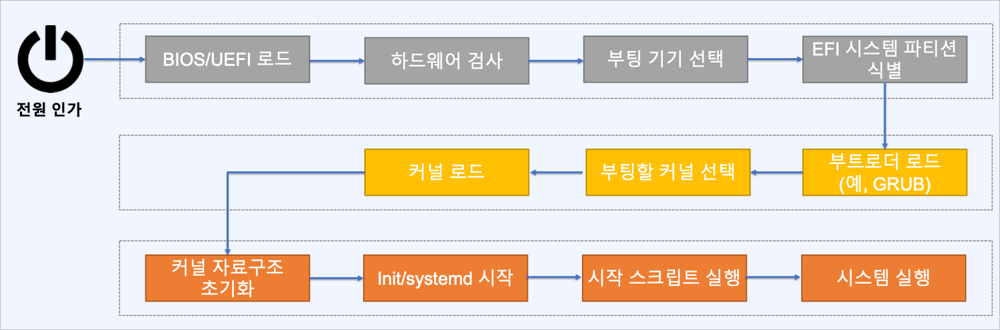
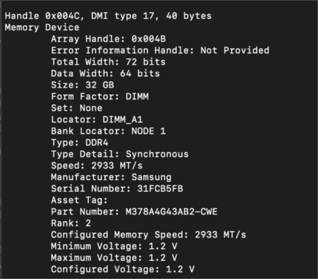
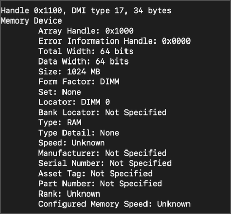
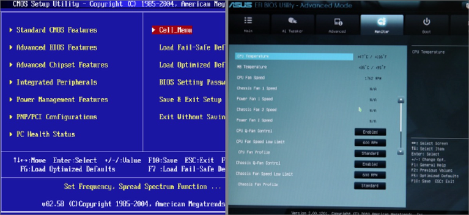
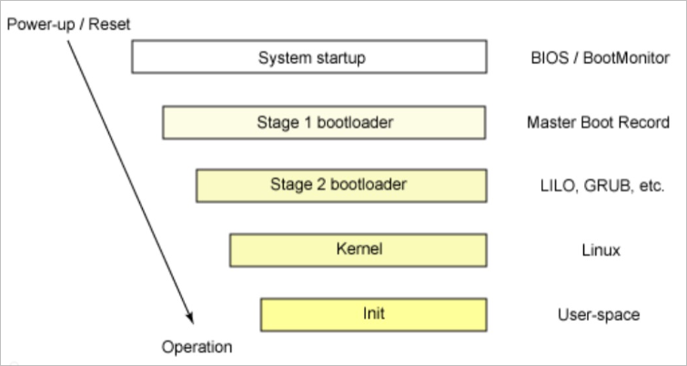

# 부팅 및 시스템 관리 데몬의 이해

## 부팅 프로세스 이해

### 물리 호스트

- BIOS 검사 통과 후 직접 콘솔을 통해 로그인

### 클라우드 가상머신

- 상태 검사 진행 후 ssh를 통한 인스턴스 접근
- 네트워크를 통한 서버 접속
- 부팅 후 dmesg, syslog를 통해 부팅 단계에서 진행된 메시지 확인 가능
- 네트워크 오류로 접속이 되지 않을 경우
  - 인스턴스 상의 모니터링 > 시스템 로그 가져오기를 통해 확인 가능

### 리눅스 시스템 부팅 순서



1. BIOS/UEFI에서 하드웨어 검사 후 부팅 기기 선택 및 파티션 식별
2. 부트로더(GRUB)에서 커널 선택 및 커널 로드
3. 리눅스에서 커널 자료구조 초기화 및 시작 서비스 구동

### BIOS / UEFI

- BIOS
  - 컴퓨터에 전원이 인가되면 실행이 시작되는 최초의 프로그램
  - 바이오스는 마더보드에 연결된 디바이스를 초기화하고 검사(POST)하는 역할을 수행
    POST: Power On Self Test
  - 부트로더 또는 운영체제를 RAM으로 읽어오는 기능을 수행
- 클라우드/가상화/컨테이너 환경에서는 시스템 관리자가 하드웨어 상태를 직접 관리할 일은 많지 않음
- 하드웨어 상태 조회 시 사용 가능
- 호스트 머신 하드웨어에서 문제가 발생한 경우
  - stop + start (다른 호스트에서 구동) ≠ restart (동일 호스트에서 재구동)

### BIOS에서 시스템 정보 읽기

- dmidecode
  - DMI 테이블 정보를 사람이 읽을 수 있는 형태로 출력해주는 도구
  - DMI 테이블
    - 하드웨어 구성 요소에 대한 정보를 추적하기 위한 산업 표준
    - 시스템 하드웨어 정보, 시리얼 번호, BIOS 리비전 등의 정보가 유지됨
  ```
  $ dmidecode -t memory
  ```
  - 물리 호스트
    
  - AWS EC2
    
    - 가상화된 환경이기 때문에 대부분 Not Specified로 표시됨
    - 가상화 환경은 벤더에 종속적이지 않기 때문임

### 부트모드: BIOS / UEFI

- BIOS (Basic Input/Output System) vs UEFI (Unified Extensible Firmware Interface)
- BIOS는 전통적인 PC 펌웨어로 Legacy BIOS
- UEFI는 BIOS를 계승한 좀 더 정형화되고 표준화된 PC 펌웨어
  - 2TB이상의 스토리지 지원, 더 빠른 부팅시간, UI 및 기능 개선 (주소공간 추가)
- PC 환경에서는 UEFI가 표준화되어 가고 있지만, 가상화 환경에서는 여전히 BIOS가 많이 사용됨
- (참고) AWS EC2 기본 구성
  - Intel 및 AMD 인스턴스 유형 → 레거시 BIOS에서 실행
  - Graviton 인스턴스 유형 → UEFI에서 실행



### 부트로더 (Boot Loader)

- 사용 가능한 커널을 확인하고 로드하는 작업을 수행
- 대부분의 부트 로더는 **부팅 타임에 사용 가능한 운영체제를 선택하기 위한 UI를 제공**
- 커널 부팅 방법에 대한 설정
  -s 옵션: 런레벨 1, 단일 사용자 모드, 시스템 관리 목적으로 부팅 (예, 네트워크 연결 안됨)




