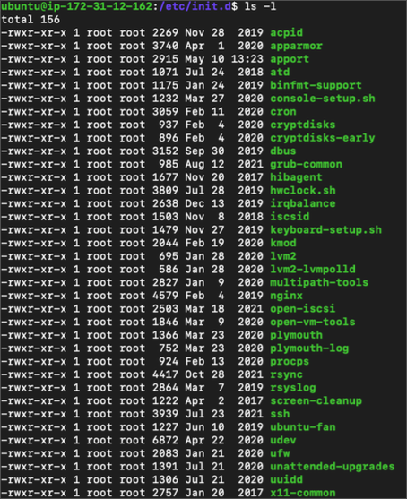
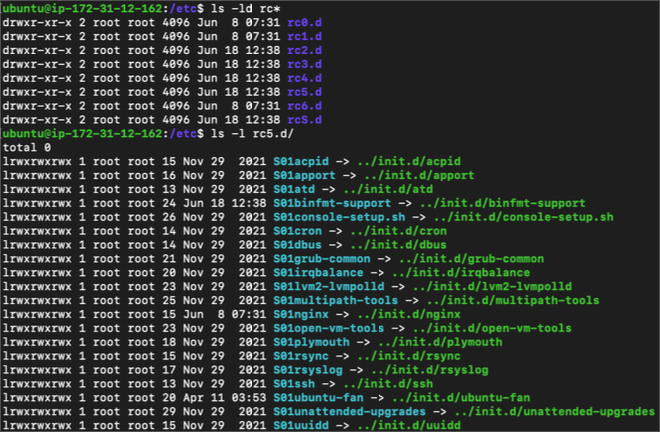
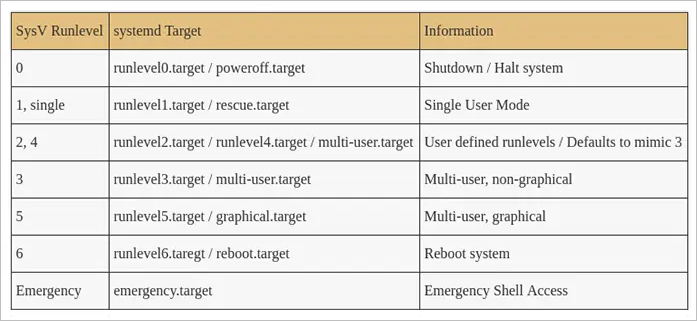

# 시작 서비스의 이해

## 시작 서비스

- 시스템 구동 시 최초로 실행되는 사용자 레벨 프로세스
- 시스템 구동에 필요한 각종 스크립트를 실행 (실행 레벨/모드는 배포판에 따라 차이가 있음)
  - 컴퓨터 이름 설정
  - 타임존 설정
  - fsck로 디스크 상태 확인
  - 파일시스템 마운트
  - /tmp 디렉토리의 오래된 파일 삭제
  - 네트워크 인터페이스 구성
  - 패킷 필터 설정
  - 네트워크 서비스 시작
  - 기타 데몬 시작

시작 서비스 위치 /etc/init.d/

실행 레벨에 맞게 시작 서비스가 구동됨 /etc/rd5.d/ (rc5)

## 실행 레벨 / 오퍼레이팅 모드

- 운영체제가 부팅 이후의 머신 상태를 결정 (어떤 프로그램을 실행할 것인지 결정)
  - single user
    - 파일시스템 마운트, 네트워크 비활성화, 시스템 관리용 쉘 접근
  - multi user
    - 일반적인 사용자 접근
- SysV에서는 run level 개념 사용, systemd에서는 오퍼레이팅 모드 개념 사용

